<!-- ---
title: consul version
date: 2019-07-23 01:06:28
category: src, consul
--- -->

# Consul agent 启动

agent 命令包括client 客户端模式和service 服务端模式。

client 模式下，会接收本地请求，并且将请求转发给service 服务端进行处理。



```go
// github.com/hashicorp/consul/command/commands_oss.go
Register("agent", func(ui cli.Ui) (cli.Command, error) {
    return agent.New(ui, rev, ver, verPre, verHuman, make(chan struct{})), nil
})

// 创建agent 实例
agent, err := agent.New(config, c.logger)

// 运行agent
err = agent.Start()
```

主要数据结构：

```go
// Agent 结构体
type Agent struct {
    // 请求代理服务
    delegate delegate
    // state 本地数据存储
    State *local.State
    // cache 本地请求缓存
    cache *cache.Cache
    // httpServers 提供http 服务
    httpServers []*HTTPServer
    // serviceManager 服务管理器
    serviceManager *ServiceManager
}
```

## 1. 运行Agent

```go
// github.com/hashicorp/consul/command/agent/agent.go
// cmd 运行命令
func (c *cmd) Run(args []string) int {
    code := c.run(args)
    // ...
    return code
}

// agent 命令入口逻辑
func (c *cmd) run(args []string) int {
    // 读取配置
    config := c.readConfig()

    // 创建agent 实例
    agent, err := agent.New(config, c.logger)
    
    // 运行agent
    err = agent.Start()

    // 启动服务后加入到集群中
    if err := c.startupJoin(agent, config); err != nil {
        c.UI.Error(err.Error())
        return 1
    }

    // 通知agent 已经完成初始注册
    agent.StartSync()
}
```

## 2. 创建 Agent

创建 Agent 实例。

```go
// github.com/hashicorp/consul/agent/agent.go
// consul agent 中创建agent
func New(c *config.RuntimeConfig, logger *log.Logger) (*Agent, error) {
    // 创建实例
    a := Agent{
        config:           c,
        joinLANNotifier:  &systemd.Notifier{},
        endpoints:        make(map[string]string),
    }

    // 服务管理器
    a.serviceManager = NewServiceManager(&a)

    // 初始化acl
    if err := a.initializeACLs(); err != nil {
        return nil, err
    }

    // 设置节点id
    if err := a.setupNodeID(c); err != nil {
        return nil, fmt.Errorf("Failed to setup node ID: %v", err)
    }

    return &a, nil
}
```

## 3. 运行 Agent

`Start` 运行Agent。这里会运行Agent 的所有子进程。

```go
// 开始运行agent 相关服务
func (a *Agent) Start() error {
    c := a.config

    // 创建本地 state，用来管理服务
    a.State = local.NewState(LocalConfig(c), a.logger, a.tokens)

    // 创建状态同步器，用于同步state 状态
    a.sync = ae.NewStateSyncer(a.State, c.AEInterval, a.shutdownCh, a.logger)

    // 创建缓存实例
    a.cache = cache.New(nil)

    // 获取rpc 配置
    consulCfg, err := a.consulConfig()
    
    // ServerUp 通知新的服务节点产生
    consulCfg.ServerUp = a.sync.SyncFull.Trigger

    // 判断是否是服务端模式
    if c.ServerMode {
        // 如果是服务端模式，需要初始化服务端逻辑
        server, err := consul.NewServerWithOptions(consulCfg, a.logger, a.tokens, a.tlsConfigurator)

        a.delegate = server
    } else {
        // 客户端模式时，启动客户端命令
        client, err := consul.NewClientWithOptions(consulCfg, a.logger, a.tlsConfigurator)

        a.delegate = client
    }

    // 将代理同步到状态机上
    a.State.Delegate = a.delegate
    a.State.TriggerSyncChanges = a.sync.SyncChanges.Trigger

    // 注册缓存
    a.registerCache()

    // 加载健康检查，服务的元数据
    if err := a.loadServices(c); err != nil {
        return err
    }
    if err := a.loadProxies(c); err != nil {
        return err
    }
    if err := a.loadChecks(c); err != nil {
        return err
    }
    if err := a.loadMetadata(c); err != nil {
        return err
    }

    // 开启代理
    a.proxyConfig, err = proxycfg.NewManager(proxycfg.ManagerConfig{
        Cache:  a.cache,
        Logger: a.logger,
        State:  a.State,
        Source: &structs.QuerySource{
            Node:       a.config.NodeName,
            Datacenter: a.config.Datacenter,
            Segment:    a.config.SegmentName,
        },
    })

    go func() {
        // 运行代理
        if err := a.proxyConfig.Run(); err != nil {
            a.logger.Printf("[ERR] Proxy Config Manager exited: %s", err)
        }
    }()

    // 开启监听中止的服务
    go a.reapServices()

    // 开启运行event 处理
    go a.handleEvents()

    // 开启运行DNS 服务
    if err := a.listenAndServeDNS(); err != nil {
        return err
    }

    // 开启http 监听服务
    servers, err := a.listenHTTP()
    if err != nil {
        return err
    }

    // 运行监听中的http 服务
    for _, srv := range servers {
        if err := a.serveHTTP(srv); err != nil {
            return err
        }
        a.httpServers = append(a.httpServers, srv)
    }

    // 开启grpc 服务
    if err := a.listenAndServeGRPC(); err != nil {
        return err
    }

    // 注册观察器
    if err := a.reloadWatches(a.config); err != nil {
        return err
    }

    // 加入局域网集群和广域网集群
    go a.retryJoinLAN()
    go a.retryJoinWAN()

    return nil
}
```

## 参考资料

- github.com/hashicorp/consul/agent/consul/client.go

