<!-- ---
title: Consul agent server 模式
date: 2019-07-23 01:06:36
category: src, consul
--- -->

# Consul agent server 模式

agent 服务端模式，以服务形式运行。服务处理来至client 的请求。服务之间通过 Raft 协议保持数据和状态一致。



主要代码逻辑：

```go
server, err := consul.NewServerWithOptions(consulCfg, options...)
```

主要数据结构：

```go
// Server consul 服务端，管理服务发现，健康检查，多数据中心请求转发
type Server struct {
    // Consul 配置
    config *Config
    // configReplicator 用于管理主节点复制
    configReplicator *Replicator
    // fsm Raft 状态机
    fsm *fsm.FSM
    // Listener 服务监听
    Listener  net.Listener
    rpcServer *rpc.Server
    // serverLookup 查找服务主节点
    serverLookup *ServerLookup
    // tombstoneGC 用来跟踪kv 键值对的gc
    tombstoneGC *state.TombstoneGC
}
```

## 1. 启动server 服务

如果agent 以服务端模式启动，需要启动服务端处理逻辑：

1. 创建当前consul 服务到其他服务节点的连接池
2. 创建服务
3. 创建服务端限流器
4. 初始化服务端RPC
5. 初始化Raft 服务
6. 初始化局域网Serf
7. 开始监听和处理RPC 请求

```go
// github.com/hashicorp/consul/agent/consul/server.go
// NewServerWithOptions 创建一个consul 服务
func NewServerWithOptions(config *Config, options ...ConsulOption) (*Server, error) {
    // ...

    // Create 清理器
    gc, err := state.NewTombstoneGC(config.TombstoneTTL, config.TombstoneTTLGranularity)
    
    // 创建当前consul 服务到其他服务节点的连接池
    connPool = &pool.ConnPool{
        Server:          true,
        SrcAddr:         config.RPCSrcAddr,
        Datacenter:      config.Datacenter,
    }

    // 创建服务
    s := &Server{
        config:            config,
        tokens:            tokens,
        connPool:          connPool,
        router:            router.NewRouter(logger, config.Datacenter),
        rpcServer:         rpc.NewServer(),
        insecureRPCServer: rpc.NewServer(),
        sessionTimers:     NewSessionTimers(),
        serverLookup:      NewServerLookup(),
    }

    // 创建服务端限流器
    s.rpcLimiter.Store(rate.NewLimiter(config.RPCRate, config.RPCMaxBurst))

    // 复制器
    s.configReplicator, err = NewReplicator(&configReplicatorConfig)

    // ...

    // 初始化服务端RPC
    s.setupRPC()

    // 初始化Raft 服务
    s.setupRaft()

    // 初始化局域网Serf
    s.serfLAN, err = s.setupSerf(config.SerfLANConfig, s.eventChLAN, serfLANSnapshot, false, serfBindPortWAN, "", s.Listener)

    // 处理局域网Event
    go s.lanEventHandler()

    // 启动Flooders
    s.floodSegments(config)

    // 开启主节点监听，用于选举主节点
    go s.monitorLeadership()

    // 开始监听和处理RPC 请求
    go s.listen(s.Listener)

    // Start listeners for any segments with separate RPC listeners.
    for _, listener := range segmentListeners {
        go s.listen(listener)
    }

    // Start 指标统计
    go s.updateMetrics()
    return s, nil
}
```

## 2. 初始化RPC 监听

1. 将注册的处理实例注册到RPC 服务端
2. 开启net 监听

```go
// 注册服务端处理服务
// github.com/hashicorp/consul/agent/consul/server_oss.go
func init() {
    registerEndpoint(func(s *Server) interface{} { return &Catalog{s, s.loggers.Named(logging.Catalog)} })
    registerEndpoint(func(s *Server) interface{} { return &DiscoveryChain{s} })
    registerEndpoint(func(s *Server) interface{} { return &Health{s} })
    registerEndpoint(func(s *Server) interface{} { return &KVS{s, s.loggers.Named(logging.KV)} })
}

func registerEndpoint(fn factory) {
    endpoints = append(endpoints, fn)
}
```

```go
// setupRPC 开启server 端处理RPC 请求的listener
func (s *Server) setupRPC() error {
    // 注册rpc 处理器
    for _, fn := range endpoints {
        s.rpcServer.Register(fn(s))
    }

    // 开启网络监听
    ln, err := net.ListenTCP("tcp", s.config.RPCAddr)
    s.Listener = ln

    // ...
    // Raft 协议请求处理
    s.raftLayer = NewRaftLayer(s.config.RPCSrcAddr, s.config.RPCAdvertise, wrapper, tlsFunc)
    return nil
}
```

## 3. RPC 监听与处理

启动server 时，开启针对RPC 的 `go s.listen(s.Listener)` 监听与处理。

```go
// listen 监听RPC 请求
func (s *Server) listen(listener net.Listener) {
    for {
        // 接收请求数据
        conn, err := listener.Accept()
        
        // 调用处理函数，对收到的每个请求都启动一个goroutine 去处理
        go s.handleConn(conn, false)
    }
}

// handleConn 判断RPC 请求是一个Raft 请求还是Consul 客户端RPC 请求，并且调用相应的处理方法
func (s *Server) handleConn(conn net.Conn, isTLS bool) {
    // 读取第一个byte 用来判断请求类型
    buf := make([]byte, 1)
    _, err := conn.Read(buf)
    typ := pool.RPCType(buf[0])
    // ...

    // Switch on the byte
    switch typ {
    case pool.RPCConsul:
        // 常规 consul agent rpc 请求
        s.handleConsulConn(conn)
    case pool.RPCRaft:
        // Raft 请求
        metrics.IncrCounter([]string{"rpc", "raft_handoff"}, 1)
        s.raftLayer.Handoff(conn)
    case pool.RPCSnapshot:
        s.handleSnapshotConn(conn)
    // ...
    }
}
```

处理来自consul 客户端的rpc 请求。

```go
// handleConsulConn 用于服务端处理 consul 客户端的rpc 请求
func (s *Server) handleConsulConn(conn net.Conn) {
    // 初始化msgpack 服务端编码器
    rpcCodec := msgpackrpc.NewServerCodec(conn)
    for {
        // 注册服务端编码器，并且处理服务端数据
        err := s.rpcServer.ServeRequest(rpcCodec)
    }
}
```


## 参考资料

- github.com/hashicorp/consul/agent/consul/rpc.go
