<!-- ---
title: Consul API 客户端
date: 2019-07-23 21:37:56
category: src, consul
--- -->

# Consul API 客户端

consul api 用于简化对`consul agent` 的操作，可以作为consul 客户端api 嵌入应用中使用。



主要代码：

```go
// 创建客户端
client := api.NewClient(c)

// 调用请求
client.KV().Put(pair, nil)
```

主要数据结构：

```go
// Client http 客户端
type Client struct {
    config Config
}

// Config Client 配置
type Config struct {
    // Address Consul server 地址
    Address string
    // HttpClient http client
    HttpClient *http.Client
    // ...
}
```

## 1. 创建客户端

`api/api.go` 中包含Client 的配置

```go
// client := api.NewClient(c)

// NewClient 创建一个client
func NewClient(config *Config) (*Client, error) {
    // 默认配置
    defConfig := DefaultConfig()

    if len(config.Address) == 0 {
        config.Address = defConfig.Address
    }

    if config.HttpClient == nil {
        config.HttpClient, err = NewHttpClient(config.Transport, config.TLSConfig)
    }

    // ...
    return &Client{config: *config}, nil
}

// DefaultConfig 返回一个默认配置
func DefaultConfig() *Config {
    return defaultConfig(cleanhttp.DefaultPooledTransport)
}

// 从环境变量获取默认配置
func defaultConfig(transportFn func() *http.Transport) *Config {
    config := &Config{
        Address:   "127.0.0.1:8500",
        Scheme:    "http",
        Transport: transportFn(),
    }

    if addr := os.Getenv(HTTPAddrEnvName); addr != "" {
        config.Address = addr
    }
    
    // ...

    return config
}
```

## 2. 创建业务Client

```go
// 创建一个用户特定子命令的实例
func (c *Client) KV() *KV {
    return &KV{c}
}

// Get 执行查询
func (k *KV) Get(key string, q *QueryOptions) (*KVPair, *QueryMeta, error) {
    resp, qm, err := k.getInternal(key, nil, q)
    // ...
    return nil, qm, nil
}

func (k *KV) getInternal(key string, params map[string]string, q *QueryOptions) (*http.Response, *QueryMeta, error) {
    // 创建请求
    r := k.c.newRequest("GET", "/v1/kv/"+strings.TrimPrefix(key, "/"))

    // 处理请求参数
    for param, val := range params {
        r.params.Set(param, val)
    }

    // 执行请求
    rtt, resp, err := k.c.doRequest(r)
    // ...
    return resp, qm, nil
}
```

## 3. Http 请求处理

client 主要包含创建request 和发送request 方法。

```go
// 创建一个request 实例
func (c *Client) newRequest(method, path string) *request {
    r := &request{
        config: &c.config,
        method: method,
        url: &url.URL{
            Scheme: c.config.Scheme,
            Host:   c.config.Address,
            Path:   path,
        },
        params: make(map[string][]string),
        header: make(http.Header),
    }
    
    // ...

    return r
}

// 发送一个request
func (c *Client) doRequest(r *request) (time.Duration, *http.Response, error) {
    req, err := r.toHTTP()
    // ...
    resp, err := c.config.HttpClient.Do(req)
    return diff, resp, err
}
```

## 参考资料

- github.com/hashicorp/consul/api/api.go