<!-- ---
title: consul version
date: 2019-07-23 01:06:16
category: src, consul
--- -->

# consul version 子命令

> consul version 是一个最简单的 consul 子命令，用来查看consul 程序版本。因为逻辑简单，我们从 consul version 入手，来了解子命令实现逻辑。

`version` 子命令在终端的使用命令是: `consul version`。

子命令对象需要实现 `cli.Command` 接口的3 个函数：`Run`, `Synopsis`, `Help`。这样子命令可以作为一个 `Command` 实例，插入到子命令基数树上，在使用时根据命令名从基数树上找到子命令。



主要代码逻辑：

```go
// 注册 consul version 子命令
Register("version", func(ui cli.Ui) (cli.Command, error) { return version.New(ui, verHuman), nil })
```

主要代码结构：

```go
// command 可以作为一个 CLI 子命令
type Command interface {
    // Help 返回帮助信息
    Help() string

    // Run 实际执行命令的主体逻辑
    Run(args []string) int

    // Synopsis 返回使用示例信息
    Synopsis() string
}

type cmd struct {
    UI      cli.Ui
    version string
}
```

## version 子命令实现

在`cli.Run` 函数中，终端第一个参数是子命令名，这里命令名是 `version`，根据命令名就能找到`Command`，并且执行 `Run` 函数，在`Run` 函数中实现命令的主逻辑。

`ui` 实例在 `New` 创建实例时传入，程序中统一通过`ui.Output` 输出信息。

```go
//子命令结构, 子命令需要实现 cli.Command 接口，既要实现Run, Synopsis, Help 函数
func New(ui cli.Ui, version string) *cmd {
    return &cmd{UI: ui, version: version}
}

// 通过 ui 变量打印终端版本号
func (c *cmd) Run(_ []string) int {
    c.UI.Output(fmt.Sprintf("Consul %s", c.version))
    return 0
}

func (c *cmd) Synopsis() string {
    return "Prints the Consul version"
}

func (c *cmd) Help() string {
    return ""
}
```

## 参考资料

- github.com/hashicorp/consul/command/version/version.go
