<!-- ---
title: Consul Http 服务
date: 2020-06-23 09:07:32
category: showcode, consul
--- -->

# Consul Http 服务

启动http 服务，处理http 请求。



主要代码逻辑：

```go
// 启动服务
servers, err := a.listenHTTP()

// 启动http 服务
a.serveHTTP(srv)
```

主要数据结构：

```go
type wrappedMux struct {
    mux     *http.ServeMux
    handler http.Handler
}
```

## 1. 启动Agent Http 服务

```go
// 开启http 监听
servers, err := a.listenHTTP()

// 启动http 服务
for _, srv := range servers {
    if err := a.serveHTTP(srv); err != nil {
        return err
    }
    a.httpServers = append(a.httpServers, srv)
}
```

### 1.1 开启http 监听

```go
// github.com/hashicorp/consul/agent/agent.go
// listenHTTP 开启agent http 服务监听
func (a *Agent) listenHTTP() ([]*HTTPServer, error) {
    var ln []net.Listener
    var servers []*HTTPServer
    start := func(proto string, addrs []net.Addr) error {
        // 拨号打开所有服务端监听
        listeners, err := a.startListeners(addrs)

        // 初始化网络连接和监听
        for _, l := range listeners {
            // 初始化http 服务
            srv := &HTTPServer{
                Server: &http.Server{
                    Addr:      l.Addr().String(),
                    TLSConfig: tlscfg,
                },
                ln:        l,
            }

            // 处理http 服务的处理器
            srv.Server.Handler = srv.handler(a.config.EnableDebug)

            ln = append(ln, l)
            servers = append(servers, srv)
        }
        return nil
    }

    // 开启http 服务端监听，如果有https 配置也会开启https 服务
    err := start("http", a.config.HTTPAddrs)

    return servers, nil
}
```

开启网络监听：

```go
// 开启网络监听
func (a *Agent) startListeners(addrs []net.Addr) ([]net.Listener, error) {
    var ln []net.Listener
    for _, addr := range addrs {
        switch x := addr.(type) {
        case *net.TCPAddr:
            l, err = net.Listen("tcp", x.String())
            // ...
            l = &tcpKeepAliveListener{l.(*net.TCPListener)}
        }
        ln = append(ln, l)
    }
    return ln, nil
}
```

## 2. Http handler 处理

Http 处理器初始化。

```go
// github.com/hashicorp/consul/agent/http.go
// handler 是http 服务的处理器
func (s *HTTPServer) handler(enableDebug bool) http.Handler {
    // 创建http 多路器
    mux := http.NewServeMux()

    // handleFuncMetrics 指标统计中间件
    handleFuncMetrics := func(pattern string, handler http.HandlerFunc) {
        // http 请求耗时中间件
        wrapper := func(resp http.ResponseWriter, req *http.Request) {
            start := time.Now()
            handler(resp, req)
            metrics.MeasureSince(key, start)
        }

        // gzip 中间件
        gzipWrapper, _ := gziphandler.GzipHandlerWithOpts(gziphandler.MinSize(0))

        // 中间件调用链注册到mux 上
        gzipHandler := gzipWrapper(http.HandlerFunc(wrapper))
        mux.Handle(pattern, gzipHandler)
    }

    // 注册http 首页端点
    mux.HandleFunc("/", s.Index)
    
    // endpoints 路由在 init 里面注册
    for pattern, fn := range endpoints {
        thisFn := fn
        methods, _ := allowedMethods[pattern]
        bound := func(resp http.ResponseWriter, req *http.Request) (interface{}, error) {
            return thisFn(s, resp, req)
        }
        handleFuncMetrics(pattern, s.wrap(bound, methods))
    }

    // 如果开启了UI 界面，还需要开启前端页面http 服务
    if s.IsUIEnabled() {
        // 前端静态页面路由
        if s.agent.config.UIDir != "" {
            uifs = http.Dir(s.agent.config.UIDir)
        } else {
            fs := assetFS()
            uifs = fs
        }
    }

    // 清理不可见字符中间件
    h := cleanhttp.PrintablePathCheckHandler(mux, nil)
    // ...
    return &wrappedMux{
        mux:     mux,
        handler: h,
    }
}
```

http 请求鉴权中间件处理：

```go
// wrap 鉴权中间件
func (s *HTTPServer) wrap(handler endpoint, methods []string) http.HandlerFunc {
    return func(resp http.ResponseWriter, req *http.Request) {
        // 设置响应头
        setHeaders(resp, s.agent.config.HTTPResponseHeaders)
    
        // ...
        // 调用http 请求处理handler，进行http 请求处理
        // Invoke the handler
        obj, err = handler(resp, req)
    
        // 响应结果数据
        if contentType == "application/json" {
            buf, err = s.marshalJSON(req, obj)
            // ...
        }
        resp.Header().Set("Content-Type", contentType)
        resp.WriteHeader(httpCode)
        resp.Write(buf)
    }
}
```

开启http 服务：

```go
// 开启http 服务
a.serveHTTP(srv)

func (a *Agent) serveHTTP(srv *HTTPServer) error {
    // ...
    go func() {
        err := srv.Serve(srv.ln)
    }()
}
```

## 3. 注册http 路由

http 路由注册在引入`github.com/hashicorp/consul/agent` 时通过 `init` 函数注册到全局变量 `endpoints` 中。

路由注册逻辑：

1. 引入包时注册http 服务端点
2. 初始化服务时，将http 端点注册到http 服务

引入包时注册http 服务端点。

```go
// github.com/hashicorp/consul/agent/http_register.go
func init() {
    registerEndpoint("/v1/acl/create", []string{"PUT"}, (*HTTPServer).ACLCreate)
    registerEndpoint("/v1/agent/members", []string{"GET"}, (*HTTPServer).AgentMembers)
    registerEndpoint("/v1/catalog/register", []string{"PUT"}, (*HTTPServer).CatalogRegister)
    registerEndpoint("/v1/health/checks/", []string{"GET"}, (*HTTPServer).HealthServiceChecks)
    registerEndpoint("/v1/kv/", []string{"GET", "PUT", "DELETE"}, (*HTTPServer).KVSEndpoint)
}
```

将http 端点信息保存到全局变量中：

```go
// github.com/hashicorp/consul/agent/http.go
// 路由保存到 endpoints 的map 中
var endpoints map[string]unboundEndpoint

// 添加路由
// github.com/hashicorp/consul/agent/http_oss.go
// 添加路由
registerEndpoint("/v1/kv/", []string{"GET", "PUT", "DELETE"}, (*HTTPServer).KVSEndpoint)

// registerEndpoint 注册http 端点
func registerEndpoint(pattern string, methods []string, fn unboundEndpoint) {
    // ...
    endpoints[pattern] = fn
    allowedMethods[pattern] = methods
}
```

## 参考资料

- github.com/hashicorp/consul/agent/http_register.go

