<!-- ---
title: Consul HTTP KV 接口实现
date: 2020-06-24 09:07:42
category: showcode, consul
--- -->

# Consul HTTP KV 接口实现

实现 consul http kv 处理请求逻辑。



主要代码逻辑：

```go
// 注册agent 的http kv 端口
registerEndpoint("/v1/kv/", []string{"GET", "PUT", "DELETE"}, (*HTTPServer).KVSEndpoint)
```

## 1. KV HTTP 服务

```go
func (s *HTTPServer) KVSEndpoint(resp http.ResponseWriter, req *http.Request) (interface{}, error) {
    // 根据请求方法划分处理方式
    switch req.Method {
    case "GET":
        if keyList {
            return s.KVSGetKeys(resp, req, &args)
        }
        return s.KVSGet(resp, req, &args)
    case "PUT":
        return s.KVSPut(resp, req, &args)
    case "DELETE":
        return s.KVSDelete(resp, req, &args)
    default:
        return nil, MethodNotAllowedError{req.Method, []string{"GET", "PUT", "DELETE"}}
    }
}
```

## 2. Get 请求处理

```go
// KVSGetKeys handles a GET request for keys
func (s *HTTPServer) KVSGetKeys(resp http.ResponseWriter, req *http.Request, args *structs.KeyRequest) (interface{}, error) {
    // 构造请求参数
    listArgs := structs.KeyListRequest{
        Datacenter:     args.Datacenter,
        Prefix:         args.Key,
        Seperator:      sep,
        EnterpriseMeta: args.EnterpriseMeta,
        QueryOptions:   args.QueryOptions,
    }

    // 发送RPC 请求
    // 如果是客户端，RPC 请求 Consul 服务
    // 如果是Consul 服务，则内部处理请求
    var out structs.IndexedKeyList
    if err := s.agent.RPC("KVS.ListKeys", &listArgs, &out); err != nil {
        return nil, err
    }
    
    // 返回数据
    return out.Keys, nil
}
```

## 3. RPC 请求

```go
// RPC 通过RPC 请求Consul 服务
func (a *Agent) RPC(method string, args interface{}, reply interface{}) error {
    /// ...
    return a.delegate.RPC(method, args, reply)
}
```

Consul 分为Agent 和Server：

```go
if c.ServerMode {
    server, err := consul.NewServerWithOptions(consulCfg, options...)
    // ...
    a.delegate = server
} else {
    client, err := consul.NewClientWithOptions(consulCfg, options...)
    // ...
    a.delegate = client
}
```

### 3.1 Agent RPC

```go
// RPC 通过RPC 请求consul server
func (c *Client) RPC(method string, args interface{}, reply interface{}) error {
    // 发送请求
    rpcErr := c.connPool.RPC(c.config.Datacenter, server.ShortName, server.Addr, method, args, reply)
    if rpcErr == nil {
        return nil
    }
}

// RPC 请求
func (p *ConnPool) RPC(
    dc string,
    nodeName string,
    addr net.Addr,
    method string,
    args interface{},
    reply interface{},
) error {
    // ...
    return p.rpc(dc, nodeName, addr, method, args, reply)
}

func (p *ConnPool) rpc(dc string, nodeName string, addr net.Addr, method string, args interface{}, reply interface{}) error {
    p.once.Do(p.init)

    // 远程连接客户端
    conn, sc, err := p.getClient(dc, nodeName, addr)
    
    // 远程调用
    err = msgpackrpc.CallWithCodec(sc.codec, method, args, reply)
    
    // ...
    return nil
}
```

### 3.2 Server RPC

```go
// RPC 服务端RPC 调用是模拟调用，直接进程内处理
func (s *Server) RPC(method string, args interface{}, reply interface{}) error {
    // 进程内RPC 处理
    codec := &inmemCodec{
        method: method,
        args:   args,
        reply:  reply,
    }

    // 服务请求处理
    s.rpcServer.ServeRequest(codec)
    
    // ...
    return codec.err
}
```

## 参考资料

- github.com/hashicorp/consul/agent/kvs_endpoint.go

