<!-- ---
title: consul main
date: 2019-02-22 20:06:40
category: src, consul
--- -->

# consul main 入口实现

> consul/main.go 是consul 程序的入口函数，这里会解析终端命令参数，选择一条子命令执行。

## 1. main.go 结构图

`main.go` 入口函数代码中主要包含3 部分逻辑：

1. 在 `import` 依赖包时，`command` 中 `init` 初始化函数会注册所有子命令。
2. `main` 函数中拿到所有子命令后创建`cli` 实例并且运行 `cli.Run` 主逻辑。
3. 在 `cli.Run` 逻辑中会解析终端参数，以第一个参数为子命令名来确定子命令，并且运行子命令。




主要数据结构：

`Command interface` 定义了 `Run`, `Help` 和 `Synopsis`，所有子命令结构体都实现了这3 个函数。

```go
// command 可以作为一个 CLI 子命令
type Command interface {
    // Help 返回帮助信息
    Help() string

    // Run 实际执行命令的主体逻辑
    Run(args []string) int

    // Synopsis 返回使用示例信息
    Synopsis() string
}

// CLI 结构体包含cli 应用的常用信息
type CLI struct {
    // Args 终端参数
    Args []string

    // Commands 子命令列表，CommandFactory 函数可以返回一个命令
    Commands map[string]CommandFactory

    // ...
}
```

## 2. main 函数

`main` 函数中的逻辑：

1. import 依赖包
2. 遍历子命令传入 `ui` 实例
3. 创建`cli` 实例并且运行

`main.go` 代码，在 `import` command 包时，command 的`init` 函数会初始化执行，`command.init` 中会进行子命令注册。

创建`ui`，`ui` 变量封装了终端输出 `os.Stdout`。这里会遍历所有注册的子命令，将`ui` 传递到子命令结构体中，这样在子命令中可以统一调用 `ui` 输出信息。

依赖`github.com/mitchellh/cli` 创建 `cli` 实例，`cli` 封装了终端程序对参数的处理和子命令运行。`main` 函数中只需要创建`cli` 实例，执行 `cli.Run`，由`cli.Run` 负责解析和运行真正需要运行的子命令。 

```go
// 初始化时注册子命令
import （
    "github.com/hashicorp/consul/command"
    // ...
)

// 实例化cli 环境下的交互逻辑
ui := &cli.BasicUi{Writer: os.Stdout, ErrorWriter: os.Stderr}

// 遍历子命令，传入ui 实例，Map 实现见下方
cmds := command.Map(ui)

// 创建cli 实例
cli := &cli.CLI{
    Args:         args,
    Commands:     cmds,
    Autocomplete: true,
    Name:         "consul",
    HelpFunc:     cli.FilteredHelpFunc(names, cli.BasicHelpFunc("consul")),
}

// 运行cli 程序，根据终端参数运行不同子命令
exitCode, err := cli.Run()
```

## 3. command 子命令注册

在`main.go` 中 `import command` 包时，`command` 包的`init` 函数会初始化执行，进行consul 子命令注册；`command` 包内变量 `registry` 会初始化，`registry` 用来存放注册的子命令。

子命令包括：

1. agent // consul agent 命令
2. catalog // 服务注册与发现服务
3. info
4. join
5. kv // 键值处理
6. members // 查看成员
7. services
8. ...

```go
// github.com/hashicorp/consul/command/commands_oss.go

func init() {
    // Register 函数注册子命令
    Register("agent", func(ui cli.Ui) (cli.Command, error) {
        return agent.New(ui, rev, ver, verPre, verHuman, make(chan struct{})), nil
    })

    Register("kv", func(cli.Ui) (cli.Command, error) { return kv.New(), nil })
    Register("kv delete", func(ui cli.Ui) (cli.Command, error) { return kvdel.New(ui), nil })
    Register("version", func(ui cli.Ui) (cli.Command, error) { return version.New(ui, verHuman), nil })
    // ...
}
```

调用`Register` 函数注册子命令。对于注册的每个子命令，`Register` 会将子命令放到一个`map` 中。

注册的子命令是一个函数，这个函数接收`ui` 对象，并且返回一个新创建的子命令对象。函数原型为 `type Factory func(cli.Ui) (cli.Command, error)`。

这里放入变量`registry` 是一个类型为 `Factory` 的函数。`main` 函数中会调用 `command.Map(ui)` 函数后，遍历`registry` 调用每个`Factory` 函数，从而实现将`ui` 变量传到每个子命令对象中。

子命令对象都实现了 `Command` 接口，所以子命令也是 `Command` 类型。

```go
// 子命令集合
var registry map[string]Factory

// 子命令函数类型，该函数需要返回一个 cli.Command
type Factory func(cli.Ui) (cli.Command, error)

// 将子命令注册到map 中，key 是命令名
func Register(name string, fn Factory) {
    //注册子命令
    if registry[name] != nil {
        panic(fmt.Errorf("Command %q is already registered", name))
    }
    registry[name] = fn
}

// Map 遍历注册的子命令函数，注入ui 实现并且实例化子命令
// 经过处理后，获取到实例化的子命令集合
// 在main.go 中调用 cmds := command.Map(ui)
func Map(ui cli.Ui) map[string]cli.CommandFactory {
    m := make(map[string]cli.CommandFactory)
    for name, fn := range registry {
        thisFn := fn
        m[name] = func() (cli.Command, error) {
            return thisFn(ui)
        }
    }
    return m
}
```

## 4. cli.Run 命令执行

在注册子命令，创建`cli.CLI` 实例后，开始运行`cli` 程序。

```go
// main.go 中执行cli.Run
exitCode, err := cli.Run()
```

`cli` 使用的是 `github.com/mitchellh/cli`，这个库封装了`cli` 操作。

`CLI` 结构体最重要的是 `Args` 属性，包含所有终端参数；`Commands` 属性，包含所有注册的子命令。

在`Run` 执行函数中包含2 部分逻辑：

1. 通过调用`init` 函数，这里面会将子命令处理成一颗基数树，这样方便快速查找子命令；再终端参数进行解析，这样就能知道要执行的子命令名称和子命令参数。
2. 根据子命令名称从子命令基数树中找到子命令，并且运行子命令。

```go
// github.com/mitchellh/cli/cli.go
// Run 执行cli 逻辑
func (c *CLI) Run() (int, error) {
    // 初始化请求参数信息
    c.once.Do(c.init)

    // 根据终端参数获取子命令名，再从子命令基数树上获取子命令
    raw, ok := c.commandTree.Get(c.Subcommand())
    
    // 断言出子命令类型，并且实例化子命令
    command, err := raw.(CommandFactory)()
    
    // 运行子命令，传入子命令的参数
    code := command.Run(c.SubcommandArgs())
    
    // ...

    return code, nil
}
```

`init` 函数中，创建了一颗基数树，并且将所有子命令插入到基数树上。处理完子命令后，再对终端参数进行解析：第一个参数作为子命令名称，其余参数作为子命令参数。

```go
// 初始化cli 请求数据
// 1. 创建子命令基数树
// 2. 获取请求参数和子命令
func (c *CLI) init() {
    // 创建子命令基数树，方便查找子命令
    c.commandTree = radix.New()
    c.commandNested = false
    for k, v := range c.Commands {
        k = strings.TrimSpace(k)
        c.commandTree.Insert(k, v)
        // ...
    }

    // Process the args
    c.processArgs()
}

// 解析终端参数
func (c *CLI) processArgs() {
    for i, arg := range c.Args {
        // ...
        // 使用第一个flag 参数作为子命令
        if c.subcommand == "" && arg != "" && arg[0] != '-' {
            c.subcommand = arg
            
            // 剩余的flag 作为子命令的参数
            c.subcommandArgs = c.Args[i+1:]
        }
    }

    // ...
}
```

## 参考资料

- github.com/hashicorp/consul/main.go
