<!-- ---
title: consul server catalog
date: 2020-06-29 00:06:42
category: showcode, consul
--- -->

# Consul Catelog 实现

Consul Catelog 服务发现实现。



服务注册逻辑：

```go
registerEndpoint(func(s *Server) interface{} { return &Catalog{s, s.loggers.Named(logging.Catalog)} })
```

主要数据结构：

```go
type Catalog struct {
    srv    *Server
    logger hclog.Logger
}
```

## 1. 服务注册

Register 用于注册服务节点。

```go
// Register
func (c *Catalog) Register(args *structs.RegisterRequest, reply *struct{}) error {
    // 判断是否将请求转发到主节点
    if done, err := c.srv.forward("Catalog.Register", args, args, reply); done {
        return err
    }
    
    // fsm 状态机
    state := c.srv.fsm.State()
    
    // 通过raft 协议同步节点信息
    resp, err := c.srv.raftApply(structs.RegisterRequestType, args)
    
    // ...
    if respErr, ok := resp.(error); ok {
        return respErr
    }
    return nil
}
```

## 2. 服务发现

查找服务的所有节点。

```go
// ServiceNodes
func (c *Catalog) ServiceNodes(args *structs.ServiceSpecificRequest, reply *structs.IndexedServiceNodes) error {
    // 是否需要将请求转发到远程服务节点
    if done, err := c.srv.forward("Catalog.ServiceNodes", args, args, reply); done {
        return err
    }

    switch {
    // ...
    default:
        f = func(ws memdb.WatchSet, s *state.Store) (uint64, structs.ServiceNodes, error) {
            // 查询不同节点类型
            return s.ServiceNodes(ws, args.ServiceName, &args.EnterpriseMeta)
        }
    }

    // 查询节点数据
    err = c.srv.blockingQuery(
        &args.QueryOptions,
        &reply.QueryMeta,
        func(ws memdb.WatchSet, state *state.Store) error {
            index, services, err := f(ws, state)
            
            reply.Index, reply.ServiceNodes = index, services
            
            // 结果数据排序
            return c.srv.sortNodesByDistanceFrom(args.Source, reply.ServiceNodes)
        })

    return err
}
```

查找服务的所有节点。

```go
func (s *Store) ServiceNodes(ws memdb.WatchSet, serviceName string, entMeta *structs.EnterpriseMeta) (uint64, structs.ServiceNodes, error) {
    return s.serviceNodes(ws, serviceName, false, entMeta)
}

func (s *Store) serviceNodes(ws memdb.WatchSet, serviceName string, connect bool, entMeta *structs.EnterpriseMeta) (uint64, structs.ServiceNodes, error) {
    tx := s.db.Txn(false)
    
    // 从内存db 查询节点信息
    services, err := s.catalogServiceNodeList(tx, serviceName, index, entMeta)

    // 遍历数据
    for service := services.Next(); service != nil; service = services.Next() {
        results = append(results, service.(*structs.ServiceNode))
    }

    // 解析节点信息
    results, err = s.parseServiceNodes(tx, ws, results)
    
    return idx, results, nil
}
```

## 参考资料

- github.com/hashicorp/consul/agent/consul/catalog_endpoint.go

