<!-- ---
title: Consul 服务端KV 实现
date: 2019-07-29 20:02:46
category: showcode, consul
--- -->

# Consul 服务端KV 实现

注册服务端KV RPC 服务。使用serve 模式下的KV 处理。



主要调用逻辑：

```go
// 注册RPC 服务
registerEndpoint(func(s *Server) interface{} { return &KVS{s, s.loggers.Named(logging.KV)} })
```

主要数据结构：

```go
// KVS 端点用来处理kv 键值对的存储
type KVS struct {
    srv *Server
}
```

## 1. KV Get 实现

注册的键值获取处理逻辑实现。

```go
// github.com/hashicorp/consul/agent/consul/kvs_endpoint.go
// Get 根据key 获取键的值
func (k *KVS) Get(args *structs.KeyRequest, reply *structs.IndexedDirEntries) error {
    // 检查是否需要发到其他数据中心的服务节点
    if done, err := k.srv.forward("KVS.Get", args, args, reply); done {
        return err
    }

    // 阻塞查询
    return k.srv.blockingQuery(
        &args.QueryOptions,
        &reply.QueryMeta,
        func(ws memdb.WatchSet, state *state.Store) error {
            // 从内存数据库中根据key 查询键值数据
            index, ent, err := state.KVSGet(ws, args.Key, &args.EnterpriseMeta)
            // ...

            reply.Index = ent.ModifyIndex
            reply.Entries = structs.DirEntries{ent}
        
            return nil
        })
}
```

### 1.1 服务转发 forward 

```go
k.srv.forward("KVS.Get", args, args, reply)

// forward 将请求转发给其他数据中心，或者转发给主服务节点
func (s *Server) forward(method string, info structs.RPCInfo, args interface{}, reply interface{}) (bool, error) {
    dc := info.RequestDatacenter()
    if dc != s.config.Datacenter {
        // 如果数据中心不一致，就将请求转发给其他数据中心
        err := s.forwardDC(method, dc, args, reply)
        return true, err
    }
    
    // 查找主节点
    isLeader, leader := s.getLeader()

    // 如果当前节点就是主节点，返回false 就由当前节点进行处理
    if isLeader {
        return false, nil
    }
    
    // 否则转发给主节点处理
    if leader != nil {
        rpcErr = s.connPool.RPC(s.config.Datacenter, leader.ShortName, leader.Addr,
            method, args, reply)
        return true, rpcErr
    }
}
```

### 1.2 服务查询 blockingQuery

阻塞查询，最终是查询 `State` 状态服务。

```go
// blockingQuery 执行阻塞查询请求
func (s *Server) blockingQuery(queryOpts structs.QueryOptionsCompat, queryMeta structs.QueryMetaCompat, fn queryFn) error {
    // ...

    // 获取fsm 的State
    state := s.fsm.State()
    
    // Execute 执行查询
    err := fn(ws, state)
}
```

### 1.3 查询 Store

```go
// 从内存数据库中根据key 查询键值数据
index, ent, err := state.KVSGet(ws, args.Key, &args.EnterpriseMeta)

// KVSGet 从store 中查询键值对
func (s *Store) KVSGet(ws memdb.WatchSet, key string, entMeta *structs.EnterpriseMeta) (uint64, *structs.DirEntry, error) {
    // 开启事务
    tx := s.db.Txn(false)
    defer tx.Abort()
    // 查询数据
    return s.kvsGetTxn(tx, ws, key, entMeta)
}
```

## 2. Apply 实现

Apply 用于写入数据。

```go
// Apply 更新数据到store
func (k *KVS) Apply(args *structs.KVSRequest, reply *bool) error {
    // 是否将请求转发到其他数据中心，或者转发给主节点
    if done, err := k.srv.forward("KVS.Apply", args, args, reply); done {
        return err
    }

    //  通过raft 协议更新数据
    resp, err := k.srv.raftApply(structs.KVSRequestType, args)

    // ...
    return nil
}

// 通过raft 协议同步新增数据
func (s *Server) raftApply(t structs.MessageType, msg interface{}) (interface{}, error) {
    return s.raftApplyMsgpack(t, msg)
}

func (s *Server) raftApplyMsgpack(t structs.MessageType, msg interface{}) (interface{}, error) {
    return s.raftApplyWithEncoder(t, msg, structs.Encode)
}

func (s *Server) raftApplyWithEncoder(t structs.MessageType, msg interface{}, encoder raftEncoder) (interface{}, error) {
    // 序列化数据
    buf, err := encoder(t, msg)
    
    // 发送数据请求
    future = s.raft.Apply(buf, enqueueLimit)
    
    // ...

    // 响应数据
    resp := future.Response()

    return resp, nil
}
```

## 参考资料

- github.com/hashicorp/consul/agent/consul/kvs_endpoint.go

