<!-- ---
title: Echo 中间件
date: 2018-05-04 12:27:12
update: 2020-05-08 12:27:12
category: language, go, echo
--- -->

# Echo 中间件

中间件可以再请求处理前或者处理后执行统一操作，提升开发速度和代码维护性。

中间件函数以http 请求处理函数为参数，将中间件业务逻辑打包进匿名函数，并且返回新的http 请求处理函数。



## 1. 中间件定义

echo 中中间件类型。

```go
// 中间件函数类型
type MiddlewareFunc func(HandlerFunc) HandlerFunc

// Handler 函数
type HandlerFunc func(Context) error
```

中间件定义，中间件组件返回中间件类型函数，中间件类型函数执行后再返回http 请求处理函数。

中间件组件需要执行2次，第一次返回http 请求处理函数，第2次就是执行真正的http 请求处理逻辑。

```go
func LoggerWithConfig(config LoggerConfig) echo.MiddlewareFunc {
    //...
    return func(next echo.HandlerFunc) echo.HandlerFunc {
        return func(c echo.Context) (err error) {
            //逻辑处理 ...

            //err
            return next(c)
        }
    }
}
```

## 2. 添加全局中间件

框架实例中间件使用，该中间件在处理请求时生效。

```go
// 框架中间件，添加到 e.middleware 中
func (e *Echo) Use(middleware ...MiddlewareFunc) {
    e.middleware = append(e.middleware, middleware...)
}

func (e *Echo) ServeHTTP(w http.ResponseWriter, r *http.Request) {
    // ...
    e.findRouter(r.Host).Find(r.Method, GetPath(r), c)
    h = c.Handler()
    // 处理请求时应用中间件
    h = applyMiddleware(h, e.middleware...)    
    if err := h(c); err != nil {
        e.HTTPErrorHandler(err, c)
    }
}

// 中间件调用
// 调用中间件逻辑，返回中间件处理后的handler
func applyMiddleware(h HandlerFunc, middleware ...MiddlewareFunc) HandlerFunc {
    for i := len(middleware) - 1; i >= 0; i-- {
        // 从后往前，取出中间件逻辑执行，产生handler
        h = middleware[i](h)
    }
    return h
}
```

## 3. 添加请求中间件

在请求路由上添加中间件，只针当前请求生效。

```go
// 加入到中间件调用链
func (e *Echo) GET(path string, h HandlerFunc, m ...MiddlewareFunc) *Route {
    return e.Add(http.MethodGet, path, h, m...)
}

func (e *Echo) add(host, method, path string, handler HandlerFunc, middleware ...MiddlewareFunc) *Route {
    // ...
    router.Add(method, path, func(c Context) error {
        h := handler
        // 添加路由时应用中间件
        for i := len(middleware) - 1; i >= 0; i-- {
            h = middleware[i](h)
        }
        return h(c)
    })
}
```

## 参考资料

- github.com/labstack/echo/echo.go 

