<!-- ---
title: Echo 网络监听服务
date: 2018-05-07 10:33:28
category: language, go
--- -->

# Echo 网络监听服务

包括网络监听和http 请求服务处理逻辑。

```go
// 开启网络监听
e.Listener, err = newListener(s.Addr)

// 开启http 服务
s.Serve(e.Listener)
```



主要数据结构：

```go
// s *http.Server，s 直接使用的原生http Server 服务
type Server struct {
    Addr    string  // 监听地址
    Handler Handler // 处理handler，这里就是Echo 实例
}

type serverHandler struct {
    srv *Server
}
```

## 1. 开启http 服务

开启http 服务。

```go
// 开启服务
e.StartServer(e.Server)

// 开启网络监听
// 调用http.Server 处理网络监听
func (e *Echo) StartServer(s *http.Server) (err error) {
    // 处理handler
    s.Handler = e
    
    // 开启网络监听
    e.Listener, err = newListener(s.Addr)

    // 开启http 服务
    return s.Serve(e.Listener)
}
```

## 2. http 服务处理逻辑

http 服务逻辑主要包括：
1. 持续等待连接，获取到请求连接就开始处理
2. 创建连接实例
3. 记录连接状态
4. 启动goroutine 处理连接 c.serve
5. 调用e.ServeHTTP 处理http 请求

```go
// 开启服务处理，接收网络连接的请求，调用 Handler 处理后响应结果
s.Serve(e.Listener)

func (srv *Server) Serve(l net.Listener) error {
    // ...
    for {
        // 获取请求连接
        rw, e := l.Accept()
        
        // 创建新的连接处理实例
        c := srv.newConn(rw)
        // 设置连接状态
        c.setState(c.rwc, StateNew)
        // 针对每个连接，启动goroutine 开始处理
        go c.serve(connCtx)
    }
}

// 创建请求连接
func (srv *Server) newConn(rwc net.Conn) *conn {
    c := &conn{
        server: srv,
        rwc:    rwc,
    }
}

// Serve 单独goroutine 处理网络连接
func (c *conn) serve(ctx context.Context) {
    // ...
    for {
        // 读取网络请求数据
        w, err := c.readRequest(ctx)
    
        // 请求头
        req := w.req
        
        // 调用处理handler，处理请求
        serverHandler{c.server}.ServeHTTP(w, w.req)
        // ...
    }
}

// 请求处理，最终调用http.Server 的处理handler
func (sh serverHandler) ServeHTTP(rw ResponseWriter, req *Request) {
    handler := sh.srv.Handler
    
    // e.Server.Handler = e
    // 这里 sh.srv.Handler 就是Echo 框架实例
    // ...
    handler.ServeHTTP(rw, req)
}
```


## 参考资料

- github.com/labstack/echo/echo.go

