<!-- ---
title: Echo 路由逻辑
date: 2018-05-07 10:33:09
category: language, go
--- -->

# Echo 路由逻辑

路由操作主要包括2 部分：

1. 注册路由
2. 查找路由



## 1. 注册路由

注册路由调用逻辑：

1. 初始化Router 实体
2. r.Add 添加路由
3. r.insert 将路由插入路由树

路由涉及数据结构：

```go
//路由结构
type Router struct {
    tree *node  //路由树
    routers map //记录了有哪些路由
    echo
}

//路由树节点
type node struct {
    parent *node
    children []*node
    methodHandler *methodHandler
    ...
}

// 路由节点类型
skind kind = iota //普通节点
pkind //参数节点
akind //任意节点
```

### 1.1 注册请求路由

注册路由，注册信息包括：请求路径，请求处理方法，中间件。

通过调用框架路由实例的Add 方法，统一添加路由。

在将路由添加到路由树上前，调用中间件第一层函数，获取 HandlerFunc 调用链。

```go
// 添加路由
func (e *Echo) Add(method, path string, handler HandlerFunc, middleware ...MiddlewareFunc) *Route {
    return e.add("", method, path, handler, middleware...)
}

func (e *Echo) add(host, method, path string, handler HandlerFunc, middleware ...MiddlewareFunc) *Route {
    // ...
    // 找到路由树
    router := e.findRouter(host)
    // 添加路由信息
    router.Add(method, path, func(c Context) error {
        h := handler
        // Chain middleware
        for i := len(middleware) - 1; i >= 0; i-- {
            h = middleware[i](h)
        }
        return h(c)
    })
    return r
}

func (e *Echo) findRouter(host string) *Router {
    // 返回路由树实例
    return e.router
}
```

### 1.2 路由添加到路由树

根据路径节点，将路径插入路由树中。

1. 解析参数，处理不同参数情况
2. 调用 insert 插入路由

```go
func (r *Router) Add(method, path string, h HandlerFunc) {
    // ...
    // 将路由信息插入到路由树上
    // 参数h 为包含处理逻辑的中间件调用链
    r.insert(method, path, h, skind, ppath, pnames)
}
```

### 1.3 插入路由

查找当前路由参数在路由基数树上的位置，并且将路由节点插入到路由树上。

路由树是一颗基数树，以请求路径为参数。

找到路由节点位置：

```go
func (r *Router) insert(method, path string, h HandlerFunc, t kind, ppath string, pnames []string) {
    // ...
    // 获取当前节点树
    cn := r.tree
    // 待插入的数据
    search := path

    for {
        sl := len(search) // len(a1)
        pl := len(cn.prefix) //len("") 根目录长度
        l := 0

        max := pl // max pl 和 sl 中较小的一个
        if sl < max {
            max = sl 
        }

        // 字符串查找,匹配节点前缀和查找路径，直到遇到差异
        for ; l < max && search[l] == cn.prefix[l]; l++ {
        }

        // 根节点情况: prefix: ""  search:  /a1 l:  0 max:  0
        if l == 0 {
            // 根节点
            cn.label = search[0]
            cn.prefix = search
            if h != nil {
                cn.kind = t
                cn.addHandler(method, h)
                cn.ppath = ppath
                cn.pnames = pnames
            }
        } else if l < pl {
            //路径有重合也有差异，此时老节点需要分割成两部分
            // prefix = /a1  search = /b1  l =  1  max =  3  sl= 3  pl= 3
            // /, a1, b1
            
            // 分割节点, 基于cn 当前节点生成子节点，当前节点是新生成的节点的父节点
            n := newNode(cn.kind, cn.prefix[l:], cn, cn.children, cn.methodHandler, cn.ppath, cn.pnames)

            // 当前节点也需要重置
            cn.kind = skind
            cn.label = cn.prefix[0]
            cn.prefix = cn.prefix[:l]
            cn.children = nil
            cn.methodHandler = new(methodHandler)
            cn.ppath = ""
            cn.pnames = nil

            //新生成的节点作为当前节点的子节点
            cn.addChild(n)

            // 新增节点与当前节点已经在同一个位置时，添加处理函数
            // prefix = /a1  search = /a  l =  2  max =  1  sl= 2  pl= 3
            if l == sl {
                // At parent node
                cn.kind = t
                cn.addHandler(method, h)
                cn.ppath = ppath
                cn.pnames = pnames
            } else {
                // 新增节点与当前接口有区别，新增节点作为新节点
                n = newNode(t, search[l:], cn, nil, new(methodHandler), ppath, pnames)
                n.addHandler(method, h)
                cn.addChild(n)
            }
        } else if l < sl {
            //新节点较长，则继续在当前节点下查找叶子节点
            search = search[l:]
            
            //子节点存在，那就继续往下查找
            c := cn.findChildWithLabel(search[0])
            if c != nil {
                // 继续往子节点查找
                cn = c
                continue
            }

            // 子节点不存在时，新增节点就是当前节点的子节点
            // prefix = c1  search = c11  l =  2  max =  2  sl= 3  pl= 2
            n := newNode(t, search, cn, nil, new(methodHandler), ppath, pnames)
            n.addHandler(method, h)
            cn.addChild(n)
        } else {
            // 新增节点就是当前节点，直接增加hander
            if h != nil {
                cn.addHandler(method, h)
                cn.ppath = ppath
                if len(cn.pnames) == 0 {
                    cn.pnames = pnames
                }
            }
        }
        return
    }
}
```

创建路由节点，将http 请求handler 挂载到路由节点上，再将节点插入路由树上。

```go
// 创建新的路由节点
func newNode(t kind, pre string, p *node, c children, mh *methodHandler, ppath string, pnames []string) *node {
    return &node{
        parent:        p,
        children:      c,
        methodHandler: mh,
    }
}

// 将http handler 插入路由节点
func (n *node) addHandler(method string, h HandlerFunc) {
    switch method {
    case http.MethodGet:
        n.methodHandler.get = h
    case http.MethodPost:
        n.methodHandler.post = h
        // ...
    }
}

// 将节点添加到路由树上
func (n *node) addChild(c *node) {
    n.children = append(n.children, c)
}
```

## 2. 查找路由

处理请求时，根据请求路径查找请求对应的处理函数。

找到路由并且解析出参数后，将请求数据放入 context 结构体。通过http 请求方法，找到对应方法的处理handler。

```go
// 查找路由
e.findRouter(r.Host).Find(r.Method, GetPath(r), c)

func (r *Router) Find(method, path string, c Context) {
    ctx := c.(*context)
    ctx.path = path
    cn := r.tree // Current node as root
    // ...
    // 路由查找顺序：普通路由 > 参数路由 > any
    for {
        // ...
        pl := 0 // Prefix length
        l := 0  // LCP length

        if cn.label != ':' {
            sl := len(search) //待查找的路径
            pl = len(cn.prefix) //当前节点前缀

            // 最大相同路径
            max := pl
            if sl < max {
                max = sl
            }

            //节点匹配，找到最大相同路径
            for ; l < max && search[l] == cn.prefix[l]; l++ {
            }
        }

        //当前节点前缀等于最大相同路径，继续查找子节点
        if l == pl {
            // Continue search
            search = search[l:]
        } else {
            //否则判断子节点类型，进行查找
            cn = nn
            search = ns
            if nk == pkind {
                goto Param
            } else if nk == akind {
                goto Any
            }
            // Not found
            return
        }

        //找到
        if search == "" {
            goto End
        }

        // Static node
        // 待查找节点较长，继续查找子节点
        if child = cn.findChild(search[0], skind); child != nil {
            // Save next
            if cn.prefix[len(cn.prefix)-1] == '/' { // Issue #623
                nk = pkind
                nn = cn
                ns = search
            }
            cn = child
            continue
        }
    }

    End:
        ctx.handler = cn.findHandler(method)
        ctx.path = cn.ppath
        ctx.pnames = cn.pnames
}
```

找到路由节点后，再取出对应的http 处理器。

```go
func (n *node) findHandler(method string) HandlerFunc {
    switch method {
    case http.MethodGet:
        return n.methodHandler.get
    case http.MethodPost:
        return n.methodHandler.post
    default:
        return nil
    }
}
```

## 参考资料

- github.com/labstack/echo/router.go

