<!-- ---
title: Traefix Balancer
date: 2020-07-17 09:10:52
category: showcode, gateway, traefix
--- -->

# Traefix Balancer

balancer 负载均衡器。使用的三方库实现，根据负载均衡算法，选择后端节点进行处理。



主要代码逻辑：

```go
// 创建负载均衡器
lb, err := roundrobin.New(fwd, options...)

// 更新服务节点
m.upsertServers(ctx, lbsu, service.Servers)

// 实现http.Handler 接口
ServeHTTP(ResponseWriter, *Request)
```

主要代码结构：

```go
// RoundRobin 实现负载均衡算法
type RoundRobin struct {
    mutex      *sync.Mutex
    // 真正的http 处理handler
    // 当前服务节点索引
    index                  int
    servers                []*server
}
```

## 1. 创建负载均衡器

```go
// lb, err := roundrobin.New(fwd, options...)
// New 创建轮询实例
func New(next http.Handler, opts ...LBOption) (*RoundRobin, error) {
    rr := &RoundRobin{
        next:          next,
        index:         -1,
        mutex:         &sync.Mutex{},
        servers:       []*server{},
        stickySession: nil,
    }
    // ...
    return rr, nil
}
```

## 2. 更新服务节点

```go
// m.upsertServers(ctx, lbsu, service.Servers)
func (m *Manager) upsertServers(ctx context.Context, lb healthcheck.BalancerHandler, servers []dynamic.Server) error {
    // ...
    for name, srv := range servers {
        u, err := url.Parse(srv.URL)

        lb.UpsertServer(u, roundrobin.Weight(1))
    }
    return nil
}
```

```go
// UpsertServer 更新服务节点
func (r *RoundRobin) UpsertServer(u *url.URL, options ...ServerOption) error {
    // ...
    // 创建新的server 节点
    srv := &server{url: utils.CopyURL(u)}
    // 更新配置
    for _, o := range options {
        if err := o(srv); err != nil {
            return err
        }
    }
    // 节点权重
    if srv.weight == 0 {
        srv.weight = defaultWeight
    }

    r.servers = append(r.servers, srv)
    return nil
}
```

## 3. 实现http.Handler 接口

选择轮询节点。

```go
// ServeHTTP(ResponseWriter, *Request)
func (r *RoundRobin) ServeHTTP(w http.ResponseWriter, req *http.Request) {
    // ...
    // 创建新的请求体
    newReq := *req

    // 获取下个节点
    url, err := r.NextServer()

    // 设置请求体url
    newReq.URL = url

    r.next.ServeHTTP(w, &newReq)
}

// NextServer 获取下个节点
func (r *RoundRobin) NextServer() (*url.URL, error) {
    srv, err := r.nextServer()
    // ...
    return utils.CopyURL(srv.url), nil
}

func (r *RoundRobin) nextServer() (*server, error) {
    // 普通轮询
    for {
        r.index = (r.index + 1) % len(r.servers)
        // ...
        srv := r.servers[r.index]
    }
}
```

## 参考资料

- github.com/containous/traefik/pkg/server/service/service.go
- github.com/vulcand/oxy/roundrobin/rr.go