<!-- ---
title: traefix 服务入口
date: 2020-07-11 16:18:47
category: showcode, gateway, traefix
--- -->

# traefix 服务入口

开启traefix 服务，包括：开启监听入口，开启配置变更监听。

traefix 中路由配置属于动态配置，所以静态配置相关代码中只有缺省处理handler，正式的router 处理hander 需要在加载配置后初始化，因此traefix router 处理需要在配置通知到观察者后才会有。



主要结构：

```go
type Server struct {
    // 配置变更监听
    watcher        *ConfigurationWatcher
    // tcp 协议入口
    tcpEntryPoints TCPEntryPoints
}
```

## 1. 入口启动代码

1. 创建服务
2. 运行服务

```go
func runCmd(staticConfiguration *static.Configuration) error {
    // ...
    svr, err := setupServer(staticConfiguration)

    svr.Start(ctx)
    defer svr.Close()
    
    svr.Wait()

    return nil
}
```

## 2. 创建服务

1. 创建配置provider
2. TCP 入口
3. 程序指标注册
4. 创建中间件链
5. 管理端实现
6. 路由管理器
7. 配置监听器
8. 创建服务实例

```go
func setupServer(staticConfiguration *static.Configuration) (*server.Server, error) {
    // 创建配置provider
    providerAggregator := aggregator.NewProviderAggregator(*staticConfiguration.Providers)
    err := providerAggregator.AddProvider(traefik.New(*staticConfiguration))

    // TCP 入口
    serverEntryPointsTCP, err := server.NewTCPEntryPoints(staticConfiguration.EntryPoints)

    // 指标实例
    metricsRegistry := registerMetricClients(staticConfiguration.Metrics)
    // 日志
    accessLog := setupAccessLog(staticConfiguration.AccessLog)
    // 中间件
    chainBuilder := middleware.NewChainBuilder(*staticConfiguration, metricsRegistry, accessLog)
    // 管理端实例
    managerFactory := service.NewManagerFactory(*staticConfiguration, routinesPool, metricsRegistry)
    // 路由管理器
    routerFactory := server.NewRouterFactory(*staticConfiguration, managerFactory, tlsManager, chainBuilder)
    
    var defaultEntryPoints []string
    for name, cfg := range staticConfiguration.EntryPoints {
        if protocol != "udp" && name != static.DefaultInternalEntryPointName {
            defaultEntryPoints = append(defaultEntryPoints, name)
        }
    }

    // 配置监听器
    watcher := server.NewConfigurationWatcher(
        routinesPool,
        providerAggregator,
        time.Duration(staticConfiguration.Providers.ProvidersThrottleDuration),
        defaultEntryPoints,
    )
    
    // 添加配置变更通知
    watcher.AddListener(switchRouter(routerFactory, acmeProviders, serverEntryPointsTCP, serverEntryPointsUDP))

    // 创建服务
    return server.NewServer(routinesPool, serverEntryPointsTCP, serverEntryPointsUDP, watcher, chainBuilder, accessLog), nil
}
```

```go
func NewServer(routinesPool *safe.Pool, entryPoints TCPEntryPoints, entryPointsUDP UDPEntryPoints, watcher *ConfigurationWatcher,
    chainBuilder *middleware.ChainBuilder, accessLoggerMiddleware *accesslog.Handler) *Server {
    srv := &Server{
        watcher:                watcher,
        tcpEntryPoints:         entryPoints,
        chainBuilder:           chainBuilder,
        accessLoggerMiddleware: accessLoggerMiddleware,
    }
    
    return srv
}
```

## 3. 运行服务

运行服务：

```go
func (s *Server) Start(ctx context.Context) {
    // ...
    // tcp 端口监听
    s.tcpEntryPoints.Start()
    // 配置变更监听
    s.watcher.Start()
}
```

### 3.1 运行TCP 入口

tcp 端口监听：

```go
// Start 开启入口处理
func (eps TCPEntryPoints) Start() {
    for entryPointName, serverEntryPoint := range eps {
        go serverEntryPoint.Start(ctx)
    }
}

// Start 运行每一个具体入口
func (e *TCPEntryPoint) Start(ctx context.Context) {
    for {
        conn, err := e.listener.Accept()
        // ...

        writeCloser, err := writeCloser(conn)

        safe.Go(func() {
            // ...
            // 开启tcp 服务
            e.switcher.ServeTCP(newTrackedConnection(writeCloser, e.tracker))
        })
    }
}
```

### 3.2 运行配置监听服务

配置变更监听：

```go
// Start the configuration watcher.
func (c *ConfigurationWatcher) Start() {
    c.routinesPool.GoCtx(c.listenProviders)
    c.routinesPool.GoCtx(c.listenConfigurations)
    c.startProvider()
}
```

## 4. 阻塞服务

阻塞服务，直到服务手动停止。

```go
// Wait blocks until the server shutdown.
func (s *Server) Wait() {
    <-s.stopChan
}
```

## 参考资料

- github.com/containous/traefik/cmd/traefik/traefik.go

