<!-- ---
title: Traefix 路由创建
date: 2020-07-16 00:15:34
category: showcode, gateway, traefix
--- -->

# Traefix 路由创建

路由创建器，创建路由管理器。

路由管理器根据路由策略配置，将请求转发到不同后端服务。



主要调用逻辑：

```go
// 创建路由创建器
routerFactory := server.NewRouterFactory(*staticConfiguration, managerFactory, tlsManager, chainBuilder)

// 创建器根据配置，创建路由实例
routers, udpRouters := routerFactory.CreateRouters(conf)

// 更新TCP 入口处理实例的路由器
serverEntryPointsTCP.Switch(routers)
```

主要结构：

```go
// 路由创建器
type RouterFactory struct {
    // TCP 协议入口
    entryPointsTCP []string
    // UDP 协议入口
    entryPointsUDP []string

    // service 管理器
    managerFactory *service.ManagerFactory
}
```

## 1. 创建路由创建器实例

`NewRouterFactory` 创建路由创建器，用来创建路由实例。

```go
// 路由创建器
func NewRouterFactory(staticConfiguration static.Configuration, managerFactory *service.ManagerFactory, tlsManager *tls.Manager, chainBuilder *middleware.ChainBuilder) *RouterFactory {
    var entryPointsTCP, entryPointsUDP []string
    for name, cfg := range staticConfiguration.EntryPoints {
        // ...
        if protocol == "udp" {
            entryPointsUDP = append(entryPointsUDP, name)
        } else {
            entryPointsTCP = append(entryPointsTCP, name)
        }
    }

    // 区分入口协议
    return &RouterFactory{
        entryPointsTCP: entryPointsTCP,
        entryPointsUDP: entryPointsUDP,
        managerFactory: managerFactory,
        tlsManager:     tlsManager,
        chainBuilder:   chainBuilder,
    }
}
```

## 2. 创建路由 CreateRouters

动态配置在加载后，才能更新路由。所以这里通过`switchRouter` 观察动态配置变动。

```go
func switchRouter(routerFactory *server.RouterFactory, acmeProviders []*acme.Provider, serverEntryPointsTCP server.TCPEntryPoints, serverEntryPointsUDP server.UDPEntryPoints) func(conf dynamic.Configuration) {
    return func(conf dynamic.Configuration) {
        // 基于动态路由配置，路由创建器创建路由
        routers, udpRouters := routerFactory.CreateRouters(conf)
        
        // 更新入口请求处理器
        serverEntryPointsTCP.Switch(routers)
        serverEntryPointsUDP.Switch(udpRouters)
    }
}
```

基于配置创建TCP 和UDP 路由。

1. 创建HTTP service 后端服务管理器
2. 创建HTTP 路由管理器
3. 创建http 协议的请求处理路由器
4. 开启service 服务健康检查
5. TCP 协议管理器
6. TCP 路由管理器
7. 创建TCP 路由器，处理TCP 处理handler

```go
// CreateRouters 基于配置创建TCP 和UDP 路由
// TCP 协议路由包括HTTP 路由和TCP 路由
func (f *RouterFactory) CreateRouters(conf dynamic.Configuration) (map[string]*tcpCore.Router, map[string]udpCore.Handler) {
    // HTTP service 后端服务管理器
    serviceManager := f.managerFactory.Build(rtConf)

    // 路由管理器
    routerManager := router.NewManager(rtConf, serviceManager, middlewaresBuilder, responseModifierFactory, f.chainBuilder)

    // 创建http 协议的请求处理路由器
    handlersNonTLS := routerManager.BuildHandlers(ctx, f.entryPointsTCP, false)
    // 创建https 协议的请求处理路由器
    handlersTLS := routerManager.BuildHandlers(ctx, f.entryPointsTCP, true)

    // service 开启service 服务健康检查
    serviceManager.LaunchHealthCheck()

    // TCP 协议管理器
    svcTCPManager := tcp.NewManager(rtConf)

    // TCP 路由管理器
    rtTCPManager := routertcp.NewManager(rtConf, svcTCPManager, handlersNonTLS, handlersTLS, f.tlsManager)
    // 创建TCP 路由器
    routersTCP := rtTCPManager.BuildHandlers(ctx, f.entryPointsTCP)
    
    // ...
    return routersTCP, routersUDP
}
```


## 参考资料

- github.com/containous/traefik/pkg/tcp/router.go