<!-- ---
title: Traefix BuildHandlers
date: 2020-07-17 23:58:11
category: showcode, gateway, traefix
--- -->

# Traefix 路由管理器

路由管理器，创建入口配置的处理器。由路由创建器创建。



主要代码调用：

```go
// 路由管理器
routerManager := router.NewManager(rtConf, serviceManager, middlewaresBuilder, responseModifierFactory, f.chainBuilder)

// 创建http 协议的请求处理路由器
handlersNonTLS := routerManager.BuildHandlers(ctx, f.entryPointsTCP, false)
```

主要代码结构：

```go
// 路由管理器
type Manager struct {
    // 路由处理handler
    routerHandlers     map[string]http.Handler
    // service 后端服务管理器
    serviceManager     serviceManager
    // 配置
    conf               *runtime.Configuration
}

// 配置，路由配置
type RouterInfo struct {
    *dynamic.Router // dynamic configuration
}

// 配置，动态配置中的路由配置
type Router struct {
    // 配置的入口列表
    EntryPoints []string
    // 路由对应的后端服务
    Service     string
    // 转发路由
    Rule        string
}

// 路由规则的路由器
type Router struct {
    *mux.Router
    parser predicate.Parser
}
```

## 1. 创建路由管理器 

```go
// NewManager 创建路由管理器
func NewManager(conf *runtime.Configuration,
    serviceManager serviceManager,
    middlewaresBuilder middlewareBuilder,
    modifierBuilder responseModifierBuilder,
    chainBuilder *middleware.ChainBuilder,
) *Manager {
    return &Manager{
        routerHandlers:     make(map[string]http.Handler),
        serviceManager:     serviceManager,
        middlewaresBuilder: middlewaresBuilder,
        modifierBuilder:    modifierBuilder,
        chainBuilder:       chainBuilder,
        conf:               conf,
    }
}
```

## 2. 创建入口处理 handler

这里创建的是http 协议的handler。

分为2 步：
1. 获取http 路由配置
2. 根据路由配置创建处理handler
3. 将路由处理handler 存入入口map 中

```go

// BuildHandlers 创建传入的入口参数的所有处理handler
func (m *Manager) BuildHandlers(rootCtx context.Context, entryPoints []string, tls bool) map[string]http.Handler {
    entryPointHandlers := make(map[string]http.Handler)
    // 获取到路由配置
    for entryPointName, routers := range m.getHTTPRouters(rootCtx, entryPoints, tls) {
        entryPointName := entryPointName

        // 创建路由处理
        handler, err := m.buildEntryPointHandler(ctx, routers)
        
        // 添加中间件
        entryPointHandlers[entryPointName] = handler
    }
    // ...
    return entryPointHandlers
}
```

### 2.1 获取http 路由配置

```go
func (m *Manager) getHTTPRouters(ctx context.Context, entryPoints []string, tls bool) map[string]map[string]*runtime.RouterInfo {
    if m.conf != nil {
        return m.conf.GetRoutersByEntryPoints(ctx, entryPoints, tls)
    }

    return make(map[string]map[string]*runtime.RouterInfo)
}
```

解析动态配置中http 路由配置。

```go
// 返回配置中所有指定入口的http 路由配置
func (c *Configuration) GetRoutersByEntryPoints(ctx context.Context, entryPoints []string, tls bool) map[string]map[string]*RouterInfo {
    // 入口名，路由名，路由配置
    entryPointsRouters := make(map[string]map[string]*RouterInfo)

    for rtName, rt := range c.Routers {
        // ...
        for _, entryPointName := range rt.EntryPoints {
            // ...
            entryPointsRouters[entryPointName][rtName] = rt
        }

        // ...
    }

    return entryPointsRouters
}
```

### 2.2 创建入口路由处理handler

一个入口 EntryPoint 包含多个路由配置，这里创建入口的所有路由配置处理器。

1. 创建规则路由实例
2. 根据路由配置，创建http 处理器
3. 将路由规则添加到路由树上

```go
// 出口处理
func (m *Manager) buildEntryPointHandler(ctx context.Context, configs map[string]*runtime.RouterInfo) (http.Handler, error) {
    // 创建http 规则路由实例
    // 根据路由规则，查找路由器
    router, err := rules.NewRouter()
    
    // ...
    for routerName, routerConfig := range configs {
        // ...
        // 根据路由配置，创建该条路由配置的http 处理器
        handler, err := m.buildRouterHandler(ctxRouter, routerName, routerConfig)
        
        // 将规则和处理handler 添加到路由树上
        err = router.AddRoute(routerConfig.Rule, routerConfig.Priority, handler)
    }

    // 路由排序，根据权重排序
    router.SortRoutes()

    // ...
    return chain.Then(router)
}
```

根据路由配置，创建http 处理器。

```go
func (m *Manager) buildRouterHandler(ctx context.Context, routerName string, routerConfig *runtime.RouterInfo) (http.Handler, error) {
    // ...
    
    // 根据路由配置，创建http 处理handler
    handler, err := m.buildHTTPHandler(ctx, routerConfig, routerName)

    // ...
    return m.routerHandlers[routerName], nil
}
```

创建http 处理handler。

```go
// 根据
func (m *Manager) buildHTTPHandler(ctx context.Context, router *runtime.RouterInfo, routerName string) (http.Handler, error) {
    // ...
    
    // 通过路由配置的service ，调用service 管理器获取service 服务处理handler
    sHandler, err := m.serviceManager.BuildHTTP(ctx, router.Service, rm)

    // ...
    return alice.New().Extend(*mHandler).Append(tHandler).Then(sHandler)
}
```

将规则和处理handler 添加到路由树上。

```go
// router.AddRoute(routerConfig.Rule, routerConfig.Priority, handler)
// AddRoute 添加新的路由到路由树上
func (r *Router) AddRoute(rule string, priority int, handler http.Handler) error {
    // 添加路由
    // ...
    route := r.NewRoute().Handler(handler).Priority(priority)
    return addRuleOnRoute(route, buildTree())
}
```

## 参考资料

- github.com/containous/traefik/pkg/server/router/router.go
