<!-- ---
title: Traefix Http 规则路由器
date: 2020-07-17 09:11:11
category: showcode, gateway, traefix
--- -->

# Traefix Http 规则路由器

Http 规则路由分发器，包含动态配置中同一个EntryPoint 的所有router 配置。

Http 规则路由分发器，根据router 配置中的rule 规则，分发入口请求到后端服务。



主要逻辑与代码：

```go
// 创建http 规则路由实例
// 根据路由规则，查找路由器
router, err := rules.NewRouter()

// 将规则和处理handler 添加到路由分发器上
err = router.AddRoute(routerConfig.Rule, routerConfig.Priority, handler)

// 路由排序，根据权重排序
router.SortRoutes()

// 实现http.Handler 接口
ServeHTTP(ResponseWriter, *Request)
```

主要数据结构：

```go
// Router 根据路由规则，添加规则对应的处理handler
type Router struct {
    // http 路由分发器，规则及其处理handler 添加到路由分发器上
    *mux.Router
    // 规则解析器
    parser predicate.Parser
}

// http.Handler 接口
type Handler interface {
    ServeHTTP(ResponseWriter, *Request)
}
```

## 1. 创建http 规则路由分发器

路由分发器基于 mux 库实现。

```go
// NewRouter
func NewRouter() (*Router, error) {
    // 创建规则解析器
    parser, err := newParser()
    // ...
    
    return &Router{
        Router: mux.NewRouter().SkipClean(true),
        parser: parser,
    }, nil
}
```

## 2. 添加路由配置到路由分发器

将规则和处理handler 添加到路由分发器上

```go
// AddRoute 添加新的路由规则和处理handler
func (r *Router) AddRoute(rule string, priority int, handler http.Handler) error {
    // 解析路由规则
    parse, err := r.parser.Parse(rule)
    
    // 创建规则树
    buildTree, ok := parse.(treeBuilder)
    
    // 处理路由权重，如果没有设置权重，默认按路由规则长度处理
    if priority == 0 {
        priority = len(rule)
    }

    // 添加路由规则
    route := r.NewRoute().Handler(handler).Priority(priority)
    // route 会根据rule 规则匹配处理handler
    return addRuleOnRoute(route, buildTree())
}
```

## 3. 实现 http.Handler 接口

通过内嵌，继承mux 的http.Handler 处理接口。

```go
// 找到注册的路由处理handler
func (r *Router) ServeHTTP(w http.ResponseWriter, req *http.Request) {
    // ...
    var match RouteMatch
    var handler http.Handler
    // 匹配路由规则
    if r.Match(req, &match) {
        // 获取匹配到的http 请求处理handler
        handler = match.Handler
        req = setVars(req, match.Vars)
        req = setCurrentRoute(req, match.Route)
    }

    // ...
    // 调用handler 进行请求处理
    handler.ServeHTTP(w, req)
}
```

## 参考资料

- github.com/containous/traefik/pkg/server/router/router.go

