<!-- ---
title: Traefix Tcp 路由分发实现
date: 2020-07-26 00:04:09
category: showcode, gateway, traefix
--- -->

# Traefix Tcp 路由分发实现

实现TCP 协议请求分发处理。这里包括HTTP 请求。如果是HTTP 请求，会通过 `httpForwarder` 将网络连接请求转发给HTTP handler 处理。



主要接口：

```go
// TCP 路由器
type Router struct {
    routingTable      map[string]Handler
    httpForwarder     Handler // HTTP 协议请求转发器
    httpHandler       http.Handler
    catchAllNoTLS     Handler
}
```

## 1. TCP 服务接口

`ServeTCP` TCP 服务接口，用于处理TCP 请求。

```go
// ServeTCP 转发连接到适合的 TCP 或者HTTP 处理handler。
func (r *Router) ServeTCP(conn WriteCloser) {
    // ...
    // 默认处理handler
    if r.catchAllNoTLS != nil && len(r.routingTable) == 0 {
        r.catchAllNoTLS.ServeTCP(conn)
        return
    }

    // 读取请求连接的头几个字符，确定请求是否是 https
    br := bufio.NewReader(conn)
    serverName, tls, peeked, err := clientHelloServerName(br)
    
    if !tls {
        switch {
        case r.catchAllNoTLS != nil:
            r.catchAllNoTLS.ServeTCP(r.GetConn(conn, peeked))
        case r.httpForwarder != nil:
            // 如果请求不是https，并且有 http 转发handler，则将请求交给http handler 处理
            r.httpForwarder.ServeTCP(r.GetConn(conn, peeked))
        default:
            conn.Close()
        }
        return
    }

    // 如果路由表有配置服务的处理handler，则调用对应handler 进行处理
    serverName = strings.ToLower(serverName)
    if r.routingTable != nil && serverName != "" {
        if target, ok := r.routingTable[serverName]; ok {
            target.ServeTCP(r.GetConn(conn, peeked))
            return
        }
    }

    // 通配处理handler
    if target, ok := r.routingTable["*"]; ok {
        target.ServeTCP(r.GetConn(conn, peeked))
        return
    }

    // 如果Https 转发器不为空，调用Https 转发器
    if r.httpsForwarder != nil {
        r.httpsForwarder.ServeTCP(r.GetConn(conn, peeked))
    } else {
        conn.Close()
    }
}
```

## 2. 添加host 处理handler

添加host 处理handler，当前只能配置通配符 `*`。

```go
func (r *Router) AddRoute(sniHost string, target Handler) {
    if r.routingTable == nil {
        r.routingTable = map[string]Handler{}
    }
    r.routingTable[strings.ToLower(sniHost)] = target
}
```


## 参考资料

- github.com/containous/traefik/pkg/tcp/router.go

