<!-- ---
title: Traefix 配置监听
date: 2020-07-14 23:40:54
category: showcode, gateway, traefix
--- -->

# Traefix 配置监听

监听配置变更，通过配置提供者获取最新变动的配置，并且将变更通知到接收配置变更的观察者。



```go
// ConfigurationWatcher 配置监听，监听配置变更情况
type ConfigurationWatcher struct {
    provider provider.Provider
    // 当前配置
    currentConfigurations safe.Safe
    // 监听配置变更的channel
    configurationChan          chan dynamic.Message
    configurationValidatedChan chan dynamic.Message
    // 配置消息
    providerConfigUpdateMap    map[string]chan dynamic.Message
    // 接收配置变更的观察者
    configurationListeners []func(dynamic.Configuration)
}
```

主要调用：

```go
// 创建监听器
watcher := server.NewConfigurationWatcher(
    routinesPool,
    providerAggregator,
    time.Duration(staticConfiguration.Providers.ProvidersThrottleDuration),
    defaultEntryPoints,
)

// 添加变更观察者
watcher.AddListener(switchRouter(routerFactory, acmeProviders, serverEntryPointsTCP, serverEntryPointsUDP))

// 启动配置变更监听
s.watcher.Start()
```

## 1. 创建监听器

创建监听器。

```go
func NewConfigurationWatcher(
    routinesPool *safe.Pool,
    pvd provider.Provider,
    providersThrottleDuration time.Duration,
    defaultEntryPoints []string,
) *ConfigurationWatcher {
    watcher := &ConfigurationWatcher{
        provider:                   pvd,
        configurationChan:          make(chan dynamic.Message, 100),
    }

    // ...
    return watcher
}
```

## 2. 添加配置变更观察者

添加配置变更观察者。

```go
// AddListener 观察者是个函数，在配置变更时，会调用该函数
func (c *ConfigurationWatcher) AddListener(listener func(dynamic.Configuration)) {
    // ...
    c.configurationListeners = append(c.configurationListeners, listener)
}
```

## 3. 启动配置监听

启动配置监听服务。

```go
// Start
func (c *ConfigurationWatcher) Start() {
    // 监听配置提供器
    c.routinesPool.GoCtx(c.listenProviders)
    // 合并新老配置，并且通知观察者
    c.routinesPool.GoCtx(c.listenConfigurations)
    // 从配置提供者获取最新配置
    c.startProvider()
}
```

### 3.1 获取最新配置变更

监听配置提供器。

```go
// listenProviders 监听配置提供器发送来的最新配置
func (c *ConfigurationWatcher) listenProviders(ctx context.Context) {
    for {
        select {
        case configMsg, ok := <-c.configurationChan:
            // ...
            c.preLoadConfiguration(configMsg)
        }
    }
}

// 配置延迟更新
func (c *ConfigurationWatcher) preLoadConfiguration(configMsg dynamic.Message) {
    providerConfigUpdateCh, ok := c.providerConfigUpdateMap[configMsg.ProviderName]
    if !ok {
        providerConfigUpdateCh = make(chan dynamic.Message)
        c.providerConfigUpdateMap[configMsg.ProviderName] = providerConfigUpdateCh
        c.routinesPool.GoCtx(func(ctxPool context.Context) {
            // 配置延迟更新
            c.throttleProviderConfigReload(ctxPool, c.providersThrottleDuration, c.configurationValidatedChan, providerConfigUpdateCh)
        })
    }

    providerConfigUpdateCh <- configMsg
}
```

### 3.2 通知观察者

从配置channel 中获取配置，并且合并新老配置后，将最新配置通知给观察者。

```go
func (c *ConfigurationWatcher) listenConfigurations(ctx context.Context) {
    for {
        select {
        case configMsg, ok := <-c.configurationValidatedChan:
            // 获取配置
            // ...
            c.loadMessage(configMsg)
        }
    }
}

// 合并新旧配置，并且通知给观察者
func (c *ConfigurationWatcher) loadMessage(configMsg dynamic.Message) {
    currentConfigurations := c.currentConfigurations.Get().(dynamic.Configurations)

    // 合并新旧配置
    newConfigurations := currentConfigurations.DeepCopy()
    newConfigurations[configMsg.ProviderName] = configMsg.Configuration

    // 更新当前配置
    c.currentConfigurations.Set(newConfigurations)

    conf := mergeConfiguration(newConfigurations, c.defaultEntryPoints)
    conf = applyModel(conf)

    // 配置更新通知给配置观察者
    for _, listener := range c.configurationListeners {
        listener(conf)
    }
}
```

### 3.2 调用配置提供者

从配置提供者获取最新配置。

```go
func (c *ConfigurationWatcher) startProvider() {
    // ...
    currentProvider := c.provider

    safe.Go(func() {
        err := currentProvider.Provide(c.configurationChan, c.routinesPool)
        // ...
    })
}
```

## 参考资料

- github.com/containous/traefik/pkg/server/configurationwatcher.go