<!-- ---
title: Grpc 客户端地址解析
date: 2020-10-28 13:23:28
category: showcode, grpc
--- -->

# Grpc 客户端地址解析

地址解析主要逻辑：

1. 解析库通过 init 注册解析器
2. 根据地址schema 确定解析器
3. 调用Builder 创建解析实例
4. 通过解析实例监听地址变动

```go
// 获取解析构建器
resolverBuilder := cc.getResolver(cc.parsedTarget.Scheme)

// 构建解析器
rWrapper, err := newCCResolverWrapper(cc, resolverBuilder)
```



主要数据结构：

```go
type Builder interface {
    // 创建解析器
    Build(target Target, cc ClientConn, opts BuildOptions) (Resolver, error)
    Scheme() string
}

type Resolver interface {
    // ResolveNow 用于再次解析地址
    ResolveNow(ResolveNowOptions)
    Close()
}

type ClientConn interface {
    // 更新解析结果
    UpdateState(State)
}

type ccResolverWrapper struct {
    cc         *ClientConn
    resolver   resolver.Resolver
    curState   resolver.State
}
```

## 1. 创建解析器

```go
rWrapper, err := newCCResolverWrapper(cc, resolverBuilder)

func newCCResolverWrapper(cc *ClientConn, rb resolver.Builder) (*ccResolverWrapper, error) {
    // cc ClientConn
    ccr := &ccResolverWrapper{
        cc:   cc,
        done: grpcsync.NewEvent(),
    }

    // 创建解析器
    ccr.resolver, err = rb.Build(cc.parsedTarget, ccr, rbo)

    return ccr, nil
}
```

## 2. passthrough 解析器实现

注册解析器。

```go
resolver.Register(&passthroughBuilder{})

func Register(b Builder) {
    m[b.Scheme()] = b
}
```

### 2.1 passthrough Build 实现

构建解析器。

```go
func (*passthroughBuilder) Build(target resolver.Target, cc resolver.ClientConn, opts resolver.BuildOptions) (resolver.Resolver, error) {
    // cc 类型为 ccResolverWrapper
    r := &passthroughResolver{
        target: target,
        cc:     cc,
    }
    r.start()
    return r, nil
}

func (r *passthroughResolver) start() {
    r.cc.UpdateState(resolver.State{Addresses: []resolver.Address{{Addr: r.target.Endpoint}}})
}
```

### 2.2 更新连接地址

cc 类型为 ccResolverWrapper，因此是调用的 `ccResolverWrapper.UpdateState` 函数。

```go
r.cc.UpdateState(resolver.State{Addresses: []resolver.Address{{Addr: r.target.Endpoint}}})

func (ccr *ccResolverWrapper) UpdateState(s resolver.State) {
    // ...
    // 地址信息
    ccr.curState = s
    ccr.cc.updateResolverState(ccr.curState, nil)
}
```

## 3. 更新解析结果 

这里 `ccr.cc` 是 `ClientConn`。

```go
ccr.cc.updateResolverState(ccr.curState, nil)
```

```go
func (cc *ClientConn) updateResolverState(s resolver.State, err error) error {
    // ...
    // 获取balancer 均衡器
    cc.maybeApplyDefaultServiceConfig(s.Addresses)

    // 当前balance 名称和封装器
    cbn := cc.curBalancerName
    bw := cc.balancerWrapper
    
    // 处理解析器返回的地址列表
    uccsErr := bw.updateClientConnState(&balancer.ClientConnState{ResolverState: s, BalancerConfig: balCfg})
    return ret
}

func (ccb *ccBalancerWrapper) updateClientConnState(ccs *balancer.ClientConnState) error {
    // ...
    return ccb.balancer.UpdateClientConnState(*ccs)
}
```

## 参考资料

- github.com/grpc/grpc-go/clientconn.go