<!-- ---
title: jaeger collector sample
date: 2020-04-26 11:20:11
category: showcode, jaeger
--- -->

# Jaeger Collector Sample 采样实现

> jaeger collector sample 采样策略存储器，解析Collector 配置中的采样策略，并且提供接口，获取采样配置。



```go
// 根据配置确定采样策略存储方式
strategyStoreFactory, err := ss.NewFactory(ss.FactoryConfigFromEnv())
strategyStoreFactory.InitFromViper(v)
strategyStoreFactory.Initialize(metricsFactory, logger)

// 创建底层存储实例
strategyStore, err := strategyStoreFactory.CreateStrategyStore()
```

## 1. 创建采样策略实例

主要数据结构：

```go
// 采样策略配置
type Factory interface {
    // Initialize 初始化采样策略工厂
    Initialize(metricsFactory metrics.Factory, logger *zap.Logger) error

    // CreateStrategyStore 创建采样存储实例
    CreateStrategyStore() (StrategyStore, error)
}

type StrategyStore interface {
    // GetSamplingStrategy 获取采样策略
    GetSamplingStrategy(serviceName string) (*sampling.SamplingStrategyResponse, error)
}

// 采样存储实例
type strategyStore struct {
    // 默认采样策略
    defaultStrategy   *sampling.SamplingStrategyResponse
    serviceStrategies map[string]*sampling.SamplingStrategyResponse
}
```

创建采样存储创建器：

```go
// NewFactory 返回采样存储配置信息
func NewFactory(config FactoryConfig) (*Factory, error) {
    // 当前只有静态配置文件采样存储策略
    f.factories = make(map[string]strategystore.Factory)
    for t := range uniqueTypes {
        ff, err := f.getFactoryOfType(t)
        f.factories[t] = ff
    }
    return f, nil
}

// 静态配置文件采样策略实例化
func (f *Factory) getFactoryOfType(factoryType string) (strategystore.Factory, error) {
    switch factoryType {
    case staticStrategyStoreType:
        return static.NewFactory(), nil
    }
}
```

创建底层存储实例：

```go
// CreateStrategyStore
func (f *Factory) CreateStrategyStore() (strategystore.StrategyStore, error) {
    // ...
    factory, ok := f.factories[f.StrategyStoreType]
    return factory.CreateStrategyStore()
}
```

## 2. 创建静态配置存储实例

```go
// 创建静态配置存储实例
static.NewFactory()

// NewFactory 创建采样存储实例
func NewFactory() *Factory {
    return &Factory{
        options: &Options{},
        logger:  zap.NewNop(),
    }
}

// CreateStrategyStore 创建策略存储实例
func (f *Factory) CreateStrategyStore() (strategystore.StrategyStore, error) {
    return NewStrategyStore(*f.options, f.logger)
}
```

创建策略存储实例：

```go
// NewStrategyStore 精彩策略存储处理
func NewStrategyStore(options Options, logger *zap.Logger) (ss.StrategyStore, error) {
    h := &strategyStore{
        serviceStrategies: make(map[string]*sampling.SamplingStrategyResponse),
    }
    
    // 加载配置策略
    strategies, err := loadStrategies(options.StrategiesFile)
    
    // 解析配置策略
    h.parseStrategies(strategies)
    return h, nil
}


// 从文件中读取配置策略
func loadStrategies(strategiesFile string) (*strategies, error) {
    // ...
    bytes, err := ioutil.ReadFile(strategiesFile)
    
    // 解析策略
    var strategies strategies
    err := json.Unmarshal(bytes, &strategies)
    
    return &strategies, nil
}

// GetSamplingStrategy 查询服务采样策略配置
func (h *strategyStore) GetSamplingStrategy(serviceName string) (*sampling.SamplingStrategyResponse, error) {
    // 查询服务采样策略
    if strategy, ok := h.serviceStrategies[serviceName]; ok {
        return strategy, nil
    }
}
```

## 参考资料

- github.com/jaegertracing/jaeger/plugin/sampling/strategystore/static/factory.go

