<!-- ---
title: Go-Micro 客户端grpc 实现
date: 2020-08-23 20:52:33
category: showcode, micro, go-micro
--- -->

# Go-Micro 客户端grpc 实现

主要代码逻辑：

```go
// 创建grpc 客户端
var DefaultClient client.Client = grpc.NewClient()

// NewRequest 创建请求体
func NewRequest(service, endpoint string, req interface{}, reqOpts ...client.RequestOption) client.Request {
    return DefaultClient.NewRequest(service, endpoint, req, reqOpts...)
}

// Call 执行请求
func Call(ctx context.Context, req client.Request, rsp interface{}, opts ...client.CallOption) error {
    return DefaultClient.Call(ctx, req, rsp, opts...)
}
```



主要数据结构：

```go
// 客户端需要实现的接口
type Client interface {
    NewRequest(service, endpoint string, req interface{}, reqOpts ...RequestOption) Request
    Call(ctx context.Context, req Request, rsp interface{}, opts ...CallOption) error
}

// Request 请求体需要实现的接口
type Request interface {
    Service() string
    Method() string
    Endpoint() string
    Body() interface{}
}

// grpc 客户端
type grpcClient struct {
    opts client.Options
    pool *pool
    once atomic.Value
}
```

## 1. 创建grpc 客户端

```go
func NewClient(opts ...client.Option) client.Client {
    return newClient(opts...)
}

func newClient(opts ...client.Option) client.Client {
    // 默认客户端配置
    options := client.NewOptions()
    
    // grpc 客户端
    rc := &grpcClient{
        opts: options,
    }
    
    // 请求连接池
    rc.pool = newPool(options.PoolSize, options.PoolTTL, rc.poolMaxIdle(), rc.poolMaxStreams())

    c := client.Client(rc)

    // 接入中间件
    for i := len(options.Wrappers); i > 0; i-- {
        c = options.Wrappers[i-1](c)
    }

    return c
}
```

```go
// 默认客户端配置参数
func NewOptions(options ...Option) Options {
    opts := Options{
        CallOptions: CallOptions{
            Retry:          DefaultRetry,
        },
        Lookup:    LookupRoute,
        Broker:    http.NewBroker(),
        Router:    regRouter.NewRouter(),
        Selector:  roundrobin.NewSelector(),
    }

    for _, o := range options {
        o(&opts)
    }

    return opts
}
```

请求连接池。

```go
func newPool(size int, ttl time.Duration, idle int, ms int) *pool {
    // ...
    return &pool{
        size:       size,
        ttl:        int64(ttl.Seconds()),
        maxStreams: ms,
        maxIdle:    idle,
        conns:      make(map[string]*streamsPool),
    }
}
```

## 2. NewRequest 创建请求体

```go
func (g *grpcClient) NewRequest(service, method string, req interface{}, reqOpts ...client.RequestOption) client.Request {
    return newGRPCRequest(service, method, req, g.opts.ContentType, reqOpts...)
}

func newGRPCRequest(service, method string, request interface{}, contentType string, reqOpts ...client.RequestOption) client.Request {
    // ...
    return &grpcRequest{
        service:     service,
        method:      method,
        request:     request,
        contentType: contentType,
        opts:        opts,
    }
}
```

## 3. Call 执行请求

```go
func (g *grpcClient) Call(ctx context.Context, req client.Request, rsp interface{}, opts ...client.CallOption) error {
    // 复制调用函数
    gcall := g.call

    // 调用lookup 获取路由
    routes, err := g.opts.Lookup(ctx, req, callOpts)
    
    // 通过负载均衡策略，选择一个调用节点
    next, err := callOpts.Selector.Select(routes)
    
    // 调用逻辑
    call := func(i int) error {
        // 获取请求节点
        node := next()

        // 执行调用
        err = gcall(ctx, node, req, rsp, callOpts)

        // ...
        return err
    }

    // 执行调用，调用失败时会重试
    for i := 0; i <= callOpts.Retries; i++ {
        go func(i int) {
            ch <- call(i)
        }(i)

        // ...
    }

    return gerr
}
```

grpc invoke 逻辑执行。

```go
func (g *grpcClient) call(ctx context.Context, addr string, req client.Request, rsp interface{}, opts client.CallOptions) error {
    // 获取节点连接
    cc, err := g.pool.getConn(addr, grpcDialOptions...)
    
    // 执行请求
    go func() {
        // ...
        err := cc.Invoke(ctx, methodToGRPC(req.Service(), req.Endpoint()), req.Body(), rsp, grpcCallOptions...)
        ch <- microError(err)
    }()

    return grr
}
```

## 参考资料

- github.com/micro/micro/v3/service/service.go
- github.com/micro/go-micro/client/grpc/grpc.go
