<!-- ---
title: Go-Micro 客户端调用实现
date: 2020-08-23 20:52:46
category: showcode, micro, go-micro
--- -->

# Go-Micro 客户端连接池实现

主要调用逻辑：

```go
// 创建grpc 连接池
rc.pool = newPool(options.PoolSize, options.PoolTTL, rc.poolMaxIdle(), rc.poolMaxStreams())

// 获取一条grpc 连接
cc, err := g.pool.getConn(addr, grpcDialOptions...)
```



主要数据结构：

```go
type pool struct {
    // 连接池
    conns map[string]*streamsPool
}

type streamsPool struct {
    //  可用连接池
    head *poolConn
    //  繁忙连接池
    busy *poolConn
}

// 一条grpc 连接
type poolConn struct {
    // grpc conn
    *grpc.ClientConn
    
    // 连接链
    pre  *poolConn
    next *poolConn
}
```

## 1. 创建连接池

```go
func newPool(size int, ttl time.Duration, idle int, ms int) *pool {
    // 创建连接池
    return &pool{
        size:       size,
        ttl:        int64(ttl.Seconds()),
        maxStreams: ms,
        maxIdle:    idle,
        conns:      make(map[string]*streamsPool),
    }
}
```

## 2. 获取连接

获取一条连接。

```go
func (p *pool) getConn(addr string, opts ...grpc.DialOption) (*poolConn, error) {
    // 获取指定地址的连接
    sp, ok := p.conns[addr]
    
    // 获取一条可用连接
    conn := sp.head.next
    for conn != nil {
        //  检查连接是否可用
        switch conn.GetState() {
        case connectivity.Shutdown:
            // 连接不可用时，需要清理链接
            next := conn.next
            if conn.streams == 0 {
                removeConn(conn)
                sp.idle--
            }

            continue
        // 连接可用
        case connectivity.Ready:
        case connectivity.Idle:
        }
        
        // 增加连接使用数
        conn.streams++
        // 返回链接，进行使用
        return conn, nil
    }
    
    // 如果没有可用连接，就创建一个grpc 链接
    cc, err := grpc.Dial(addr, opts...)
    
    // 连接插入连接池
    conn = &poolConn{cc, nil, addr, p, sp, 1, time.Now().Unix(), nil, nil, false}
    addConnAfter(conn, sp.head)

    return conn, nil
}
```

## 3. 管理连接池

连接插入连接池。

```go
func addConnAfter(conn *poolConn, after *poolConn) {
    conn.next = after.next
    conn.pre = after
    if after.next != nil {
        after.next.pre = conn
    }
    after.next = conn
    conn.in = true
    conn.sp.count++
    return
}
```

从连接池中移除连接。

```go
func removeConn(conn *poolConn) {
    if conn.pre != nil {
        conn.pre.next = conn.next
    }
    if conn.next != nil {
        conn.next.pre = conn.pre
    }
    conn.pre = nil
    conn.next = nil
    conn.in = false
    conn.sp.count--
    return
}
```

## 参考资料

- github.com/micro/go-micro/client/grpc/grpc_pool.go

