<!-- ---
title: Go-Micro 客户端服务发现与节点选择实现
date: 2020-08-23 20:52:36
category: showcode, micro, go-micro
--- -->

# Go-Micro 客户端服务发现与节点选择实现

主要调用逻辑：

```go
// 调用lookup 获取路由
routes, err := g.opts.Lookup(ctx, req, callOpts)

// 通过负载均衡策略，选择一个调用节点
next, err := callOpts.Selector.Select(routes)

// 获取请求节点
node := next()
```



默认配置参数：

```go
Lookup:    LookupRoute,
Router:    regRouter.NewRouter(),
Selector:  roundrobin.NewSelector(),
```

主要数据结构：

```go
// rtr 节点路由实现
type rtr struct {
    table    *table
}

type table struct {
    // 服务节点
    routes map[string]map[uint64]*route
}
```

## 1. 查询节点列表

```go
// LookupRoute 通过路由器获取请求节点列表
func LookupRoute(ctx context.Context, req Request, opts CallOptions) ([]string, error) {
    // 查询请求节点列表
    routes, err := opts.Router.Lookup(req.Service(), query...)
    
    // 返回节点地址
    for _, route := range routes {
        addrs = append(addrs, route.Address)
    }

    return addrs, nil
}
```

## 2. 节点路由实现

```go
// 创建路由实例
regRouter.NewRouter()

// NewRouter
func NewRouter(opts ...router.Option) router.Router {
    r := &rtr{
        options:  options,
        initChan: make(chan bool),
    }

    // ...
    r.table = newTable()

    // 节点路由服务，持续获取服务节点
    r.start()
    return r
}

func newTable() *table {
    return &table{
        routes:   make(map[string]map[uint64]*route),
        watchers: make(map[string]*tableWatcher),
    }
}
```

### 2.1 获取服务节点信息

开启路由服务，获取服务节点。

```go
func (r *rtr) start() error {
    // 获取所有服务节点列表
    go func() {
        for {
            select {
            case <-refresh:
                // 加载所有路由节点
                r.loadRoutes(r.options.Registry)
            }
        }
    }()

    return nil
}

// 接在所有服务节点信息
func (r *rtr) loadRoutes(reg registry.Registry) error {
    services, err := reg.ListServices(registry.ListDomain(registry.WildcardDomain))
    
    // add each service node as a separate route
    for _, service := range services {
        // 基于服务节点信息创建路由
        routes := r.createRoutes(service, domain)

        if len(routes) > 0 {
            for _, rt := range routes {
                // 添加路由信息
                err := r.table.Create(rt)
            }
        }
    }

    return nil
}
```

### 2.2 节点信息写入变量缓存

```go
// Create creates new route in the routing table
func (t *table) Create(r router.Route) error {
    service := r.Service
    sum := r.Hash()

    // 检查服务是否存在
    if _, ok := t.routes[service]; !ok {
        t.routes[service] = make(map[uint64]*route)
    }

    // 添加路由节点
    t.routes[service][sum] = &route{r, time.Now()}

    // ...
    return nil
}
```

### 2.3 查询服务节点

```go
func (r *rtr) Lookup(service string, opts ...router.LookupOption) ([]router.Route, error) {
    // 查询服务信息
    routes, err := r.table.Query(service)
    
    // ...
    return routes, nil
}

func (t *table) Query(service string) ([]router.Route, error) {
    // 获取服务节点列表
    routeMap, ok := t.routes[service]
    
    // ...
    for _, rt := range routeMap {
        routes = append(routes, rt.route)
    }

    return routes, nil
}
```

## 3. 负载均衡选择节点

```go
// 创建负载均衡节点选择器
roundrobin.NewSelector()

func NewSelector(opts ...selector.Option) selector.Selector {
    return new(roundrobin)
}
```

```go
// 选择一个调用节点
next, err := callOpts.Selector.Select(routes)

func (r *roundrobin) Select(routes []string, opts ...selector.SelectOption) (selector.Next, error) {
    var i int
    // 节点轮询
    return func() string {
        route := routes[i%len(routes)]
        // increment
        i++
        return route
    }, nil
}
```

## 参考资料

- github.com/micro/go-micro/client/lookup.go
- github.com/micro/go-micro/router/registry/registry.go

