<!-- ---
title: Go-Micro 服务注册与发现实现
date: 2020-08-23 20:52:30
category: showcode, micro, go-micro
--- -->

# Go-Micro 服务注册与发现实现



服务注册与发现实现，这里基于etcd 进行讲解。

```go
// 创建服务注册与发现客户端实例
opts.Registry = etcd.NewRegistry()

// 服务注册
config.Registry.Register(service, rOpts...)
```

主要数据结构：

```go
type Registry interface {
    Register(*Service, ...RegisterOption) error
    GetService(string, ...GetOption) ([]*Service, error)
    ListServices(...ListOption) ([]*Service, error)
    Watch(...WatchOption) (Watcher, error)
}
```

## 1. 创建服务注册与发现实例

NewRegistry 创建基于 etcd 的服务发现实例。

```go
// NewRegistry 初始化etcd 注册器
func NewRegistry(opts ...registry.Option) registry.Registry {
    e := &etcdRegistry{
        options:  registry.Options{},
        register: make(map[string]register),
        leases:   make(map[string]leases),
    }
    configure(e, opts...)
    return e
}

// configure 设置注册器配置
func configure(e *etcdRegistry, opts ...registry.Option) error {
    for _, o := range opts {
        o(&e.options)
    }

    // setup the client
    cli, err := newClient(e)

    e.client = cli
    return nil
}

func newClient(e *etcdRegistry) (*clientv3.Client, error) {
    for _, address := range e.options.Addrs {
        cAddrs = append(cAddrs, net.JoinHostPort(addr, port))
    }

    config.Endpoints = cAddrs

    // 创建etcd client
    cli, err := clientv3.New(config)
    return cli, nil
}
```

## 2. 注册服务

注册节点信息：

```go
func (e *etcdRegistry) Register(s *registry.Service, opts ...registry.RegisterOption) error {
    // 分别注册每个节点
    for _, node := range s.Nodes {
        e.registerNode(s, node, opts...)
    }

    return gerr
}

func (e *etcdRegistry) registerNode(s *registry.Service, node *registry.Node, opts ...registry.RegisterOption) error {
    // 计算节点hash，当hash 没变时，不需要更新
    h, err := hash.Hash(node, nil)
    
    // 注册的节点信息
    service := &registry.Service{
        Name:      s.Name,
        Version:   s.Version,
        Metadata:  s.Metadata,
        Endpoints: s.Endpoints,
        Nodes:     []*registry.Node{node},
    }

    // 创建租约
    lgr, err = e.client.Grant(ctx, int64(options.TTL.Seconds()))

    // 注册节点信息
    putOpts = append(putOpts, clientv3.WithLease(lgr.ID))
    key := nodePath(options.Domain, s.Name, node.Id)
    e.client.Put(ctx, key, encode(service), putOpts...)

    // 暂存节点摘要hash
    e.register[options.Domain][s.Name+node.Id] = h
    // 暂存租约id
    if lgr != nil {
        e.leases[options.Domain][s.Name+node.Id] = lgr.ID
    }

    return nil
}
```

## 3. 发现服务

查询服务信息：

```go
func (e *etcdRegistry) GetService(name string, opts ...registry.GetOption) ([]*registry.Service, error) {
    // 查询服务信息
    prefix := servicePath(options.Domain, name) + "/"
    rsp, err := e.client.Get(ctx, prefix, clientv3.WithPrefix(), clientv3.WithSerializable())
    results = rsp.Kvs

    // 格式化服务数据
    for _, n := range results {
        // 解析节点数据
        if sn := decode(n.Value); sn != nil {
            // 节点信息
            key := sn.Name + sn.Version + domain

            s, ok := versions[key]
            if !ok {
                s = &registry.Service{
                    Name:      sn.Name,
                    Endpoints: sn.Endpoints,
                }
                versions[key] = s
            }
            s.Nodes = append(s.Nodes, sn.Nodes...)
        }
    }

    services := make([]*registry.Service, 0, len(versions))
    for _, service := range versions {
        services = append(services, service)
    }

    return services, nil
}
```

## 参考资料

- github.com/micro/go-micro/registry/mdns/mdns.go
- github.com/micro/go-micro/registry/registry.go

