<!-- ---
title: Go-Micro 创建微服务实现
date: 2020-08-23 20:52:23
category: showcode, micro, go-micro
--- -->

# Go-Micro 创建微服务实现

创建微服务实例，并且开启运行。



主要代码结构：

```go
// 创建服务对象
srv := service.New(
    service.Name("helloworld"),
)

// 注册处理handler
srv.Handle(new(handler.Helloworld))

// 运行服务
if err := srv.Run(); err != nil {
    logger.Fatal(err)
}
```

主要数据结构：

```go
// 服务对象
type Service struct {
    opts Options
}
```

## 1. 创建服务对象

```go
// 创建服务对象
srv := service.New(
    service.Name("helloworld"),
)

// New 创建一个微服务实例
func New(opts ...Option) *Service {
    // 解析终端参数
    before := func(ctx *cli.Context) error {
        if n := ctx.String("service_name"); len(n) > 0 {
            opts = append([]Option{Name(n)}, opts...)
        }
        return nil
    }

    // 设置微服务参数
    cmd.New(cmd.SetupOnly(), cmd.Before(before)).Run()

    // 返回一个服务实例对象
    return &Service{opts: newOptions(opts...)}
}

// 参数设置
func newOptions(opts ...Option) Options {
    opt := Options{
        Cmd:    cmd.DefaultCmd,
        Signal: true,
    }

    for _, o := range opts {
        o(&opt)
    }
    return opt
}
```

## 2. 注册处理handler

```go
// 注册处理handler
srv.Handle(new(handler.Helloworld))

// Handler registers a handler
func (s *Service) Handle(v interface{}) error {
    // 调用默认的grpc 服务进行handler 注册
    return s.Server().Handle(s.Server().NewHandler(v))
}

// 获取一个默认的grpc server 服务
func (s *Service) Server() server.Server {
    return muserver.DefaultServer
}
```

## 3. 运行服务

```go
// 运行服务
srv.Run()

// Run the service
func (s *Service) Run() error {
    // 注册内部处理handler，主要是调试和健康检查
    s.Server().Handle(
        s.Server().NewHandler(
            debug.NewHandler(s.Client()),
            server.InternalHandler(true),
        ),
    )
    
    // 开启服务
    s.Start()
}
```

运行底层服务。

```go
func (s *Service) Start() error {
    // 运行前置处理
    for _, fn := range s.opts.BeforeStart {
        fn()
    }

    // 运行服务
    s.Server().Start()

    // 运行服务启动后处理程序
    for _, fn := range s.opts.AfterStart {
        fn()
    }

    return nil
}
```

## 参考资料

- github.com/micro/micro/v3/service/service.go

