<!-- ---
title: alertmanager
date: 2019-04-26 06:42:37
category: src, prometheus, alertmanager
--- -->

# 告警中心启动实现

1. 创建cluster
2. 创建silences 静默器
3. 创建alerts 内存实例服务
4. 配置协调器，协调器内对告警进行流式处理
5. 注册web 路由





## 启动实现

```go
// 创建 cluster
peer, err = cluster.Create(
    *clusterBindAddr,
    *clusterAdvertiseAddr,
    *peers,
    true,
    // ...
)

// 通知日志实例
notificationLog, err := nflog.New(notificationLogOpts...)
// 通知日志集群广播
c := peer.AddState("nfl", notificationLog, prometheus.DefaultRegisterer)
notificationLog.SetBroadcast(c.Broadcast)

// 创建标识实例
marker := types.NewMarker(prometheus.DefaultRegisterer)

// 创建silences 静默器
silences, err := silence.New(silenceOpts)

// 集群中广播消息
c := peer.AddState("sil", silences, prometheus.DefaultRegisterer)
silences.SetBroadcast(c.Broadcast)

// 开启静默器
silences.Maintenance(15*time.Minute, filepath.Join(*dataDir, "silences"), stopc)

// 集群节点加入
err = peer.Join(
    *reconnectInterval,
    *peerReconnectTimeout,
)

// 集群开启，关闭阻塞运行的 channel
go peer.Settle(ctx, *gossipInterval*10)

// 创建alerts 内存实例服务
alerts, err := mem.NewAlerts(context.Background(), marker, *alertGCInterval, logger)

// 创建api 端点控制器实例
api, err := api.New(api.Options{
    Alerts:      alerts,
    Silences:    silences,
    StatusFunc:  marker.Status,
    Peer:        peer,
    Timeout:     *httpTimeout,
    Concurrency: *getConcurrency,
    Logger:      log.With(logger, "component", "api"),
    Registry:    prometheus.DefaultRegisterer,
    GroupFunc:   groupFn,
})

// 流式处理创建
pipelineBuilder := notify.NewPipelineBuilder(prometheus.DefaultRegisterer)

// 配置协调器
configCoordinator := config.NewCoordinator(
    *configFile,
    prometheus.DefaultRegisterer,
    configLogger,
)
configCoordinator.Subscribe(func(conf *config.Config) error {
    // 读取模板配置
    tmpl, err = template.FromGlobs(conf.Templates...)

    // 读取配置中的告警接收者
    routes := dispatch.NewRoute(conf.Route, nil)
    activeReceivers := make(map[string]struct{})
    routes.Walk(func(r *dispatch.Route) {
        activeReceivers[r.RouteOpts.Receiver] = struct{}{}
    })

    // Build 创建告警接收者实例
    receivers := make(map[string][]notify.Integration, len(activeReceivers))
    var integrationsNum int
    for _, rcv := range conf.Receivers {
        // 根据配置，创建告警接收者实例
        integrations, err := buildReceiverIntegrations(rcv, tmpl, logger)

        // 接收者实例
        receivers[rcv.Name] = integrations
    }

    // 创建告警抑制器
    inhibitor = inhibit.NewInhibitor(alerts, conf.InhibitRules, marker, logger)
    // 创建静默器
    silencer := silence.NewSilencer(silences, marker, logger)
    // 流式处理器
    pipeline := pipelineBuilder.New(
        receivers,
        waitFunc,
        inhibitor,
        silencer,
        notificationLog,
        peer,
    )

    // 更新配置
    api.Update(conf, func(labels model.LabelSet) {
        inhibitor.Mutes(labels)
        silencer.Mutes(labels)
    })

    // 告警分发器，将告警分发给所有接收器
    disp = dispatch.NewDispatcher(alerts, routes, pipeline, marker, timeoutFunc, logger, dispMetrics)
    
    // 运行分发器
    go disp.Run()
    // 运行抑制器
    go inhibitor.Run()

	return nil
})

// 重新载入配置协调器配置
configCoordinator.Reload()
// 注册ui 路由
ui.Register(router, webReload, logger)
// 注册api 路由
mux := api.Register(router, *routePrefix)
// 创建http 服务实例
srv := http.Server{Addr: *listenAddress, Handler: mux}
// 启动http 服务
srv.ListenAndServe()
```

## 参考资料

- github.com/prometheus/alertmanager/cmd/alertmanager/main.go
