<!-- ---
title: 标记器实现
date: 2020-03-07 08:51:22
category: showcode, prometheus, alertmanager
--- -->

# 标记器实现

用于记录告警是否被静默或者被抑制，如果被静默或抑制，会记录相应的静默或抑制规则ID。

1. 创建标识实例
2. SetSilenced 设置静默
3. SetInhibited 设置抑制
4. SetActive 设置激活



```go
// 创建标识实例
marker := types.NewMarker(prometheus.DefaultRegisterer)
```

## 1. 创建标识实例

```go
// Marker 用于标记告警是否被静默或者抑制
type Marker interface {
	// SetActive 设置告警为激活状态，并且从静默和抑制中删除
	SetActive(alert model.Fingerprint)
	// SetSilenced 设置为静默，这里指传入的alert 被 silenceIDs 静默规则设置为静默
	SetSilenced(alert model.Fingerprint, version int, silenceIDs ...string)
	// SetInhibited 设置抑制，这里指传入的alert 被 alertIDs 抑制规则设置为抑制
	SetInhibited(alert model.Fingerprint, alertIDs ...string)
	// Delete 删除给定的告警
	Delete(model.Fingerprint)
    // 检查告警当前状态
	Active(model.Fingerprint) bool
	Silenced(model.Fingerprint) ([]string, int, bool)
	Inhibited(model.Fingerprint) ([]string, bool)
}

type memMarker struct {
	m map[model.Fingerprint]*AlertStatus

	mtx sync.RWMutex
}

// AlertStatus 存储一个告警的状态，以及这条告警对应的静默告警和抑制告警id
type AlertStatus struct {
	State       AlertState `json:"state"`
	SilencedBy  []string   `json:"silencedBy"`
	InhibitedBy []string   `json:"inhibitedBy"`

	silencesVersion int
}

// 创建标识实例
marker := types.NewMarker(prometheus.DefaultRegisterer)

// github.com/prometheus/alertmanager/types/types.go
// NewMarker 创建告警实例
func NewMarker(r prometheus.Registerer) Marker {
	m := &memMarker{
		m: map[model.Fingerprint]*AlertStatus{},
	}
    // ...
	return m
}
```

## 2. SetSilenced 设置静默

设置为静默，这里指传入的alert 被 silenceIDs 静默规则设置为静默。

```go
// SetSilenced 告警被 ids 静默
func (m *memMarker) SetSilenced(alert model.Fingerprint, version int, ids ...string) {
    // 查找告警，如果没找到会创建
	s, found := m.m[alert]

	s.silencesVersion = version

	// 如果没有静默规则，并且告警也没有抑制规则，则告警会被设置为激活状态
	if len(ids) == 0 && len(s.InhibitedBy) == 0 {
		m.mtx.Unlock()
		m.SetActive(alert)
		return
	}

    // 告警有静默规则，设置为静默状态
	s.State = AlertStateSuppressed
	s.SilencedBy = ids
}
```

## 3. SetInhibited 设置抑制

这里指传入的alert 被 alertIDs 抑制规则设置为抑制。

```go
// SetInhibited 告警被 ids 抑制
func (m *memMarker) SetInhibited(alert model.Fingerprint, ids ...string) {
	// 查找告警，如果没找到会创建
	s, found := m.m[alert]
	if !found {
		s = &AlertStatus{}
		m.m[alert] = s
	}

	// 如果没有抑制规则，并且告警也没有静默规则，则告警会被设置为激活状态
	if len(ids) == 0 && len(s.SilencedBy) == 0 {
		m.mtx.Unlock()
		m.SetActive(alert)
		return
	}

    // 告警有抑制规则，设置为抑制状态
	s.State = AlertStateSuppressed
	s.InhibitedBy = ids
}
```

## 4. SetActive 设置激活

```go
// SetActive 设置为激活状态
func (m *memMarker) SetActive(alert model.Fingerprint) {
    // 查找告警，如果没找到会创建
	s, found := m.m[alert]
	if !found {
		s = &AlertStatus{}
		m.m[alert] = s
	}

    // 设置激活状态
	s.State = AlertStateActive
	s.SilencedBy = []string{}
	s.InhibitedBy = []string{}
}
```


## 参考资料

- github.com/prometheus/alertmanager/types/types.go