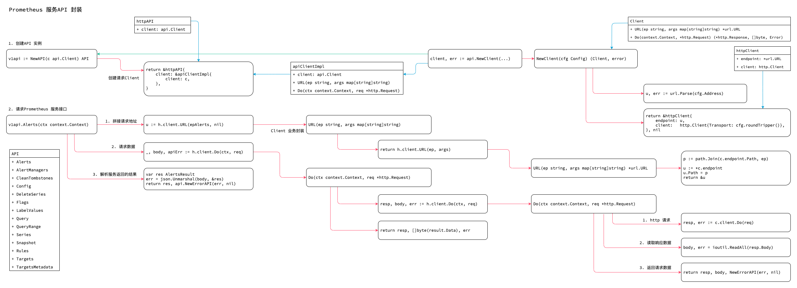

<!-- ---
title: prometheus api
date: 2019-05-30 10:04:07
category: src, prometheus, client
--- -->

# Prometheus 服务API 封装

API 部分封装了请求prometheus 服务程序的功能封装。


1. Client 封装
2. 请求功能封装
3. Prometheus 服务API 封装



封装的接口：

- Alerts
- AlertManagers
- CleanTombstones
- Config
- DeleteSeries
- Flags
- LabelValues
- Query
- QueryRange
- Series
- Snapshot
- Rules
- Targets
- TargetsMetadata


## 1. Client 封装

http 请求封装。

- Client 接口定义
- 初始化Client

```go
// Client API 客户端的接口定义
type Client interface {
	URL(ep string, args map[string]string) *url.URL
	Do(context.Context, *http.Request) (*http.Response, []byte, Error)
}

// client 结构体，包括 client 和 endpoint
type httpClient struct {
	endpoint *url.URL
	client   http.Client
}

// NewClient 创建Client，Client 可以并发安全的被调用
func NewClient(cfg Config) (Client, error) {
	u, err := url.Parse(cfg.Address)
	if err != nil {
		return nil, err
	}
	u.Path = strings.TrimRight(u.Path, "/")

	return &httpClient{
		endpoint: u,
		client:   http.Client{Transport: cfg.roundTripper()},
	}, nil
}

// 返回请求的URL，会替换url 中的参数
func (c *httpClient) URL(ep string, args map[string]string) *url.URL {
	p := path.Join(c.endpoint.Path, ep)

	for arg, val := range args {
		arg = ":" + arg
		p = strings.Replace(p, arg, val, -1)
	}

	u := *c.endpoint
	u.Path = p

	return &u
}

// 执行请求
func (c *httpClient) Do(ctx context.Context, req *http.Request) (*http.Response, []byte, Error) {
	if ctx != nil {
		req = req.WithContext(ctx)
	}
	resp, err := c.client.Do(req)
	defer func() {
		if resp != nil {
			resp.Body.Close()
		}
	}()

	if err != nil {
		return nil, nil, NewErrorAPI(err, nil)
	}

    // 读取所有请求内容
	var body []byte
	done := make(chan struct{})
	go func() {
		body, err = ioutil.ReadAll(resp.Body)
		close(done)
	}()

	select {
	case <-ctx.Done():
		<-done
		err = resp.Body.Close()
		if err == nil {
			err = ctx.Err()
		}
	case <-done:
	}

	return resp, body, NewErrorAPI(err, nil)
}
```

## 2. 请求功能封装

创建请求API Client 方式：

```go
client, err := api.NewClient(api.Config{
	Address: "http://demo.robustperception.io:9090",
	})
v1api := v1.NewAPI(client)
```

```go
type apiClient interface {
	URL(ep string, args map[string]string) *url.URL
	Do(context.Context, *http.Request) (*http.Response, []byte, Warnings, error)
	DoGetFallback(ctx context.Context, u *url.URL, args url.Values) (*http.Response, []byte, Warnings, error)
}

type httpAPI struct {
	client apiClient
}

type apiClientImpl struct {
	client api.Client
}

// NewAPI 创建一个API client
// 这里使用apiClient 做了封装
func NewAPI(c api.Client) API {
	return &httpAPI{
		client: &apiClientImpl{
			client: c,
		},
	}
}


// 调用传入的client 的URL 接口
func (h *apiClientImpl) URL(ep string, args map[string]string) *url.URL {
	return h.client.URL(ep, args)
}

// 调用的是 apiClientImpl 的Do 函数
// 最终还是使用外面传进来的Client 的Do
func (h *apiClientImpl) Do(ctx context.Context, req *http.Request) (*http.Response, []byte, Warnings, error) {
    // 最终还是使用外面传进来的Client 的Do
	resp, body, err := h.client.Do(ctx, req)
	if err != nil {
		return resp, body, nil, err
	}

    // 获取响应code
	code := resp.StatusCode

    // 如果响应码不是200 说明有异常
	if code/100 != 2 && !apiError(code) {
		errorType, errorMsg := errorTypeAndMsgFor(resp)
		return resp, body, nil, &Error{
			Type:   errorType,
			Msg:    errorMsg,
			Detail: string(body),
		}
	}

	return resp, []byte(result.Data), result.Warnings, err
}
```

## 3. 服务API 封装

请求prometheus 服务功能接口封装。


封装的接口：

- Alerts
- AlertManagers
- CleanTombstones
- Config
- DeleteSeries
- Flags
- LabelValues
- Query
- QueryRange
- Series
- Snapshot
- Rules
- Targets
- TargetsMetadata

```go

// Alerts 查询server 端的报警信息
// 拼接请求url
// 创建req
// 执行请求
// 解析响应结果
func (h *httpAPI) Alerts(ctx context.Context) (AlertsResult, api.Error) {
	u := h.client.URL(epAlerts, nil)

	req, err := http.NewRequest(http.MethodGet, u.String(), nil)
	if err != nil {
		return AlertsResult{}, api.NewErrorAPI(err, nil)
	}

	_, body, apiErr := h.client.Do(ctx, req)
	if apiErr != nil {
		return AlertsResult{}, apiErr
	}

	var res AlertsResult
	err = json.Unmarshal(body, &res)
	return res, api.NewErrorAPI(err, nil)
}
```

## 参考资料

- github.com/prometheus/client_golang/api/prometheus/v1/api.go

