<!-- ---
title: desc
date: 2019-05-26 16:51:54
category: src, prometheus, client
--- -->

## Desc 描述

Desc 描述用于描述指标。



## 1. Desc 结构

```go
// Desc 是每个Metric 都有的描述器。描述器包含metric 的元数据
type Desc struct {
	// fqName 由Namespace, Subsystem, Name 组成
	fqName string
	// help 提供帮助信息
	help string
	// constLabelPairs 包含提前计算的一些常量label
	constLabelPairs []*dto.LabelPair
	// VariableLabels 包含和维护的一些变量label
	variableLabels []string
	// id 是 ConstLabels 和 fqName hash 值，也是Desc 的唯一标识符
	id uint64
	// dimHash 是 label 和Help 的hash 值，也必须要ID 一样全局唯一
	dimHash uint64
	// err 初始化时的err 
	err error
}

// Label Metric 标签对
type LabelPair struct {
	Name                 *string  `protobuf:"bytes,1,opt,name=name" json:"name,omitempty"`
	Value                *string  `protobuf:"bytes,2,opt,name=value" json:"value,omitempty"`
}
```

## 2. 创建一个Desc 

1. 创建Desc 实例
2. 检查常量标签名和变量标签名
3. 对标签值进行hash 计算得到Desc 的id
4. 对标签名进行hash 计算得到 dimHash
5. 常量标签转为 dto 格式

```go
// NewDesc 分配和初始化一个 Desc，fqName 不能为空
// variableLabels 仅包含label 名字，因为标签值是变化的，所以他们放在metric 里面
// constLabels 因为是预设，所以直接放Desc 里面
func NewDesc(fqName, help string, variableLabels []string, constLabels Labels) *Desc {
	d := &Desc{
		fqName:         fqName,
		help:           help,
		variableLabels: variableLabels,
	}
    
    // ...

	// 处理常量标签 const labels
	labelValues := make([]string, 1, len(constLabels)+1)
	labelValues[0] = fqName
	labelNames := make([]string, 0, len(constLabels)+len(variableLabels))
	labelNameSet := map[string]struct{}{}
	// First add only the const label names and sort them...
	for labelName := range constLabels {
		if !checkLabelName(labelName) {
			d.err = fmt.Errorf("%q is not a valid label name", labelName)
			return d
		}
		labelNames = append(labelNames, labelName)
		labelNameSet[labelName] = struct{}{}
	}
	sort.Strings(labelNames)
	// ... so that we can now add const label values in the order of their names.
	for _, labelName := range labelNames {
		labelValues = append(labelValues, constLabels[labelName])
    }
    
    // ...
    
	// 处理 variable label names
	for _, labelName := range variableLabels {
		if !checkLabelName(labelName) {
			d.err = fmt.Errorf("%q is not a valid label name", labelName)
			return d
		}
		labelNames = append(labelNames, "$"+labelName)
		labelNameSet[labelName] = struct{}{}
	}
    
    // ...

    // 计算ID hash
	xxh := xxhash.New()
	for _, val := range labelValues {
		xxh.WriteString(val)
		xxh.Write(separatorByteSlice)
	}
	d.id = xxh.Sum64()

	// Sort labelNames so that order doesn't matter for the hash.
	sort.Strings(labelNames)
    // 计算 dimHash
	xxh.Reset()
	xxh.WriteString(help)
	xxh.Write(separatorByteSlice)
	for _, labelName := range labelNames {
		xxh.WriteString(labelName)
		xxh.Write(separatorByteSlice)
	}
	d.dimHash = xxh.Sum64()

	d.constLabelPairs = make([]*dto.LabelPair, 0, len(constLabels))
	for n, v := range constLabels {
		d.constLabelPairs = append(d.constLabelPairs, &dto.LabelPair{
			Name:  proto.String(n),
			Value: proto.String(v),
		})
	}
	sort.Sort(labelPairSorter(d.constLabelPairs))
	return d
}
```

## 参考资料

- github.com/prometheus/client_golang/prometheus/desc.go

