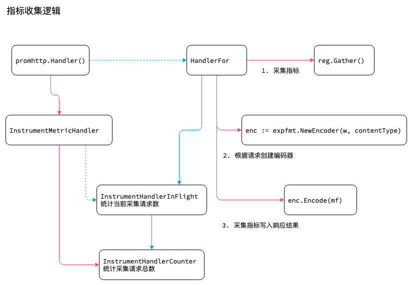

<!-- ---
title: prometheus http handler
date: 2019-04-22 21:23:56
category: src, prometheus, client
--- -->

## 指标收集逻辑

Http handler 用于将应用内收集的指标数据暴露出来，供Prometheus 主程序采集，主要功能有：

1. 嵌入到应用代码中，提供http 端点，并且整合了一套常用的应用数据指标，供prometheus 主程序拉取。
2. SDK 内部会暂存应用当前的指标数据，数据可以在 prometheus 拉取时被请求到。
3. SDK 提供默认的注册器，可以注册需要采集的自定义指标数据。

- 开启端点监控
- 设置http handler 处理函数
- 初始化处理函数
  - 添加metric 中间件，产生指标采集数据
  - 注册register
  - handler 响应请求收集注册到register 上的指标
  - handler 将数据编码后输出到响应结果中



## 1. http 监听

在应用中添加http 端点，路由端点一般是 `/metrics` ，http 处理函数使用 SDK 默认提供的 handler。这个 handler 会在每次 prometheus 请求 `/metrics` 拉取数据时收集所有指标数据并返回。

在应用中设置http 监听：开启端点监控，设置http handler 处理函数

```go
func main() {
	// metrics 的http 监听端口
	// github.com/prometheus/client_golang/prometheus/promhttp
	http.Handle("/metrics", promhttp.Handler())
}
```

## 2. http Handler 处理函数

这里实现http handler 处理函数，主要分为：

1. 添加监控中间件，记录应用metric 指标数据
2. 实现handler http 请求处理逻辑：在有http 请求时，收集注册到prometheus register 的metric 指标数据
3. 收集的数据编码格式化后再输出返回给 prometheus 主程序

```go
// Handler 上一步注册的http handler 函数
// 这个函数调用 InstrumentMetricHandler 返回一个http handler
func Handler() http.Handler {
	return InstrumentMetricHandler(
		prometheus.DefaultRegisterer, HandlerFor(prometheus.DefaultGatherer, HandlerOpts{}),
	)
}
```

### 2.1 指标采集逻辑

请求处理函数，在有请求时收集所有指标的数据，编码后压缩输出。

```go
// HandlerFor 真正处理http 请求的代码，实现收集注册到register 上的所有metric 数据
// 格式化后进行gzip 压缩，再将结果返回给请求者
func HandlerFor(reg prometheus.Gatherer, opts HandlerOpts) http.Handler {
    // 限流功能
	var inFlightSem chan struct{}
	if opts.MaxRequestsInFlight > 0 {
		inFlightSem = make(chan struct{}, opts.MaxRequestsInFlight)
	}

	h := http.HandlerFunc(func(rsp http.ResponseWriter, req *http.Request) {
        // 有请求时，往限流chan 写入一个数据，如果写不进去了说明已经达到限流阈值
		if inFlightSem != nil {
			select {
			case inFlightSem <- struct{}{}:
				defer func() { <-inFlightSem }() //当请求处理完，则减少一个chan 
			default:
				http.Error(rsp, fmt.Sprintf(
					"Limit of concurrent requests reached (%d), try again later.", opts.MaxRequestsInFlight,
				), http.StatusServiceUnavailable)
				return
			}
        }

        // 收集metric 指标数据，整个http handler 的处理逻辑基本都由这一行实现
		mfs, err := reg.Gather()

        // 根据请求设置响应头
		contentType := expfmt.Negotiate(req.Header)
		header := rsp.Header()
		header.Set(contentTypeHeader, string(contentType))

        // 判断是否需要启用gzip
		w := io.Writer(rsp)
		if !opts.DisableCompression && gzipAccepted(req.Header) {
			header.Set(contentEncodingHeader, "gzip")
			gz := gzipPool.Get().(*gzip.Writer)
			defer gzipPool.Put(gz)

			gz.Reset(w)
			defer gz.Close()

			w = gz
		}

        // 初始化编码器，用于格式化数据
		enc := expfmt.NewEncoder(w, contentType)

        // 编码数据并且输出
		var lastErr error
		for _, mf := range mfs {
			if err := enc.Encode(mf); err != nil {
				lastErr = err
				if opts.ErrorLog != nil {
					opts.ErrorLog.Println("error encoding and sending metric family:", err)
                }
                // 出现异常时处理异常
			}
		}

        // 有异常时需要处理
		if lastErr != nil {
			httpError(rsp, lastErr)
		}
	})

	// 返回h 
	return h
}
```

### 2.2 采集请求指标

采集指标的请求，也会记录采集请求总次数（使用Counter）和当前采集请求数（使用Gauge）。

```go
// InstrumentMetricHandler 添加收集当前采集请求总请求量的 counter metric 指标和
// 当前正在抓取处理中的请求量 gauge metric
// counter "promhttp_metric_handler_requests_total" 统计采集请求总请求数
// gauge "promhttp_metric_handler_requests_in_flight" 正在抓取中的请求量
func InstrumentMetricHandler(reg prometheus.Registerer, handler http.Handler) http.Handler {
	// 创建指标
	cnt := prometheus.NewCounterVec(
		prometheus.CounterOpts{
			Name: "promhttp_metric_handler_requests_total",
			Help: "Total number of scrapes by HTTP status code.",
		},
		[]string{"code"},
	)

	// Initialize the most likely HTTP status codes.
	cnt.WithLabelValues("200")
	cnt.WithLabelValues("500")
	cnt.WithLabelValues("503")
	// 注册指标
	reg.Register(cnt);

	gge := prometheus.NewGauge(prometheus.GaugeOpts{
		Name: "promhttp_metric_handler_requests_in_flight",
		Help: "Current number of scrapes being served.",
	})
	reg.Register(gge);

	return InstrumentHandlerCounter(cnt, InstrumentHandlerInFlight(gge, handler))
}

// InstrumentHandlerInFlight 中间件，包装http.Handler，统计http 当前正在处理的请求数
// 有请求时加1，请求处理完成减1
func InstrumentHandlerInFlight(g prometheus.Gauge, next http.Handler) http.Handler {
	return http.HandlerFunc(func(w http.ResponseWriter, r *http.Request) {
		g.Inc()
		defer g.Dec()
		next.ServeHTTP(w, r)
	})
}

// HandlerFunc 是个函数类型，用于将函数转换为http.Handler 类型
type HandlerFunc func(ResponseWriter, *Request)

// ServeHTTP calls f(w, r). HandlerFunc 将一个函数实现 ServeHTTP 接口
func (f HandlerFunc) ServeHTTP(w ResponseWriter, r *Request) {
	f(w, r)
}

// InstrumentHandlerCounter 中间件，统计请求结果各状态码的数量
func InstrumentHandlerCounter(counter *prometheus.CounterVec, next http.Handler) http.HandlerFunc {
	code, method := checkLabels(counter)

	if code {
        // http.HandlerFunc 的作用是类型声明
		return http.HandlerFunc(func(w http.ResponseWriter, r *http.Request) {
			d := newDelegator(w, nil)
			next.ServeHTTP(d, r)
			counter.With(labels(code, method, r.Method, d.Status())).Inc()
		})
	}

	return http.HandlerFunc(func(w http.ResponseWriter, r *http.Request) {
		next.ServeHTTP(w, r)
		counter.With(labels(code, method, r.Method, 0)).Inc()
	})
}
```

## 参考资料

- github.com/prometheus/client_golang/examples/random/main.go

