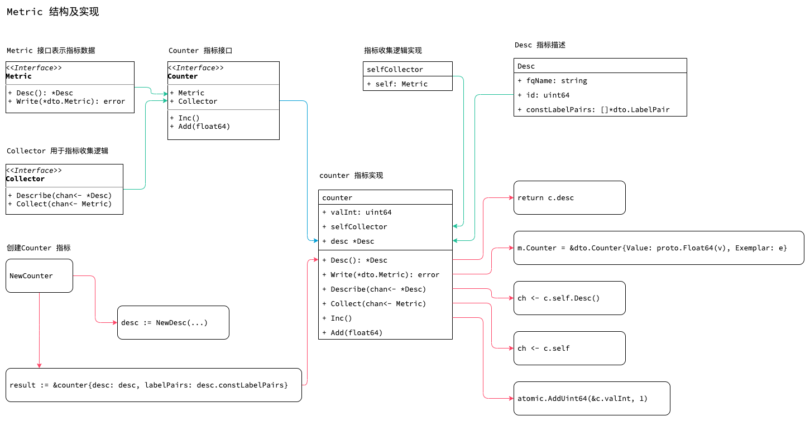

<!-- ---
title: prometheus metric
date: 2019-04-23 21:55:27
category: src, prometheus, client
--- -->

## Metric 结构及实现

Metric 的结构及实现，包括指标需要实现的功能：指标数据功能，描述，收集功能，指标通用数据写入功能。



## 1. Metric 结构

Metric 使用接口形式。所有指标均需实现`Metric` 指标接口和 `Collector` 指标收集接口。

```go
// Metric 接口 模型包含样本值和元数据
type Metric interface {
	// Desc 返回metric 的描述，描述在整个生命周期是唯一的
	Desc() *Desc
	// Write 将metric 数据编码成"Metric" 协议buffer 数据
	Write(*dto.Metric) error
}

// Collector 实现接口用来收集 metrics，Collector 需要被注册为收集器
// metrics 包括prometheus 已实现的Gauge, Counter, Summary,Histogram, Untyped
// 都会实现Collector 接口，所以Metric 也就是 Collector 收集器
type Collector interface {
    // Describe 将所有collector 收集的 metrics 写入到参数提供的 channel 中
	Describe(chan<- *Desc)
	// Collect 在prometheus 注册器收集metrics 信息时调用该函数；这里会将收集到的metrics 写入参数channel，并且一次返回
    // metrics 的descriptor 通过调用Describe 获得
	Collect(chan<- Metric)
}
```

Desc 是Metric 的描述器，表示Metric 描述信息。

```go
// Desc 是每个Metric 都有的描述器。描述器包含metric 的元数据
type Desc struct {
	// fqName 由Namespace, Subsystem, Name 组成
	fqName string
	// help 提供帮助信息
	help string
	// constLabelPairs 包含提前计算的一些常量label
	constLabelPairs []*dto.LabelPair
	// VariableLabels 包含和维护的一些变量label
	variableLabels []string
	// id 是 ConstLabels 和 fqName hash 值，也是Desc 的唯一标识符
	id uint64
	// dimHash 是 label 和Help 的hash 值，也必须要ID 一样全局唯一
	dimHash uint64
	// err 初始化时的err 
	err error
}

```

## 2. Counter 指标结构

Counter 是描述只增加不减少的数据。

以Counter 指标为例，来看看Metric 的实现。

```go
// Counter 需要实现Metric 接口，用于描述和写出数据
// Collector 接口，用于Gather 采集数据
type Counter interface {
	Metric
	Collector

	// 指标自定义接口，Counter 需要实现Inc 和Add 接口
	// Inc increments the counter by 1. Use Add to increment it by arbitrary
	Inc()
	// Add adds the given value to the counter. It panics if the value is <
	Add(float64)
}

// Counter 需要实现的接口
type Counter interface {
	// Desc 返回metric 的描述，描述在整个生命周期是唯一的
	Desc() *Desc
	// Write 将metric 数据编码成"Metric" 协议buffer 数据
	Write(*dto.Metric) error

	// Describe 将所有collector 收集的 metrics 写入到参数提供的 channel 中
	Describe(chan<- *Desc)
	// Collect 在prometheus 注册器收集metrics 信息时调用该函数；这里会将收集到的metrics 写入参数channel，并且一次返回
    // metrics 的descriptor 通过调用Describe 获得
	Collect(chan<- Metric)

	// Inc increments the counter by 1. Use Add to increment it by arbitrary
	Inc()
	// Add adds the given value to the counter. It panics if the value is <
	Add(float64)
}

// counter 默认实现的 counter 数据结构
type counter struct {
	//数值存储
	valBits uint64
	valInt  uint64

	// 内嵌实现了collector 接口
	selfCollector
	desc *Desc

	labelPairs []*dto.LabelPair // Desc 的常量标签对
}

// 创建Counter 指标
func NewCounter(opts CounterOpts) Counter {
	desc := NewDesc(
		BuildFQName(opts.Namespace, opts.Subsystem, opts.Name),
		opts.Help,
		nil,
		opts.ConstLabels,
	)
	result := &counter{desc: desc, labelPairs: desc.constLabelPairs}
	result.init(result) // Init self-collection.
	return result
}
```

## 3. Counter 指标方法

实现Counter 数据指标增加的个性化接口以及Metric 和Collector 接口。

- Add 增加数据
- Inc 数据指标加1

```go
//增加
func (c *counter) Add(v float64) {
	//...
	if float64(ival) == v {
		atomic.AddUint64(&c.valInt, ival)
		return
	}

    //...
}

func (c *counter) Inc() {
	atomic.AddUint64(&c.valInt, 1)
}
```

### 3.1 Metric 实现

```go
// Metric interface 返回Desc 用于识别Metric
func (c *counter) Desc() *Desc {
	return c.desc
}

// Metric interface，实现自定义Metric 结构到 dto 结构的转换
func (c *counter) Write(out *dto.Metric) error {
	fval := math.Float64frombits(atomic.LoadUint64(&c.valBits))
	ival := atomic.LoadUint64(&c.valInt)
	val := fval + float64(ival)

	return populateMetric(CounterValue, val, c.labelPairs, out)
}
```

### 3.2 Collector 实现

```go
// selfCollector 实现了单metric 的收集接口
type selfCollector struct {
	self Metric
}

// 实现metric 的收集函数，方便各种mertic 继承相同函数
func (c *selfCollector) init(self Metric) {
	c.self = self
}

// Describe seflCollector 自带的 Collector 接口实现，注意Metric 一般通过内嵌实现这个功能
func (c *selfCollector) Describe(ch chan<- *Desc) {
	ch <- c.self.Desc()
}

// Collect implements Collector.
func (c *selfCollector) Collect(ch chan<- Metric) {
	ch <- c.self
}
```

## 参考资料

- [Metric Types](https://prometheus.io/docs/concepts/metric_types/)
- github.com/prometheus/client_golang/prometheus/counter.go

