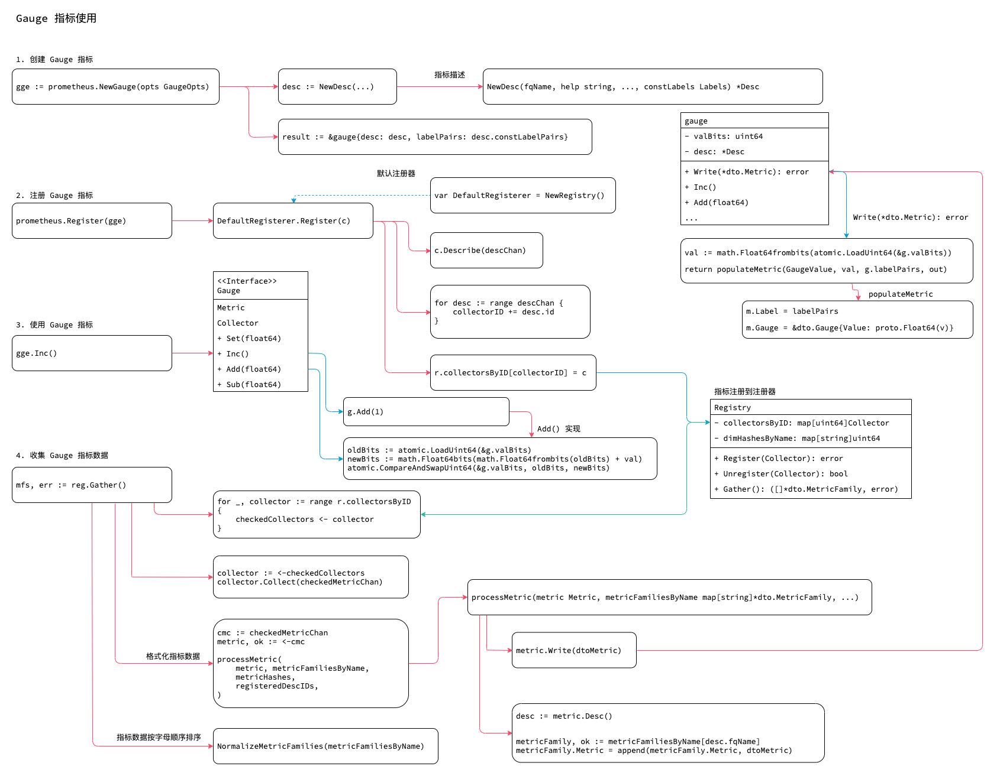

<!-- ---
title: Gauge 指标
date: 2019-06-13 12:58:17
category: src, prometheus, client
--- -->

# Gauge 指标

Gauge 指标的样本数据可增可减。

1. 创建 Gauge 指标
2. 注册 Gauge 指标
3. 设置 Gauge 指标数据
4. 收集 Gauge 指标数据



## 1. 创建 Gauge 指标

Gauge 接口和结构。

```go
// Gauge 是一种可以增减的指标数据
type Gauge interface {
    Metric
    Collector
    
    //...
	Set(float64)
	Inc()
	Add(float64)
	Sub(float64)
}

type gauge struct {
	// valBits 存储gauge 的当前值
	valBits uint64
	
	selfCollector

	desc       *Desc
	labelPairs []*dto.LabelPair // 对应Desc 的常量键值对
}
```

创建和注册Gauge 指标和Counter 指标类似。

```go
// 创建Gauge 指标和Counter 基本相同
func NewGauge(opts GaugeOpts) Gauge {
	desc := NewDesc(
		BuildFQName(opts.Namespace, opts.Subsystem, opts.Name),
		opts.Help,
		nil, // 用于vec 类指标数据
		opts.ConstLabels,
	)
	result := &gauge{desc: desc, labelPairs: desc.constLabelPairs}
	result.init(result) // Init self-collection.
	return result
}
```

## 2. 注册 Gauge 指标

注册函数，一般是使用的默认注册器实例 `prometheus.Register(c)`。

```go
var DefaultRegisterer = NewRegistry()

// NewRegistry 创建一个prometheus 实例
func NewRegistry() *Registry {
	return &Registry{
		collectorsByID:  map[uint64]Collector{}, // 放置所有Collector
		descIDs:         map[uint64]struct{}{}, // Desc 的 id
		dimHashesByName: map[string]uint64{}, // 生成规则 r.dimHashesByName[name] = dimHash
	}
}

func Register(c Collector) error {
	return DefaultRegisterer.Register(c)
}

// Register 实现注册器的注册接口函数
func (r *Registry) Register(c Collector) error {
	var (
		descChan           = make(chan *Desc, capDescChan) // Metric 指标的Desc
		newDescIDs         = map[uint64]struct{}{}
		newDimHashesByName = map[string]uint64{}
		collectorID        uint64 // Just a sum of all desc IDs.
	)

	// 获取Metric 的Desc
	go func() {
		c.Describe(descChan)
		close(descChan)
	}()

	// 对Desc 进行检测
	for desc := range descChan {
		// 如果desc 不存在，则添加，此处生成 collectorID
		if _, exists := newDescIDs[desc.id]; !exists {
			newDescIDs[desc.id] = struct{}{}
			collectorID += desc.id
		}

		// 检查已有的collector fqName 是否重复
		if dimHash, exists := newDimHashesByName[desc.fqName]; !exists {
			newDimHashesByName[desc.fqName] = desc.dimHash
		}
		
	}

	// 当上面所有检查通过后，才真正注册
	r.collectorsByID[collectorID] = c
	for hash := range newDescIDs {
		r.descIDs[hash] = struct{}{}
	}
	for name, dimHash := range newDimHashesByName {
		r.dimHashesByName[name] = dimHash
	}
	return nil
}
```

## 3. 设置 Gauge 指标数据

调用 `Gauge` 自定义指标接口函数，可以设置 `Gauge` 的数值。

```go
// Gauge 指标数据自增
func (g *gauge) Inc() {
	g.Add(1)
}

// Gauge 指标数据自减
func (g *gauge) Dec() {
	g.Add(-1)
}

// Gauge 指标数据增加
func (g *gauge) Add(val float64) {
	for {
		// 这里使用for 循环是因为 CompareAndSwapUint64 只有在g.valBits 没有被其他goroutine 修改的时候才返回true
		// 所以for 循环是为了保证 CompareAndSwapUint64 一定执行成功
		oldBits := atomic.LoadUint64(&g.valBits)
		newBits := math.Float64bits(math.Float64frombits(oldBits) + val)
		if atomic.CompareAndSwapUint64(&g.valBits, oldBits, newBits) {
			return
		}
	}
}
```

## 4. 收集 Gauge 指标数据

Gauge 收集处理步骤：

1. 调用注册器的 `Gather()` 方法
2. 调用Metric 的 `Collect` 方法将 `Metric` 写入 checkedMetricChan channl 中
3. 将checkedMetricChan 赋值给 cmc 这个channl 中
4. 从cmc channl 中读取 `Metric` 进行逐步处理
   1. 将处理的 `Metric` 收集到具有相同 `Desc.Name` 的 `metricFamiliesByName map` 中
   2. `Metric` 以 slice 形式保存
5. 最后对 metricFamiliesByName map 按照键名进行排序得到 MetricFamily slice

```go
// 请求收集数据
mfs, err := reg.Gather()

// Gather implements Gatherer.
func (r *Registry) Gather() ([]*dto.MetricFamily, error) {
	// ...
	// 已检查的Metric
	for _, collector := range r.collectorsByID {
		checkedCollectors <- collector
	}

	wg.Add(goroutineBudget)
	// 收集器处理函数
	collectWorker := func() {
		for {
			select {
			case collector := <-checkedCollectors: // 已检查收集器收集处理
				collector.Collect(checkedMetricChan) // 收集数据，将Metric 放入 checkedMetricChan channl 中
			default:
			// ...
			}
			wg.Done()
		}
	}

	// 运行收集处理
	go collectWorker()

	// ...

	// 复制channel 的引用，以方便我们最后可以删除
	cmc := checkedMetricChan // 保存着所有的Metric
	
	for {
		select {
		case metric, ok := <-cmc:
			// ...	
			// 取出metric 进行处理
			errs.Append(processMetric( // 处理metric
				metric, metricFamiliesByName,
				metricHashes,
				registeredDescIDs,
			))
		default:
			// ...
		}
	}

	// 按照名称排序 metricFamilies
	return internal.NormalizeMetricFamilies(metricFamiliesByName), errs.MaybeUnwrap()
}

// 将Metric 数据写入 metricFamiliesByName 的map 上
func processMetric(metric Metric, metricFamiliesByName map[string]*dto.MetricFamily, metricHashes map[uint64]struct{}, registeredDescIDs map[uint64]struct{}) error {
	desc := metric.Desc()

	// 将Metric 格式转为 dtoMetric
	dtoMetric := &dto.Metric{}
	if err := metric.Write(dtoMetric); err != nil {
		return fmt.Errorf("error collecting metric %v: %s", desc, err)
	}

	// 按照 desc.fqName 将Metric 放到一个slice 中
	metricFamily, ok := metricFamiliesByName[desc.fqName]

	// ...
	// 将当前dtoMetric 写入metricFamily 的Metric slice 中
	metricFamily.Metric = append(metricFamily.Metric, dtoMetric)
	return nil
}
```

Gauge 指标在收集数据时与Counter 类似，将数据打包到 dto.Metric 中。

```go
func (g *gauge) Write(out *dto.Metric) error {
	val := math.Float64frombits(atomic.LoadUint64(&g.valBits))
	return populateMetric(GaugeValue, val, g.labelPairs, out)
}

func populateMetric(t ValueType,v float64,labelPairs []*dto.LabelPair,m *dto.Metric,) error {
	m.Label = labelPairs
	switch t {
	case CounterValue:
		m.Counter = &dto.Counter{Value: proto.Float64(v), Exemplar: e}
	case GaugeValue:
		m.Gauge = &dto.Gauge{Value: proto.Float64(v)}
	case UntypedValue:
		m.Untyped = &dto.Untyped{Value: proto.Float64(v)}
	default:
		return fmt.Errorf("encountered unknown type %v", t)
	}
	return nil
}
```

## 参考资料

- github.com/prometheus/client_golang/prometheus/gauge.go
