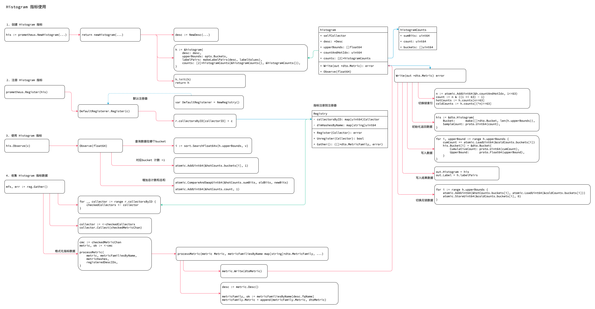

<!-- ---
title: Histogram
date: 2019-06-13 16:42:16
category: src, prometheus, client
--- -->

# Histogram 指标

1. 创建 Histogram 指标
2. 注册 Histogram 指标
3. 设置 Histogram 指标
4. 收集 Histogram 指标数据



## 1. 创建 Histogram 指标

Histogram 结构体。

```go
// Histogram 从样本统计观测值
// Histogram 和Summary 类似，但是分位数可以再服务端计算
type Histogram interface {
	Metric
	Collector

	// 添加单个观测值
	Observe(float64)
}

// Histogram 结构体
type histogramCounts struct {
	sumBits uint64 // sumBits 所有观测值的和
	count   uint64 // 观测值的数量
	buckets []uint64 // buckets
}

type histogram struct {
	// countAndHotIdx 热数据索引
	countAndHotIdx uint64

	selfCollector
	desc     *Desc

	// Two counts 是为了实现无锁编程
	// 热count 用于Observe 添加数据
	// 冷count 用于Write 读取数据
	counts [2]*histogramCounts

	upperBounds []float64
	labelPairs  []*dto.LabelPair
}
```

基于参数创建 Histogram 指标实例。

```go
// NewHistogram 创建Histogram 指标实例
func NewHistogram(opts HistogramOpts) Histogram {
	return newHistogram(
		NewDesc(
			BuildFQName(opts.Namespace, opts.Subsystem, opts.Name),
			opts.Help,
			nil,
			opts.ConstLabels,
		),
		opts,
	)
}

// 实例化histogram 实例
func newHistogram(desc *Desc, opts HistogramOpts, labelValues ...string) Histogram {
	// 参数检查
	// ...
	
	// 实例
	h := &histogram{
		desc:        desc,
		upperBounds: opts.Buckets,
		labelPairs:  makeLabelPairs(desc, labelValues),
		counts:      [2]*histogramCounts{&histogramCounts{}, &histogramCounts{}},
	}

	// 检查bucket 设置
	for i, upperBound := range h.upperBounds {
		// 未达到最后一条记录前
		// bucket 需要是升序排列
		if i < len(h.upperBounds)-1 {
			if upperBound >= h.upperBounds[i+1] {
				panic(fmt.Errorf(
					"histogram buckets must be in increasing order: %f >= %f",
					upperBound, h.upperBounds[i+1],
				))
			}
		} else {
			// 最后一条记录不能是 Inf
			if math.IsInf(upperBound, +1) {
				// The +Inf bucket is implicit. Remove it here.
				h.upperBounds = h.upperBounds[:i]
			}
		}
	}

	// 初始化热数据和冷数据的counts
	h.counts[0].buckets = make([]uint64, len(h.upperBounds))
	h.counts[1].buckets = make([]uint64, len(h.upperBounds))

	h.init(h) // 初始化，获得Collector 和Describe 接口实现
	return h
}
```


## 2. 注册 Histogram 指标

注册函数，一般是使用的默认注册器实例 `prometheus.Register(c)`。

```go
func Register(c Collector) error {
	return DefaultRegisterer.Register(c)
}

// Register 实现注册器的注册接口函数
func (r *Registry) Register(c Collector) error {
	var (
		descChan           = make(chan *Desc, capDescChan) // Metric 指标的Desc
		newDescIDs         = map[uint64]struct{}{}
		newDimHashesByName = map[string]uint64{}
		collectorID        uint64 // Just a sum of all desc IDs.
	)

	// 获取Metric 的Desc
	go func() {
		c.Describe(descChan)
		close(descChan)
	}()

	// 对Desc 进行检测
	for desc := range descChan {
		// 如果desc 不存在，则添加，此处生成 collectorID
		if _, exists := newDescIDs[desc.id]; !exists {
			newDescIDs[desc.id] = struct{}{}
			collectorID += desc.id
		}

		// 检查已有的collector fqName 是否重复
		if dimHash, exists := newDimHashesByName[desc.fqName]; !exists {
			newDimHashesByName[desc.fqName] = desc.dimHash
		}
		
	}

	// 当上面所有检查通过后，才真正注册
	r.collectorsByID[collectorID] = c
	for hash := range newDescIDs {
		r.descIDs[hash] = struct{}{}
	}
	for name, dimHash := range newDimHashesByName {
		r.dimHashesByName[name] = dimHash
	}
	return nil
}
```


## 3. 设置 Histogram 指标

向Histogram 添加观测值，实际是将对应bucket 数字 +1 。

```go
func (h *histogram) Observe(v float64) {
	// 小于30 个bucket 时，linear 查询方式要明显快于 binary 查询
	i := sort.SearchFloat64s(h.upperBounds, v)

	// 计数增加
	n := atomic.AddUint64(&h.countAndHotIdx, 1)
	hotCounts := h.counts[n>>63]

	// 增加对应bucket 计数
	if i < len(h.upperBounds) {
		atomic.AddUint64(&hotCounts.buckets[i], 1)
	}

	// 增加sum 值
	for {
		oldBits := atomic.LoadUint64(&hotCounts.sumBits)
		newBits := math.Float64bits(math.Float64frombits(oldBits) + v)
		if atomic.CompareAndSwapUint64(&hotCounts.sumBits, oldBits, newBits) {
			break
		}
	}
	// 增加count 值
	atomic.AddUint64(&hotCounts.count, 1)
}
```

## 4. 收集 Histogram 指标数据

添加完观测值后，在收集指标数据时需要格式化数据。Write 接口实现的数据类型转换。

```go
func (h *histogram) Write(out *dto.Metric) error {
	// 基于bit 获取冷热数据
	n := atomic.AddUint64(&h.countAndHotIdx, 1<<63)
	count := n & ((1 << 63) - 1)
	hotCounts := h.counts[n>>63]
	coldCounts := h.counts[(^n)>>63]

	// Await cooldown.
	for count != atomic.LoadUint64(&coldCounts.count) {
		runtime.Gosched() // Let observations get work done.
	}

	// 创建dto Histogram
	his := &dto.Histogram{
		Bucket:      make([]*dto.Bucket, len(h.upperBounds)),
		SampleCount: proto.Uint64(count),
		SampleSum:   proto.Float64(math.Float64frombits(atomic.LoadUint64(&coldCounts.sumBits))),
	}

	// 处理bucket 数据
	var cumCount uint64
	for i, upperBound := range h.upperBounds {
		cumCount += atomic.LoadUint64(&coldCounts.buckets[i])
		his.Bucket[i] = &dto.Bucket{
			CumulativeCount: proto.Uint64(cumCount),
			UpperBound:      proto.Float64(upperBound),
		}
	}

	// 设置dto Metric
	out.Histogram = his
	out.Label = h.labelPairs

	// 冷数据已经被处理
	atomic.AddUint64(&hotCounts.count, count)
	atomic.StoreUint64(&coldCounts.count, 0)
	for {
		oldBits := atomic.LoadUint64(&hotCounts.sumBits)
		newBits := math.Float64bits(math.Float64frombits(oldBits) + his.GetSampleSum())
		if atomic.CompareAndSwapUint64(&hotCounts.sumBits, oldBits, newBits) {
			atomic.StoreUint64(&coldCounts.sumBits, 0)
			break
		}
	}
	for i := range h.upperBounds {
		atomic.AddUint64(&hotCounts.buckets[i], atomic.LoadUint64(&coldCounts.buckets[i]))
		atomic.StoreUint64(&coldCounts.buckets[i], 0)
	}
	return nil
}
```

## 参考资料

- github.com/prometheus/client_golang/prometheus/histogram.go

