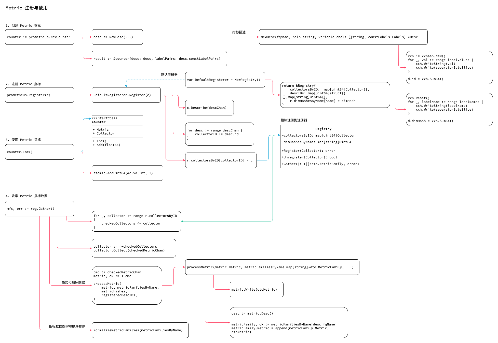

<!-- ---
title: metric register
date: 2019-05-25 03:19:36
category: src, prometheus, client
--- -->

# Metric 注册与使用

完整的Metric 使用步骤包含：

1. 创建 Metric 指标
2. 注册 Metric 指标
3. 使用 Metric 指标
4. 收集 Metric 指标数据



对应的代码关键语句：

```go
// 创建Counter 实例
counter := prometheus.NewCounter(prometheus.CounterOpts{
	Name: "myapp_counter_name",
	Help: "myapp counter help",
})

// 注册实例到Register
prometheus.Register(c)

// 使用指标数据
counter.Inc()

// 收集指标数据
mfs, err := reg.Gather()
```

## 1. 创建 Metric 指标

创建Metric 示例过程。

1. 传入Name 参数
2. 创建Desc
3. 创建 counter 实例
4. 初始化selfCollector

```go
// 调用NewCounter，传入CounterOpts 参数
// 通过Opts 指定Metric 属性。
counter := prometheus.NewCounter(prometheus.CounterOpts{
	Name: "myapp_counter_name",
	Help: "myapp counter help",
})

// NewCounter 内部初始化 desc
// 初始化赋值内嵌的 selfCollector
func NewCounter(opts CounterOpts) Counter {
	desc := NewDesc(
		BuildFQName(opts.Namespace, opts.Subsystem, opts.Name),
		opts.Help,
		nil,
		opts.ConstLabels,
	)
	result := &counter{desc: desc, labelPairs: desc.constLabelPairs}
	result.init(result) // Init self-collection.
	return result
}

// 创建Desc
func NewDesc(fqName, help string, variableLabels []string, constLabels Labels) *Desc {
	d := &Desc{
		fqName:         fqName,
		help:           help,
		variableLabels: variableLabels,
	}
    
    // ...

    // 计算ID hash
	xxh := xxhash.New()
	for _, val := range labelValues {
		xxh.WriteString(val)
		xxh.Write(separatorByteSlice)
	}
	d.id = xxh.Sum64()

	// ...
	// 计算 dimHash
	xxh.Reset()
	xxh.WriteString(help)
	xxh.Write(separatorByteSlice)
	for _, labelName := range labelNames {
		xxh.WriteString(labelName)
		xxh.Write(separatorByteSlice)
	}
	d.dimHash = xxh.Sum64()

	d.constLabelPairs = make([]*dto.LabelPair, 0, len(constLabels))
	for n, v := range constLabels {
		d.constLabelPairs = append(d.constLabelPairs, &dto.LabelPair{
			Name:  proto.String(n),
			Value: proto.String(v),
		})
	}
	sort.Sort(labelPairSorter(d.constLabelPairs))
	return d
}
```

## 2. 注册 Metric 指标

注册函数，一般是使用的默认注册器实例 `prometheus.Register(c)`。

```go
var DefaultRegisterer = NewRegistry()

// NewRegistry 创建一个prometheus 实例
func NewRegistry() *Registry {
	return &Registry{
		collectorsByID:  map[uint64]Collector{}, // 放置所有Collector
		descIDs:         map[uint64]struct{}{}, // Desc 的 id
		dimHashesByName: map[string]uint64{}, // 生成规则 r.dimHashesByName[name] = dimHash
	}
}

func Register(c Collector) error {
	return DefaultRegisterer.Register(c)
}

// Register 实现注册器的注册接口函数
func (r *Registry) Register(c Collector) error {
	var (
		descChan           = make(chan *Desc, capDescChan) // Metric 指标的Desc
		newDescIDs         = map[uint64]struct{}{}
		newDimHashesByName = map[string]uint64{}
		collectorID        uint64 // Just a sum of all desc IDs.
	)

	// 获取Metric 的Desc
	go func() {
		c.Describe(descChan)
		close(descChan)
	}()

	// 对Desc 进行检测
	for desc := range descChan {
		// 如果desc 不存在，则添加，此处生成 collectorID
		if _, exists := newDescIDs[desc.id]; !exists {
			newDescIDs[desc.id] = struct{}{}
			collectorID += desc.id
		}

		// 检查已有的collector fqName 是否重复
		if dimHash, exists := newDimHashesByName[desc.fqName]; !exists {
			newDimHashesByName[desc.fqName] = desc.dimHash
		}
		
	}

	// 当上面所有检查通过后，才真正注册
	r.collectorsByID[collectorID] = c
	for hash := range newDescIDs {
		r.descIDs[hash] = struct{}{}
	}
	for name, dimHash := range newDimHashesByName {
		r.dimHashesByName[name] = dimHash
	}
	return nil
}
```

## 3. 使用 Metric 指标

调用Metric 指标的个性化接口，调整指标值。

```go
// counter.Inc()

func (c *counter) Inc() {
	// 原子性添加数量
	atomic.AddUint64(&c.valInt, 1)
}

// Counter 类型的具体实现
type counter struct {
	// 存储Counter Metric 的值
	valBits uint64
	valInt  uint64

	selfCollector
	desc *Desc

	labelPairs []*dto.LabelPair // Desc 的常量标签对
}
```

## 4. 收集 Metric 数据

调用 `DefaultRegisterer` 默认注册器的 `Gather()` 函数收集指标数据。

1. 从注册器的collectorsByID 中读出所有Collecoter，也就是Metric。
2. 调用Metric 的Collect 方法将自身写入 checkedMetricChan channl 中
3. 将checkedMetricChan 赋值给 cmc 这个channl 中
4. 从cmc channl 中读取Metric 进行逐步处理
   1. 将处理的Metric 聚类到 metricFamily 的Metric slice 中
   2. 再将metricFamily 收集到 metricFamiliesByName map 中
5. 最后对 metricFamiliesByName map 按照键名进行排序得到 MetricFamily slice

```go
mfs, err := reg.Gather()

// Metric 族 Gather 收集产生的数据结构
type MetricFamily struct {
	Name                 *string     `protobuf:"bytes,1,opt,name=name" json:"name,omitempty"`
	Help                 *string     `protobuf:"bytes,2,opt,name=help" json:"help,omitempty"`
	Type                 *MetricType `protobuf:"varint,3,opt,name=type,enum=io.prometheus.client.MetricType"`
	Metric               []*Metric   `protobuf:"bytes,4,rep,name=metric" json:"metric,omitempty"`
}

// Gather implements Gatherer.
func (r *Registry) Gather() ([]*dto.MetricFamily, error) {
	// 初始化变量
	var (
		checkedMetricChan   = make(chan Metric, capMetricChan) // 收集到的metric 数据
	)

	// 待处理的Metric 数量
	goroutineBudget := len(r.collectorsByID) + len(r.uncheckedCollectors)
	metricFamiliesByName := make(map[string]*dto.MetricFamily, len(r.dimHashesByName))
	checkedCollectors := make(chan Collector, len(r.collectorsByID))
	
	// 已检查的Metric
	for _, collector := range r.collectorsByID {
		checkedCollectors <- collector
	}

	wg.Add(goroutineBudget)
	// 收集器处理函数
	collectWorker := func() {
		for {
			select {
			case collector := <-checkedCollectors: // 已检查收集器收集处理
				collector.Collect(checkedMetricChan) // 收集数据，将Metric 放入 checkedMetricChan channl 中
			default:
			// ...
			}
			wg.Done()
		}
	}

	// 运行收集处理
	go collectWorker()

	// 当所有collector 处理完成时，关闭chan
	go func() {
		wg.Wait()
		close(checkedMetricChan)
		close(uncheckedMetricChan)
	}()

	// 复制channel 的引用，以方便我们最后可以删除
	cmc := checkedMetricChan // 保存着所有的Metric
	
	for {
		select {
		case metric, ok := <-cmc:
			// ...	
			// 取出metric 进行处理
			errs.Append(processMetric( // 处理metric
				metric, metricFamiliesByName,
				metricHashes,
				registeredDescIDs,
			))
		// ...
		default:
			// ...
		}
		// 当所有 metric 收集完毕，就可以停止Loop
		if cmc == nil && umc == nil {
			break
		}
	}

	// 按照名称排序 metricFamilies
	return internal.NormalizeMetricFamilies(metricFamiliesByName), errs.MaybeUnwrap()
}

// processMetric Gather 的辅助函数
// 将Metric 聚类到 metricFamily 的Metric slice 中
// 再将metricFamily 收集到 metricFamiliesByName 中
func processMetric(metric Metric, metricFamiliesByName map[string]*dto.MetricFamily, metricHashes map[uint64]struct{}, registeredDescIDs map[uint64]struct{}) error {
	// 获取Desc
	desc := metric.Desc()
	
	// 将Metric 格式转为 dtoMetric
	dtoMetric := &dto.Metric{}
	if err := metric.Write(dtoMetric); err != nil {
		return fmt.Errorf("error collecting metric %v: %s", desc, err)
	}

	// 检查metric 是否已经存在
	metricFamily, ok := metricFamiliesByName[desc.fqName]
	if ok { // Existing name.
		// ...
	} else { // New name.
		// 新的 metricFamily
		metricFamily = &dto.MetricFamily{}
		metricFamily.Name = proto.String(desc.fqName)
		metricFamily.Help = proto.String(desc.help)

		switch {
		case dtoMetric.Counter != nil:
			metricFamily.Type = dto.MetricType_COUNTER.Enum()
		default:
			// ...
		}

		// 新建Metric 族后将Metric 族放入 metricFamiliesByName map
		metricFamiliesByName[desc.fqName] = metricFamily
	}
	// ...

	// 将当前dtoMetric 写入metricFamily 的Metric slice 中
	metricFamily.Metric = append(metricFamily.Metric, dtoMetric)
	return nil
}

// NormalizeMetricFamilies 过滤为空的 MetricFamily 并且按照name 排序
func NormalizeMetricFamilies(metricFamiliesByName map[string]*dto.MetricFamily) []*dto.MetricFamily {
	// 取出 Metric slice 不为空的标签名称
	names := make([]string, 0, len(metricFamiliesByName))
	for name, mf := range metricFamiliesByName {
		// 过滤MetricFamily Metric slice为空的 MetricFamily
		if len(mf.Metric) > 0 {
			names = append(names, name)
		}
	}

	// 对MetricFamily 按名称排序后返回
	sort.Strings(names)
	result := make([]*dto.MetricFamily, 0, len(names))
	for _, name := range names {
		result = append(result, metricFamiliesByName[name])
	}
	return result
}
```

## 参考资料

- github.com/prometheus/client_golang/prometheus/registry.go
- github.com/prometheus/client_golang/prometheus/counter.go

