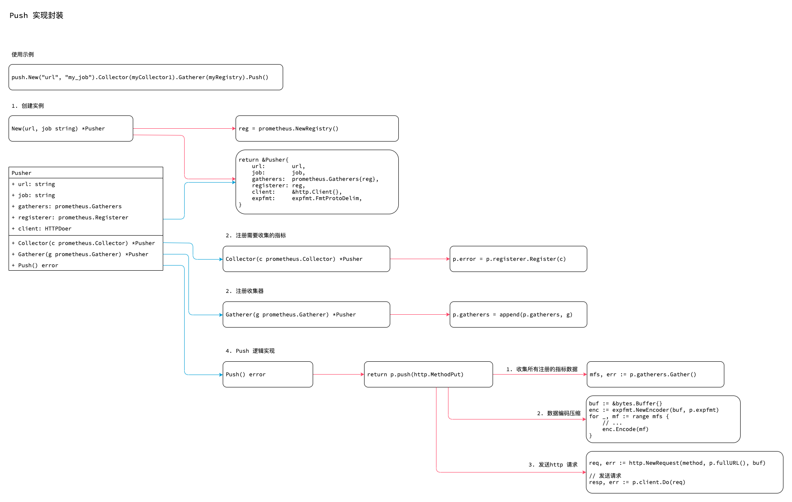

<!-- ---
title: Prometheus Push
date: 2020-02-19 08:58:39
category: showcode, prometheus, client
--- -->

# Push 实现封装

推送 metrics 到 Pushgateway 的功能封装。




推送调用示例：

```go
push.New("http://example.org/metrics", "my_job").Gatherer(myRegistry).Push()
```


## 1. 创建 Pusher 实例

Pusher 实例，提供内部注册器。

```go
type Pusher struct {
	url, job string

	gatherers  prometheus.Gatherers
	registerer prometheus.Registerer

	client             HTTPDoer
	// ...
}

func New(url, job string) *Pusher {
	var (
		reg = prometheus.NewRegistry()
		err error
	)
	
	return &Pusher{
		error:      err,
		url:        url,
		job:        job,
		grouping:   map[string]string{},
		gatherers:  prometheus.Gatherers{reg},
		registerer: reg,
		client:     &http.Client{},
		expfmt:     expfmt.FmtProtoDelim,
	}
}
```


## 2. 指标注册

注册需要推送的指标到 `Pusher` 的 `registerer` 实例上。

```go
// For convenience, this method returns a pointer to the Pusher itself.
func (p *Pusher) Collector(c prometheus.Collector) *Pusher {
	if p.error == nil {
		p.error = p.registerer.Register(c)
	}
	return p
}
```

## 3. 注册收集器

注册收集器，在收集数据时会收集所有收集器上的指标数据。

```go
func (p *Pusher) Gatherer(g prometheus.Gatherer) *Pusher {
	p.gatherers = append(p.gatherers, g)
	return p
}
```

## 4. Push 逻辑实现

push 逻辑分为两部分：收集所有注册的指标数据，将数据编码压缩后推送到服务器。

```go
func (p *Pusher) Push() error {
	return p.push(http.MethodPut)
}

func (p *Pusher) push(method string) error {
	// 收集所有注册的指标数据
	mfs, err := p.gatherers.Gather()
	
	// 将数据编码压缩
	buf := &bytes.Buffer{}
	enc := expfmt.NewEncoder(buf, p.expfmt)
	for _, mf := range mfs {
		// ...
		// 编码数据
		enc.Encode(mf)
	}

	// 准备请求
	req, err := http.NewRequest(method, p.fullURL(), buf)

	// 发送请求
	resp, err := p.client.Do(req)
	if err != nil {
		return err
	}
	defer resp.Body.Close()
	
	// 判断响应结果
	if resp.StatusCode != http.StatusOK && resp.StatusCode != http.StatusAccepted {
		// 记录异常日志
		return fmt.Errorf("unexpected status code %d while pushing to %s: %s", resp.StatusCode, p.fullURL(), body)
	}
	return nil
}
```


## 参考资料

- github.com/prometheus/client_golang/prometheus/push/push.go

