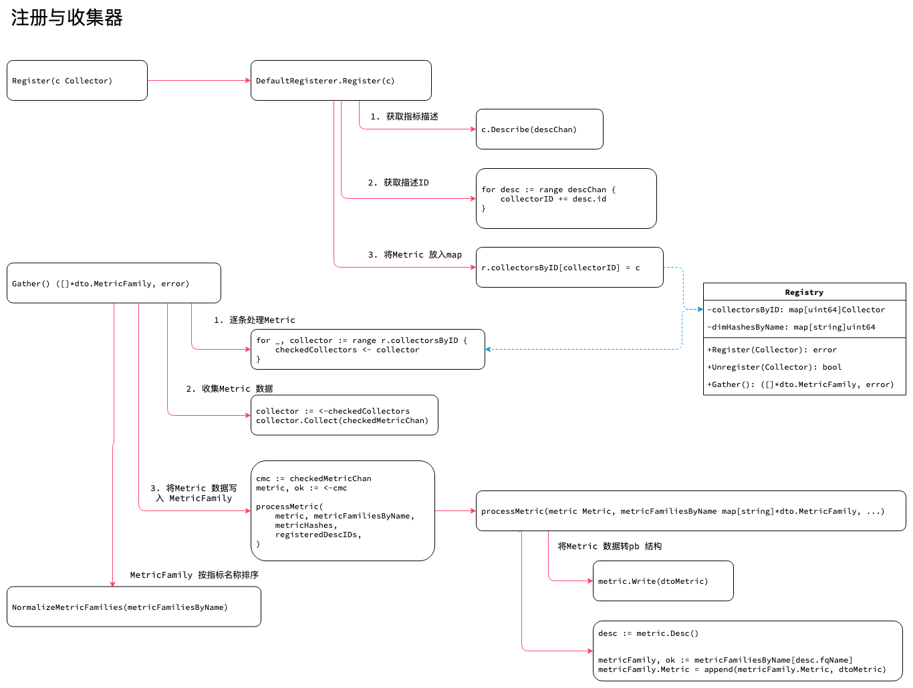

<!-- ---
title: golang sdk
date: 2019-05-21 01:04:08
category: src, prometheus, client
--- -->

# 注册与收集器

prometheus 注册器 Registry 包含2 个功能：

1. 实现注册指标 Registerer 接口，将所有Metric 放到一个map 中。
2. 实现收集指标 Gatherer 接口，收集注册器上所有Metric 的指标数据。



## 1. 注册与收集接口

Prometheus 提供默认的注册器，实现了注册和收集接口。

Register 注册器需要实现的接口如下：

```go
// Registerer 接口
type Registerer interface {
	// Register 注册一个新的指标收集器，需要注意如果指标收集器已经存在会报收集器已经存在
	Register(Collector) error

    // MustRegister 和Register 类似，一次可以注册多个收集器
    MustRegister(...Collector)
    
	// Unregister 注销一个收集器
	Unregister(Collector) bool
}
```

Gatherer 收集器需要实现的接口:

```go
// Gatherer 收集指标数据
type Gatherer interface {
	// Gather 调用收集器的Collect 方法将数据聚合到一个 lexicographically sorted slice
	// 如果收集过程中出现异常, Gather 会尽量收集更多的数据
	Gather() ([]*dto.MetricFamily, error)
}
```

## 2. 注册器实现

因为每个 Metric 指标都要实现 `Collector` 接口，以实现统一的数据收集；这里 `Collector` 是所有`Metric` 指标的通用表示。

```go
// Registry 注册collectors，用于在收集指标数据时可以从一个位置获取到所有metrics
// 注册器实现了 Registerer 和 Gatherer 接口
type Registry struct {
	mtx                   sync.RWMutex // 读写锁
	collectorsByID        map[uint64]Collector // ID is a hash of the descIDs. descId 的和
	descIDs               map[uint64]struct{} // descId
	dimHashesByName       map[string]uint64 // 全局唯一ID
	uncheckedCollectors   []Collector
	pedanticChecksEnabled bool
}

// NewRegistry 创建一个注册器 Registry
func NewRegistry() *Registry {
	return &Registry{
		collectorsByID:  map[uint64]Collector{},
		descIDs:         map[uint64]struct{}{},
		dimHashesByName: map[string]uint64{},
	}
}
```

### 2.1 注册函数 Register

实现`Metric` 注册到Registry 的逻辑。`Metric` 之所以要注册到注册器上，是为了方便收集，收集器可以到某一个地方获取所有的metric 数据。

1. 获取 `Metric` 的描述结构体 `Desc`
2. 检测`Desc` 以确定指标注册是否正常
3. 检测完后，以 desc.Id 为key，将`Metric` 放到map 中

```go
// Register 实现注册器的注册接口函数
// 对collector 描述做各种测试
// 检查desc 是否有err
// 检查descID 是否唯一
// 如果desc 不存在，则添加
// 检查已有的collector fqName 是否重复
// 检查本次新增的collector fqName 是否重复
// r.collectorsByID[collectorID] = c
func (r *Registry) Register(c Collector) error {
	var (
		descChan           = make(chan *Desc, capDescChan) // Metric 指标的Desc
		newDescIDs         = map[uint64]struct{}{}
		newDimHashesByName = map[string]uint64{}
		collectorID        uint64 // Just a sum of all desc IDs.
		duplicateDescErr   error
	)
	go func() {
		c.Describe(descChan)
		close(descChan)
	}()

	// 对collector 做各种测试
	for desc := range descChan {
		// 检查desc 是否有err
		if desc.err != nil {
			return fmt.Errorf("descriptor %s is invalid: %s", desc, desc.err)
		}

		// 检查descID 是否唯一
		if _, exists := r.descIDs[desc.id]; exists {
			duplicateDescErr = fmt.Errorf("descriptor %s already exists with the same fully-qualified name and const label values", desc)
		}

		// 如果desc 不存在，则添加
		if _, exists := newDescIDs[desc.id]; !exists {
			newDescIDs[desc.id] = struct{}{}
			collectorID += desc.id
		}

		// 检查已有的collector fqName 是否重复
		if dimHash, exists := r.dimHashesByName[desc.fqName]; exists {
			if dimHash != desc.dimHash {
				return fmt.Errorf("a previously registered descriptor with the same fully-qualified name as %s has different label names or a different help string", desc)
			}
		} else {
			// 检查本次新增的collector fqName 是否重复
			if dimHash, exists := newDimHashesByName[desc.fqName]; exists {
				if dimHash != desc.dimHash {
					return fmt.Errorf("descriptors reported by collector have inconsistent label names or help strings for the same fully-qualified name, offender is %s", desc)
				}
			} else {
				newDimHashesByName[desc.fqName] = desc.dimHash
			}
		}
	}

	// 如果Collector 没有描述，则作为未被检查的 collector
	if len(newDescIDs) == 0 {
		r.uncheckedCollectors = append(r.uncheckedCollectors, c)
		return nil
	}

	// 如果collector 已经存在，则报已存在异常
	if existing, exists := r.collectorsByID[collectorID]; exists {
		return AlreadyRegisteredError{
			ExistingCollector: existing,
			NewCollector:      c,
		}
	}
	
	// 检查是否有重复err
	if duplicateDescErr != nil {
		return duplicateDescErr
	}

	// 当上面所有检查通过后，才真正注册
	r.collectorsByID[collectorID] = c
	for hash := range newDescIDs {
		r.descIDs[hash] = struct{}{}
	}
	for name, dimHash := range newDimHashesByName {
		r.dimHashesByName[name] = dimHash
	}
	return nil
}
```

### 2.2 注销实现

注销就是将`Metric` 从map 中delete 掉。

```go
// Unregister 实现注销功能
func (r *Registry) Unregister(c Collector) bool {
	var (
		descChan    = make(chan *Desc, capDescChan)
		descIDs     = map[uint64]struct{}{}
		collectorID uint64 // Just a sum of the desc IDs.
	)

	//获取desc 信息
	go func() {
		c.Describe(descChan)
		close(descChan)
	}()
	for desc := range descChan {
		if _, exists := descIDs[desc.id]; !exists {
			collectorID += desc.id
			descIDs[desc.id] = struct{}{}
		}
	}

	//检查是否注册
	r.mtx.RLock()
	if _, exists := r.collectorsByID[collectorID]; !exists {
		r.mtx.RUnlock()
		return false
	}
	r.mtx.RUnlock()

	r.mtx.Lock()
	defer r.mtx.Unlock()

	// 注销操作，将Metric 从注册map 中删除
	delete(r.collectorsByID, collectorID)
	for id := range descIDs {
		//删除descId
		delete(r.descIDs, id)
	}
	// dimHashesByName is left untouched as those must be consistent
	// throughout the lifetime of a program.
	return true
}

// MustRegister 实现同时注册多个 Collector
func (r *Registry) MustRegister(cs ...Collector) {
	for _, c := range cs {
		if err := r.Register(c); err != nil {
			panic(err)
		}
	}
}
```

## 3. 收集函数 Gather

收集所有注册到Registry 上的`Metric` 数据

1. 从注册器的r.collectorsByID 中取出所有的Metric 指标
2. processMetric 将Metric 转为pb Metric 并且放入 `MetricFamily` 中
3. NormalizeMetricFamilies 按照名称对所有 `MetricFamily` 排序，并且返回给收集方

`MetricFamily` 是Desc.fName 相同的Metric 数据。

```go
// Metric 族
type MetricFamily struct {
	Name                 *string     `protobuf:"bytes,1,opt,name=name" json:"name,omitempty"`
	Help                 *string     `protobuf:"bytes,2,opt,name=help" json:"help,omitempty"`
	Type                 *MetricType `protobuf:"varint,3,opt,name=type,enum=io.prometheus.client.MetricType"`
	Metric               []*Metric   `protobuf:"bytes,4,rep,name=metric" json:"metric,omitempty"`
}

// Gather implements Gatherer.
func (r *Registry) Gather() ([]*dto.MetricFamily, error) {
	// 初始化变量
	var (
		checkedMetricChan   = make(chan Metric, capMetricChan) // 收集到的metric 数据
		uncheckedMetricChan = make(chan Metric, capMetricChan)
		metricHashes        = map[uint64]struct{}{}
		wg                  sync.WaitGroup
		errs                MultiError          // The collected errors to return in the end.
		registeredDescIDs   map[uint64]struct{} // Only used for pedantic checks
	)

	r.mtx.RLock()
	// 待处理的Metric 数量
	goroutineBudget := len(r.collectorsByID) + len(r.uncheckedCollectors)
	metricFamiliesByName := make(map[string]*dto.MetricFamily, len(r.dimHashesByName))
	checkedCollectors := make(chan Collector, len(r.collectorsByID))
	uncheckedCollectors := make(chan Collector, len(r.uncheckedCollectors))
	
	// 已检查的Metric
	for _, collector := range r.collectorsByID {
		checkedCollectors <- collector
	}

	// 未检查的Metric
	for _, collector := range r.uncheckedCollectors {
		uncheckedCollectors <- collector
	}
	// In case pedantic checks are enabled, we have to copy the map before
	// giving up the RLock.
	if r.pedanticChecksEnabled {
		registeredDescIDs = make(map[uint64]struct{}, len(r.descIDs))
		for id := range r.descIDs {
			registeredDescIDs[id] = struct{}{}
		}
	}
	r.mtx.RUnlock()

	wg.Add(goroutineBudget)

	// 收集器处理函数
	collectWorker := func() {
		for {
			select {
			case collector := <-checkedCollectors: // 已检查收集器收集处理
				collector.Collect(checkedMetricChan) // 收集数据，将Metric 放入 checkedMetricChan channl 中
			case collector := <-uncheckedCollectors:
				collector.Collect(uncheckedMetricChan)
			default:
				return
			}
			wg.Done()
		}
	}

	// 运行收集处理
	go collectWorker()
	goroutineBudget--

	// 当所有collector 处理完成时，关闭chan
	go func() {
		wg.Wait()
		close(checkedMetricChan)
		close(uncheckedMetricChan)
	}()

	// 清空chan
	defer func() {
		if checkedMetricChan != nil {
			for range checkedMetricChan {
			}
		}
		if uncheckedMetricChan != nil {
			for range uncheckedMetricChan {
			}
		}
	}()

	// 复制channel 的引用，以方便我们最后可以删除
	cmc := checkedMetricChan // 保存着所有的Metric
	umc := uncheckedMetricChan

	for {
		select {
		case metric, ok := <-cmc:
			// ...	
			// 取出metric 进行处理
			errs.Append(processMetric( // 处理metric
				metric, metricFamiliesByName,
				metricHashes,
				registeredDescIDs,
			))
		case metric, ok := <-umc:
			// ...
			errs.Append(processMetric(
				metric, metricFamiliesByName,
				metricHashes,
				nil,
			))
		default:
			// ...
		}
		// 当所有 metric 收集完毕，就可以停止Loop
		if cmc == nil && umc == nil {
			break
		}
	}

	// 按照名称排序 metricFamilies
	return internal.NormalizeMetricFamilies(metricFamiliesByName), errs.MaybeUnwrap()
}

// processMetric Gather 的辅助函数
// 将Metric 收集到metricFamiliesByName 中
func processMetric(
	metric Metric,
	metricFamiliesByName map[string]*dto.MetricFamily,
	metricHashes map[uint64]struct{},
	registeredDescIDs map[uint64]struct{},
) error {
	// 获取Desc
	desc := metric.Desc()
	// Wrapped metrics collected by an unchecked Collector can have an
	// invalid Desc.
	if desc.err != nil {
		return desc.err
	}

	// 将Metric 格式转为 dtoMetric
	dtoMetric := &dto.Metric{}
	if err := metric.Write(dtoMetric); err != nil {
		return fmt.Errorf("error collecting metric %v: %s", desc, err)
	}

	// 检查metric 是否已经存在
	metricFamily, ok := metricFamiliesByName[desc.fqName]
	if ok { // Existing name.
		// 如果存在则检查metric 是否一致
		if metricFamily.GetHelp() != desc.help {
			return fmt.Errorf(
				"collected metric %s %s has help %q but should have %q",
				desc.fqName, dtoMetric, desc.help, metricFamily.GetHelp(),
			)
		}
		// ...
	} else { // New name.
		// 新的 metricFamily
		metricFamily = &dto.MetricFamily{}
		metricFamily.Name = proto.String(desc.fqName)
		metricFamily.Help = proto.String(desc.help)
		// TODO(beorn7): Simplify switch once Desc has type.
		switch {
		case dtoMetric.Gauge != nil:
			metricFamily.Type = dto.MetricType_GAUGE.Enum()
		case dtoMetric.Counter != nil:
			metricFamily.Type = dto.MetricType_COUNTER.Enum()
		case dtoMetric.Summary != nil:
			metricFamily.Type = dto.MetricType_SUMMARY.Enum()
		case dtoMetric.Untyped != nil:
			metricFamily.Type = dto.MetricType_UNTYPED.Enum()
		case dtoMetric.Histogram != nil:
			metricFamily.Type = dto.MetricType_HISTOGRAM.Enum()
		default:
			return fmt.Errorf("empty metric collected: %s", dtoMetric)
		}
		if err := checkSuffixCollisions(metricFamily, metricFamiliesByName); err != nil {
			return err
		}

		// 新建Metric 族后将Metric 族放入 metricFamiliesByName map
		metricFamiliesByName[desc.fqName] = metricFamily
	}
	// 检查metric 一致性
	if err := checkMetricConsistency(metricFamily, dtoMetric, metricHashes); err != nil {
		return err
	}
	if registeredDescIDs != nil {
		// Is the desc registered at all?
		if _, exist := registeredDescIDs[desc.id]; !exist {
			return fmt.Errorf(
				"collected metric %s %s with unregistered descriptor %s",
				metricFamily.GetName(), dtoMetric, desc,
			)
		}
		if err := checkDescConsistency(metricFamily, dtoMetric, desc); err != nil {
			return err
		}
	}

	// 将当前dtoMetric 写入metricFamily 的Metric slice 中
	metricFamily.Metric = append(metricFamily.Metric, dtoMetric)
	return nil
}

// NormalizeMetricFamilies 过滤为空的 MetricFamily 并且按照name 排序
func NormalizeMetricFamilies(metricFamiliesByName map[string]*dto.MetricFamily) []*dto.MetricFamily {
	for _, mf := range metricFamiliesByName {
		sort.Sort(metricSorter(mf.Metric))
	}
	names := make([]string, 0, len(metricFamiliesByName))
	for name, mf := range metricFamiliesByName {
		// 过滤MetricFamily Metric slice为空的 MetricFamily
		if len(mf.Metric) > 0 {
			names = append(names, name)
		}
	}
	sort.Strings(names)
	result := make([]*dto.MetricFamily, 0, len(names))
	for _, name := range names {
		result = append(result, metricFamiliesByName[name])
	}
	return result
}
```

## 参考资料

- github.com/prometheus/client_golang/prometheus/registry.go

