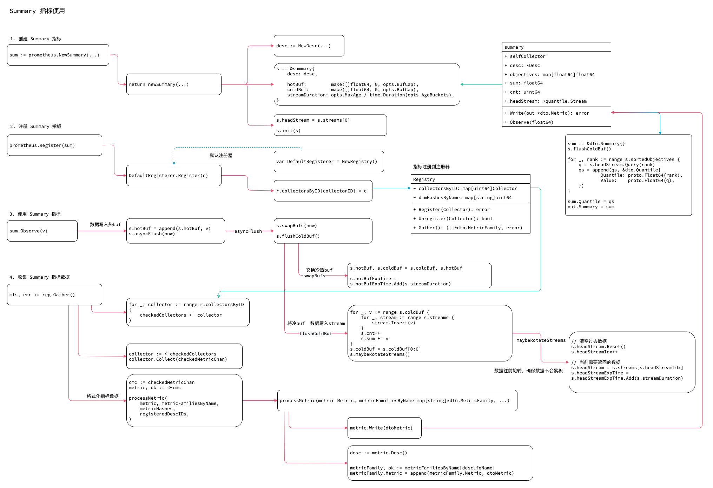

<!-- ---
title: Summary 指标
date: 2019-06-13 15:59:38
category: src, prometheus, client
--- -->

# Summary 指标

1. 创建 Summary 指标
2. 注册 Summary 指标
3. 设置 Summary 指标
4. 收集 Summary 指标数据



## 1. 创建 Summary 指标


Summary 指标涉及结构。

```go
// A Summary 统一样本数据，并且对数据结果进行分析，分析数据包括
// 样本总和 sum
// 样本总数
// 样本排序分类情况
//
// 最常用的一种情况是对请求延迟进行评估；需要注意Summary 收集的结果是不能在 PQL 中继续聚合计算的
type Summary interface {
	Metric
	Collector

	// Observe 添加一个观测值到 summary
	Observe(float64)
}

// SummaryOpts Summary 指标参数项
type SummaryOpts struct {
	// ...
	// Objectives 定义评估区间
	Objectives map[float64]float64

	// MaxAge 一个指标作为关联summary 值的有效时长
	MaxAge time.Duration

	// AgeBuckets 指标作为buckets 观测值的时长
	AgeBuckets uint32

	// BufCap 样本buffer 大小
	BufCap uint32
}

type summary struct {
    selfCollector
    
	desc *Desc

	objectives       map[float64]float64
	sortedObjectives []float64

	labelPairs []*dto.LabelPair

	sum float64
	cnt uint64

	hotBuf, coldBuf []float64

	streams                          []*quantile.Stream
	streamDuration                   time.Duration
	headStream                       *quantile.Stream
	headStreamIdx                    int
	headStreamExpTime, hotBufExpTime time.Time
}
```

创建Summary 参数指标。

```go
// NewSummary
func NewSummary(opts SummaryOpts) Summary {
	return newSummary(
		NewDesc(
			BuildFQName(opts.Namespace, opts.Subsystem, opts.Name),
			opts.Help,
			nil,
			opts.ConstLabels,
		),
		opts,
	)
}

func newSummary(desc *Desc, opts SummaryOpts, labelValues ...string) Summary {
    //参数检查
    if len(desc.variableLabels) != len(labelValues) {
		panic(makeInconsistentCardinalityError(desc.fqName, desc.variableLabels, labelValues))
	}

    // 检查变量
	for _, n := range desc.variableLabels {
		if n == quantileLabel {
			panic(errQuantileLabelNotAllowed)
		}
    }
    // 检查常量
	for _, lp := range desc.constLabelPairs {
		if lp.GetName() == quantileLabel {
			panic(errQuantileLabelNotAllowed)
		}
	}

    // 设置默认变量
	if opts.Objectives == nil {
		opts.Objectives = map[float64]float64{}
	}

	if opts.MaxAge < 0 {
		panic(fmt.Errorf("illegal max age MaxAge=%v", opts.MaxAge))
	}
	if opts.MaxAge == 0 {
		opts.MaxAge = DefMaxAge
	}

	if opts.AgeBuckets == 0 {
		opts.AgeBuckets = DefAgeBuckets
	}

	if opts.BufCap == 0 {
		opts.BufCap = DefBufCap
	}

    // 当没有设置 Objectives 观测区间时返回不同的Summary
	if len(opts.Objectives) == 0 {
		// Use the lock-free implementation of a Summary without objectives.
		s := &noObjectivesSummary{
			desc:       desc,
			labelPairs: makeLabelPairs(desc, labelValues),
			counts:     [2]*summaryCounts{&summaryCounts{}, &summaryCounts{}},
		}
		s.init(s) // Init self-collection.
		return s
	}

    // 正常有观测区间的Summary
	s := &summary{
		desc: desc,

		objectives:       opts.Objectives,
		sortedObjectives: make([]float64, 0, len(opts.Objectives)),

		labelPairs: makeLabelPairs(desc, labelValues),

		hotBuf:         make([]float64, 0, opts.BufCap),
		coldBuf:        make([]float64, 0, opts.BufCap),
		streamDuration: opts.MaxAge / time.Duration(opts.AgeBuckets),
	}
	s.headStreamExpTime = time.Now().Add(s.streamDuration)
	s.hotBufExpTime = s.headStreamExpTime

    // 初始化观测区间 bucket
	for i := uint32(0); i < opts.AgeBuckets; i++ {
		s.streams = append(s.streams, s.newStream())
	}
	s.headStream = s.streams[0]

    // 对观测区间进行排序
	for qu := range s.objectives {
		s.sortedObjectives = append(s.sortedObjectives, qu)
	}
	sort.Float64s(s.sortedObjectives)

	s.init(s) // Init self-collection.
	return s
}
```


## 2. 注册 Summary 指标

注册函数，一般是使用的默认注册器实例 `prometheus.Register(c)`。

```go
func Register(c Collector) error {
	return DefaultRegisterer.Register(c)
}

// Register 实现注册器的注册接口函数
func (r *Registry) Register(c Collector) error {
	var (
		descChan           = make(chan *Desc, capDescChan) // Metric 指标的Desc
		newDescIDs         = map[uint64]struct{}{}
		newDimHashesByName = map[string]uint64{}
		collectorID        uint64 // Just a sum of all desc IDs.
	)

	// 获取Metric 的Desc
	go func() {
		c.Describe(descChan)
		close(descChan)
	}()

	// 对Desc 进行检测
	for desc := range descChan {
		// 如果desc 不存在，则添加，此处生成 collectorID
		if _, exists := newDescIDs[desc.id]; !exists {
			newDescIDs[desc.id] = struct{}{}
			collectorID += desc.id
		}

		// 检查已有的collector fqName 是否重复
		if dimHash, exists := newDimHashesByName[desc.fqName]; !exists {
			newDimHashesByName[desc.fqName] = desc.dimHash
		}
		
	}

	// 当上面所有检查通过后，才真正注册
	r.collectorsByID[collectorID] = c
	for hash := range newDescIDs {
		r.descIDs[hash] = struct{}{}
	}
	for name, dimHash := range newDimHashesByName {
		r.dimHashesByName[name] = dimHash
	}
	return nil
}
```

## 3. 设置 Summary 指标数据

添加Summary 观测指标数据。

1. 判断观测数据是否超过冷热数据过期时间，如果超过需要计算和切换冷热数据
2. 计算并将数据指标道插入不同的bucket stream 中

```go
func (s *summary) Observe(v float64) {
	s.bufMtx.Lock()
	defer s.bufMtx.Unlock()

	now := time.Now()
	if now.After(s.hotBufExpTime) {
		s.asyncFlush(now)
	}

	// 将数据插入热buf 中
	s.hotBuf = append(s.hotBuf, v)
	if len(s.hotBuf) == cap(s.hotBuf) {
		s.asyncFlush(now)
	}
}

// 异步同步数据
func (s *summary) asyncFlush(now time.Time) {
	s.mtx.Lock()
	// 转换数据，将热buf 数据写入冷buf
	s.swapBufs(now)

	// 异步同步数据到 stream
	go func() {
		s.flushColdBuf()
		s.mtx.Unlock()
	}()
}

// 交换冷热数据
func (s *summary) swapBufs(now time.Time) {
	
	s.hotBuf, s.coldBuf = s.coldBuf, s.hotBuf
	// 重试hot buf 过期时间
	for now.After(s.hotBufExpTime) {
		s.hotBufExpTime = s.hotBufExpTime.Add(s.streamDuration)
	}
}


// 冷数据写入 stream，并且清空
func (s *summary) flushColdBuf() {
	// 将冷buf 数据写入stream
	for _, v := range s.coldBuf {
		for _, stream := range s.streams {
			stream.Insert(v)
		}
		s.cnt++
		s.sum += v
	}
	s.coldBuf = s.coldBuf[0:0]
	s.maybeRotateStreams()
}

// rotateStreams stream轮转；目的是保证stream 中的数据能不断过期
// 每次插入数据时，数据v 会插入所有stream 中；但是随时时间更新，过去的stream 会被清空，当前采集时间点的数据是最完善的
// 过去stream 数据会被清空
// 此时stream 数据是最全最多的
// 未来stream 数据依次增多
func (s *summary) maybeRotateStreams() {
	for !s.hotBufExpTime.Equal(s.headStreamExpTime) {
		// 清空过去数据
		s.headStream.Reset()
		s.headStreamIdx++
		if s.headStreamIdx >= len(s.streams) {
			s.headStreamIdx = 0
		}
		// 当前需要返回的数据
		s.headStream = s.streams[s.headStreamIdx]
		s.headStreamExpTime = s.headStreamExpTime.Add(s.streamDuration)
	}
}
```

## 4. 收集 Summary 指标数据

收集指标数据操作。

```go
mfs, err := reg.Gather()

// Gather implements Gatherer.
func (r *Registry) Gather() ([]*dto.MetricFamily, error) {
	// ...
    collector := <-checkedCollectors: // 已检查收集器收集处理
	collector.Collect(checkedMetricChan) // 收集数据，将Metric 放入 checkedMetricChan channl 中

    // 处理metric
	processMetric(metric, metricFamiliesByName,metricHashes,registeredDescIDs,)

	// 按照名称排序 metricFamilies
	return internal.NormalizeMetricFamilies(metricFamiliesByName), errs.MaybeUnwrap()
}

// processMetric Gather 的辅助函数
// 将Metric 聚类到 metricFamily 的Metric slice 中
// 再将metricFamily 收集到 metricFamiliesByName 中
func processMetric(metric Metric, metricFamiliesByName map[string]*dto.MetricFamily, metricHashes map[uint64]struct{}, registeredDescIDs map[uint64]struct{}) error {
	// 获取Desc
	desc := metric.Desc()
	
	// 将Metric 格式转为 dtoMetric
	dtoMetric := &dto.Metric{}
	if err := metric.Write(dtoMetric); err != nil {
		return fmt.Errorf("error collecting metric %v: %s", desc, err)
	}

    // 新的 metricFamily
    metricFamily = &dto.MetricFamily{}
    metricFamily.Name = proto.String(desc.fqName)
    metricFamily.Help = proto.String(desc.help)

    // 新建Metric 族后将Metric 族放入 metricFamiliesByName map
    metricFamiliesByName[desc.fqName] = metricFamily

	// ...
	// 将当前dtoMetric 写入metricFamily 的Metric slice 中
	metricFamily.Metric = append(metricFamily.Metric, dtoMetric)
	return nil
}
```

Summary Metric `Write` 接口实现。取当前 AgeBucket 对应的stream 获取百分位数据。

```go
func (s *summary) Write(out *dto.Metric) error {
	sum := &dto.Summary{}
	qs := make([]*dto.Quantile, 0, len(s.objectives))

	// Swap bufs even if hotBuf is empty to set new hotBufExpTime.
	s.swapBufs(time.Now())
    
    s.flushColdBuf()
	sum.SampleCount = proto.Uint64(s.cnt)
	sum.SampleSum = proto.Float64(s.sum)

	for _, rank := range s.sortedObjectives {
		var q float64
		if s.headStream.Count() == 0 {
			q = math.NaN()
		} else {
			q = s.headStream.Query(rank)
		}
		qs = append(qs, &dto.Quantile{
			Quantile: proto.Float64(rank),
			Value:    proto.Float64(q),
		})
	}

	if len(qs) > 0 {
		sort.Sort(quantSort(qs))
	}
	sum.Quantile = qs

	out.Summary = sum
	out.Label = s.labelPairs
	return nil
}
```


## 参考资料

- github.com/prometheus/client_golang/prometheus/summary.go

