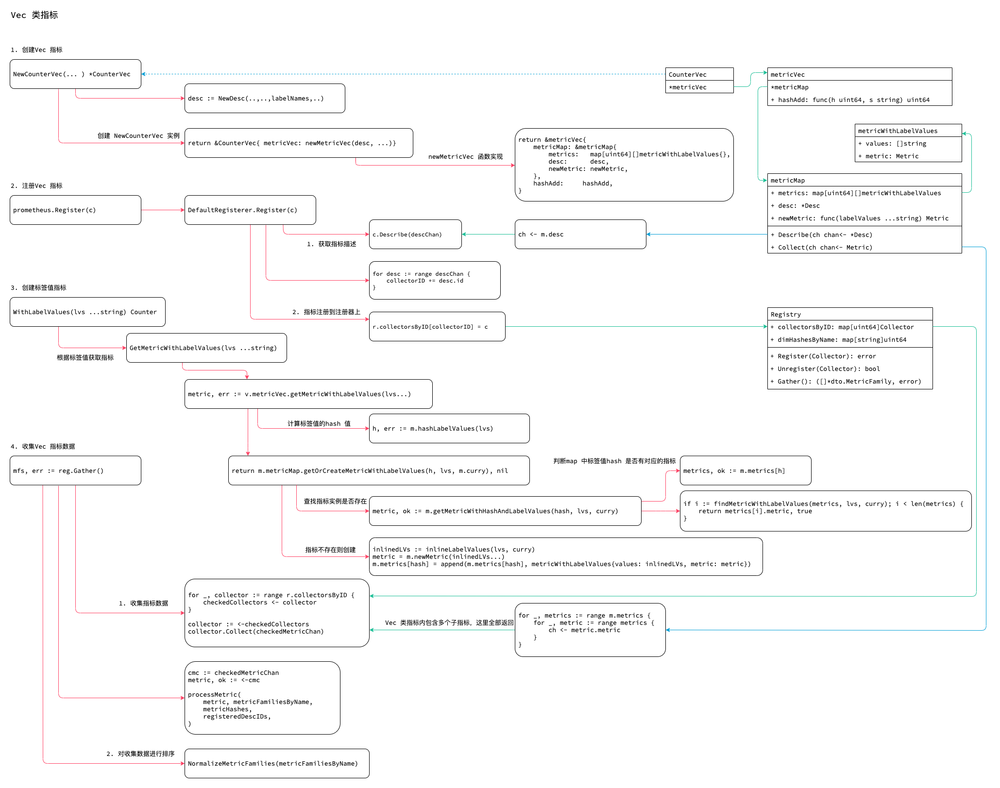

<!-- ---
title: vec
date: 2019-06-11 00:53:02
category: src, prometheus, client
--- -->

# Vec 指标

metricVec 是一组具有相同`Desc` 描述的指标，这组指标有着相同的动态标签名，但是标签值不同。

使用Vec 类指标的步骤：

1. 创建Vec 指标
2. 注册Vec 指标到注册器
3. 创建标签值指标，确定Vec 指标的标签值后，就可以初始化具体指标，再操作具体指标数据
4. 收集Vec 指标数据



## 1. 创建Vec 指标

### 1.1 Vec 指标数据结构

```go
// CounterVec 一系列相同Desc 的Counter 指标集合，这些Counter 指标有不同的变量标签
type CounterVec struct {
	*metricVec
}

// metricVec 是一些列有着不同标签值的指标集合
// metricVec 不可以直接使用，而是提供一系列基础功能
type metricVec struct {
	*metricMap

	curry []curriedLabelValue

	// hashAdd 计算
	hashAdd     func(h uint64, s string) uint64
	hashAddByte func(h uint64, b byte) uint64
}

// metricMap 辅助
type metricMap struct {
	mtx       sync.RWMutex // Protects metrics.
	metrics   map[uint64][]metricWithLabelValues // 这里map 值是一个 slice 应该是为了处理hash 冲突
	desc      *Desc
	newMetric func(labelValues ...string) Metric
}

// metricWithLabelValues 保存标签值和对应的指标
type metricWithLabelValues struct {
	values []string // 标签值
	metric Metric
}
```

### 1.2 创建指标

创建Vec 指标数据，创建vec 的Desc，并且生成metric 创建函数。

```go
// 创建CounterVec
cnt := prometheus.NewCounterVec(
	prometheus.CounterOpts{
		Name: "test",
		Help: "helpless",
		ConstLabels: map[string]string{"app":"testclient"},
	},
	[]string{"code", "api", "method", "appname"},
)

// NewCounterVec 创建 NewCounterVec ，这些counter 指标通过不同的标签名称进行区分
func NewCounterVec(opts CounterOpts, labelNames []string) *CounterVec {
	desc := NewDesc(
		BuildFQName(opts.Namespace, opts.Subsystem, opts.Name),
		opts.Help,
		labelNames,
		opts.ConstLabels,
	)
	return &CounterVec{
		metricVec: newMetricVec(desc, func(lvs ...string) Metric {
			if len(lvs) != len(desc.variableLabels) {
				panic(makeInconsistentCardinalityError(desc.fqName, desc.variableLabels, lvs))
			}
			result := &counter{desc: desc, labelPairs: makeLabelPairs(desc, lvs)}
			result.init(result) // Init self-collection.
			return result
		}),
	}
}

// newMetricVec 返回初始化的 metricVec，初始化desc
func newMetricVec(desc *Desc, newMetric func(lvs ...string) Metric) *metricVec {
	return &metricVec{
		metricMap: &metricMap{
			metrics:   map[uint64][]metricWithLabelValues{},
			desc:      desc,
			newMetric: newMetric,
		},
		hashAdd:     hashAdd,
		hashAddByte: hashAddByte,
	}
}
```

## 2. 注册Vec 指标

`CounterVec` 通过内嵌 `metricVec` ， `metricVec` 在内嵌 `metricMap` ，最终在 `metricMap` 中实现 `Describe` 接口。

```go
// Describe 返回 CounterVec 的Desc
func (m *metricMap) Describe(ch chan<- *Desc) {
	ch <- m.desc
}
```

注册逻辑中，注册的是 `CounterVec` ，并不是注册的通过标签值实例化的子标签。收集时先收集 `CounterVec`，再通过 `Collect` 收集子标签数据。

```go
// 注册cnt
reg.Register(cnt)

func (r *Registry) Register(c Collector) error {
	var (
		descChan           = make(chan *Desc, capDescChan) // Metric 指标的Desc
		newDescIDs         = map[uint64]struct{}{}
		newDimHashesByName = map[string]uint64{}
		collectorID        uint64 // Just a sum of all desc IDs.
		duplicateDescErr   error
	)
	go func() {
		c.Describe(descChan)
		close(descChan)
	}()

	// 对collector 做各种测试
	for desc := range descChan {
		// ...
		// 如果desc 不存在，则添加
		if _, exists := newDescIDs[desc.id]; !exists {
			newDescIDs[desc.id] = struct{}{}
			collectorID ^= desc.id
		}

		// ...
	}

	// ...
	// 当上面所有检查通过后，才真正注册
	r.collectorsByID[collectorID] = c
	for hash := range newDescIDs {
		r.descIDs[hash] = struct{}{}
	}
	for name, dimHash := range newDimHashesByName {
		r.dimHashesByName[name] = dimHash
	}
	return nil
}
```

## 3. 创建标签值指标

基于标签值，创建具体的指标。

1. 如果是第一次使用标签值，会创建对应的metric 指标实例
2. 通过对传入的标签值hash 计算得到hash key
3. Metric 保存在以 hash key 为健的map `map[uint64][]metricWithLabelValues` 中
4. map 的值是一个 metricWithLabelValues 的slice，应该是为了解决hash 冲突
5. `metricWithLabelValue` 的 `metric` 字段对应具体的指标实例

```go
// 设置countervec 的标签值，用于区分不同metric
cnt.WithLabelValues("200", "/simple", "GET").Inc()
cnt.WithLabelValues("200", "/simple", "GET").Inc()
cnt.WithLabelValues("500", "/metric", "POST").Add(2)

// WithLabelValues 获取标签值对应的metric 指标
func (v *CounterVec) WithLabelValues(lvs ...string) Counter {
	c, err := v.GetMetricWithLabelValues(lvs...)
	if err != nil {
		panic(err)
	}
	return c
}

// GetMetricWithLabelValues 返回指定标签值的 Counter 指标
// 第一次获取时会创建新的Counter 指标
func (v *CounterVec) GetMetricWithLabelValues(lvs ...string) (Counter, error) {
	metric, err := v.metricVec.getMetricWithLabelValues(lvs...)
	if metric != nil {
		return metric.(Counter), err
	}
	return nil, err
}

// CounterVec 的功能实际是 metricVec 实现的
func (m *metricVec) getMetricWithLabelValues(lvs ...string) (Metric, error) {
	h, err := m.hashLabelValues(lvs)
	if err != nil {
		return nil, err
	}

	return m.metricMap.getOrCreateMetricWithLabelValues(h, lvs, m.curry), nil
}

// getOrCreateMetricWithLabelValues 检查存储map 中对应标签值hash 的slice 中的标签
func (m *metricMap) getOrCreateMetricWithLabelValues(hash uint64, lvs []string, curry []curriedLabelValue,) Metric {
	metric, ok := m.getMetricWithHashAndLabelValues(hash, lvs, curry)
	if ok {
		return metric
	} else {
		// 如果没有找到标签值对应的指标实例，就会创建对应的指标
		inlinedLVs := inlineLabelValues(lvs, curry)
		metric = m.newMetric(inlinedLVs...)
		m.metrics[hash] = append(m.metrics[hash], metricWithLabelValues{values: inlinedLVs, metric: metric})
	}
	return metric
}

// getMetricWithHashAndLabelValues 通过hash 获取metric
func (m *metricMap) getMetricWithHashAndLabelValues(h uint64, lvs []string, curry []curriedLabelValue,) (Metric, bool) {
	// 取到对应的 metricWithLabelValues slice
    metrics, ok := m.metrics[h]
	if ok {
		// 通过标签值查找指标
		if i := findMetricWithLabelValues(metrics, lvs, curry); i < len(metrics) {
			return metrics[i].metric, true
		}
	}
	return nil, false
}
```

## 4. 收集Vec 指标数据

调用registry 注册器的 `Gather` 函数收集数据。Vec 类指标内包含多个 Metric 指标实例，因此 `Collect` 会返回多个指标。

1. 从注册器的collectorsByID 中读出所有Collecoter
2. 调用MetricVec 的Collect 方法将所有的Metric写入 checkedMetricChan channl 中
3. 在逐个从cmc channl 中读取Metric 进行逐步处理
4. 最后对 metricFamiliesByName map 按照键名进行排序得到 MetricFamily slice

### 4.1 CounterVec Collector 接口

`CounterVec` 通过内嵌 `metricVec` ， `metricVec` 在内嵌 `metricMap` ，最终在 `metricMap` 中实现 `Collect` 接口。

```go
// Collect Vec 的 Collector 接口实现
// 将所有的Metric 都写入 chan 中
func (m *metricMap) Collect(ch chan<- Metric) {
	// ...
	// 取出基于hash key 的map 中的 metrics
	for _, metrics := range m.metrics {
		// 取出metrics slice 中的数据
		for _, metric := range metrics {
			ch <- metric.metric
		}
	}
}
```

### 4.2 Gather 数据收集逻辑

通过Vec 类指标的 `Collect` 来采集所有标签值指标的数据。

```go
mfs, err := reg.Gather()

// Metric 族 Gather 收集产生的数据结构
type MetricFamily struct {
	Name                 *string     `protobuf:"bytes,1,opt,name=name" json:"name,omitempty"`
	Help                 *string     `protobuf:"bytes,2,opt,name=help" json:"help,omitempty"`
	Type                 *MetricType `protobuf:"varint,3,opt,name=type,enum=io.prometheus.client.MetricType"`
	Metric               []*Metric   `protobuf:"bytes,4,rep,name=metric" json:"metric,omitempty"`
}

// Gather implements Gatherer.
func (r *Registry) Gather() ([]*dto.MetricFamily, error) {
	// 初始化变量
	var (
		checkedMetricChan   = make(chan Metric, capMetricChan) // 收集到的metric 数据
	)

	// 待处理的Metric 数量
	metricFamiliesByName := make(map[string]*dto.MetricFamily, len(r.dimHashesByName))
	checkedCollectors := make(chan Collector, len(r.collectorsByID))
	
	// 已检查的Metric
	for _, collector := range r.collectorsByID {
		checkedCollectors <- collector
	}

	wg.Add(goroutineBudget)
	// 收集器处理函数
	collectWorker := func() {
		for {
			select {
            case collector := <-checkedCollectors: // 已检查收集器收集处理
                // Vec 的所有Metric 都写入chan
				collector.Collect(checkedMetricChan) // 收集数据，将Metric 放入 checkedMetricChan channl 中
			default:
			// ...
			}
			wg.Done()
		}
	}

	// 运行收集处理
	go collectWorker()

	// 当所有collector 处理完成时，关闭chan
	go func() {
		wg.Wait()
		close(checkedMetricChan)
		close(uncheckedMetricChan)
	}()

	// 复制channel 的引用，以方便我们最后可以删除
	cmc := checkedMetricChan // 保存着所有的Metric
	
	for {
		select {
		case metric, ok := <-cmc:
			// ...	
			// 逐个取出metric 进行处理
			errs.Append(processMetric( // 处理metric
				metric, metricFamiliesByName,
				metricHashes,
				registeredDescIDs,
			))
		// ...
		default:
			// ...
		}
		// 当所有 metric 收集完毕，就可以停止Loop
		if cmc == nil && umc == nil {
			break
		}
	}

	// 按照名称排序 metricFamilies
	return internal.NormalizeMetricFamilies(metricFamiliesByName), errs.MaybeUnwrap()
}
```

## 参考资料

- github.com/prometheus/client_golang/prometheus/counter.go
- github.com/prometheus/client_golang/prometheus/vec.go

