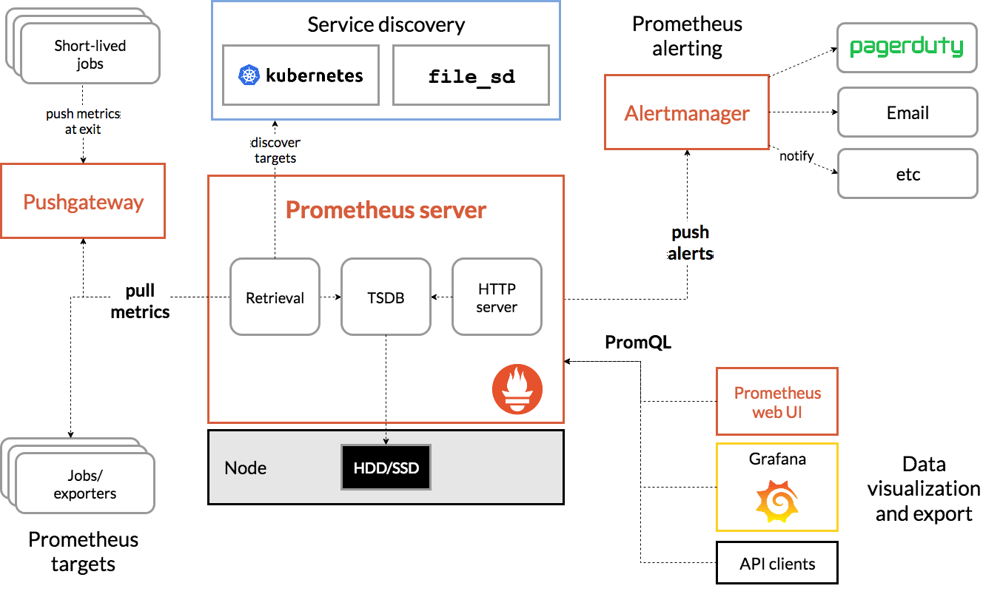

<!-- ---
title: prometheus architecture
date: 2018-11-18 13:27:11
category: src, prometheus, src
--- -->

prometheus architecture

## overview

prometheus 是一个监控和报警系统。

## 组件

1. prometheus server：服务端主程序，拉取和存储时间序列数据
2. 客户端SDK 库，用于嵌入应用代码中，产生指标数据
3. exporters 工具，用于各种第三方程序，导出指标数据，方便prometheus 采集
4. push gateway：应用将数据推送到push gateway，prometheus 才从push gateway 拉取
5. alertmanager：处理报警

## 架构

Prometheus 通过配置的job 拉取metrics 数据，存储所有样本数据到本地，并且基于这个数据执行各种规则运算以统计和计算出新的时间序列数据，然后基于这些进行报警处理。可以使用 Grafana 来可视化收集到的数据。

1. prometheus server 从服务发现系统获取target 列表
2. prometheus server 从target 拉取metrics 数据以及 pushgateway 中的指标数据
3. prometheus server 将数据存储在本地磁盘，也就是TSDB
4. alertmanager 接收prometheus server 推送过来的报警数据，进行报警处理
5. web ui 通过promql 查询prometheus server 用于可视化展示

## 适用情况

1. 适用：记录时间序列数据，和微服务监控系统
2. 不适用：需要保证100% 准确性的系统

## 参考资料

- [https://prometheus.io/docs/introduction/overview/](https://prometheus.io/docs/introduction/overview/)

