<!-- ---
title: prometheus main
date: 2018-11-18 13:54:03
category: src, prometheus, src
--- -->

# Prometheus 服务启动函数

Prometheus 服务启动逻辑。

处理步骤包括：

1. 解析配置
2. 创建服务实例
3. 启动服务实例
4. 服务启动控制



相关子服务包括:

1. notifierManager 通知服务
2. discoveryManagerNotify 通知服务发现管理器
3. scrapeManager 抓取服务
4. discoveryManagerScrape  抓取服务发现管理器
5. tsdb 存储服务
6. queryEngine 查询解析引擎
7. ruleManager 规则管理器
8. web 服务

Prometheus 服务入口 `github.com/prometheus/prometheus/cmd/prometheus/main.go`：

```go
func main() {
	// 启动代码
}
```

## 1. 解析配置

解析终端传入的参数配置。

```go
//配置实例
a := kingpin.New(filepath.Base(os.Args[0]), "The Prometheus monitoring server")

//配置解析
_, err := a.Parse(os.Args[1:])

//日志实例
logger := promlog.New(cfg.logLevel)

//启动日志
level.Info(logger).Log("msg", "Starting Prometheus", "version", version.Info())
```

## 2. 创建服务实例

子服务包括:

1. notifierManager 通知服务
2. discoveryManagerNotify 通知服务发现管理器
3. scrapeManager 抓取服务
4. discoveryManagerScrape  抓取服务发现管理器
5. queryEngine 查询解析引擎
6. ruleManager 规则管理器
7. web 服务实例

```go
// 存储实例
var (
	localStorage  = &tsdb.ReadyStorage{}
	remoteStorage = remote.NewStorage(log.With(logger, "component", "remote"), prometheus.DefaultRegisterer, localStorage.StartTime, cfg.localStoragePath, time.Duration(cfg.RemoteFlushDeadline))
	fanoutStorage = storage.NewFanout(logger, localStorage, remoteStorage)
)

var (
	//notifier 管理器实例
	notifierManager = notifier.NewManager(&cfg.notifier, log.With(logger, "component", "notifier"))

	//scrape 服务发现实例
	discoveryManagerScrape  = discovery.NewManager(ctxScrape, log.With(logger, "component", "discovery manager scrape"), discovery.Name("scrape"))

	//notify 服务发现实例
	discoveryManagerNotify  = discovery.NewManager(ctxNotify, log.With(logger, "component", "discovery manager notify"), discovery.Name("notify"))

	//scrape 管理器
	scrapeManager = scrape.NewManager(log.With(logger, "component", "scrape manager"), fanoutStorage)

	//promql 解析引擎
	queryEngine = promql.NewEngine(opts)

	//rule 管理器实例
	ruleManager = rules.NewManager(&rules.ManagerOptions{
		Appendable:      fanoutStorage,
		TSDB:            localStorage,
		QueryFunc:       rules.EngineQueryFunc(queryEngine, fanoutStorage),
		NotifyFunc:      sendAlerts(notifierManager, cfg.web.ExternalURL.String()),
		Context:         ctxRule,
		ExternalURL:     cfg.web.ExternalURL,
		Registerer:      prometheus.DefaultRegisterer,
		Logger:          log.With(logger, "component", "rule manager"),
		OutageTolerance: time.Duration(cfg.outageTolerance),
		ForGracePeriod:  time.Duration(cfg.forGracePeriod),
		ResendDelay:     time.Duration(cfg.resendDelay),
	})
)

//web 服务实例
webHandler := web.New(log.With(logger, "component", "web"), &cfg.web)
```


## 3. 启动服务实例

```go
//运行scrape 服务发现管理器
err := discoveryManagerScrape.Run()

//运行notify 服务发现管理器
err := discoveryManagerNotify.Run()

//运行scrape 管理器实例
err := scrapeManager.Run(discoveryManagerScrape.SyncCh())

//运行rule 管理器实例
ruleManager.Run()

//开启存储实例
db, err := tsdb.Open(
	cfg.localStoragePath,
	log.With(logger, "component", "tsdb"),
	prometheus.DefaultRegisterer,
	&cfg.tsdb,
)
localStorage.Set(db, startTimeMargin)

//运行web 处理逻辑
if err := webHandler.Run(ctxWeb); err != nil {
	return errors.Wrapf(err, "error starting web server")
}

//运行通知处理逻辑
notifier.Run(discoveryManagerNotify.SyncCh())

//并发运行所有启动函数
g.Run();
```

## 4. 服务启动控制

所有服务实例是并发启动，由于各服务都有相关配置，需要控制实例在读取配置后启动。

这里大量使用 `chan` 进行阻塞控制。

1. db 开启后，关闭 dbOpen
2. dbOpen 关闭后，开始加载配置文件
3. 最后关闭 reloadReady，各服务实例开始运行

```go
// 用于通知db 是否开启
dbOpen := make(chan struct{})

// sync.Once 
type closeOnce struct {
	C     chan struct{}
	once  sync.Once
	Close func()
}
// 阻塞控制
reloadReady := &closeOnce{
	C: make(chan struct{}),
}
// 关闭 chan 确保所有goroutine 收到启动消息
reloadReady.Close = func() {
	reloadReady.once.Do(func() {
		close(reloadReady.C)
	})
}

// db 开启后，关闭 dbOpen
g.Add(
	func() error {
		db, err := tsdb.Open(
			cfg.localStoragePath,
			log.With(logger, "component", "tsdb"),
			prometheus.DefaultRegisterer,
			&cfg.tsdb,
		)

		// ...
		close(dbOpen)
	},
	// ...
}

// dbOpen 关闭后，开始加载配置文件
// 然后关闭 reloadReady，确保各服务实例开始运行
g.Add(
	func() error {
		select {
		case <-dbOpen:
			break;
		}
		
		if err := reloadConfig(cfg.configFile, logger, reloaders...); err != nil {
			return errors.Wrapf(err, "error loading config from %q", cfg.configFile)
		}

		reloadReady.Close()
	},
	// ...
}
```


## 参考资料

- github.com/prometheus/prometheus/cmd/prometheus/main.go

