<!-- ---
title: prometheus web
date: 2019-06-23 03:52:18
category: src, prometheus, server
--- -->

# Web 服务实现

1. 创建Web 实例
2. 运行Web 服务
3. 更新Web 配置
4. 注册API 端点实现





web 服务启动代码示例：

```go
webHandler := web.New(log.With(logger, "component", "web"), &cfg.web)

webHandler.ApplyConfig(...),

webHandler.Run(ctxWeb)
```

## 1. 创建Web 实例

常用结构体：

```go
// Handler serves various HTTP endpoints of the Prometheus server
type Handler struct {
	scrapeManager *scrape.Manager
	ruleManager   *rules.Manager
	queryEngine   *promql.Engine
	context       context.Context
	tsdb          func() *tsdb.DB
	storage       storage.Storage
	notifier      *notifier.Manager

	apiV1 *api_v1.API

	router      *route.Router
}
```

创建web 实例，注册路由：

```go
// github.com/prometheus/prometheus/web/web.go
func New(logger log.Logger, o *Options) *Handler {
    // ...
    router := route.New().
		WithInstrumentation(m.instrumentHandler).
        WithInstrumentation(setPathWithPrefix(""))

    h := &Handler{
		router:      router,
		options:     o,
    
        scrapeManager: o.ScrapeManager,
		ruleManager:   o.RuleManager,
		queryEngine:   o.QueryEngine,
		tsdb:          o.TSDB,
		storage:       o.Storage,
        notifier:      o.Notifier,

		ready: 0,
	}

    h.apiV1 = api_v1.NewAPI(h.queryEngine, h.storage, h.scrapeManager, h.notifier,...)

    // 注册路由
    router.Get("/", func(w http.ResponseWriter, r *http.Request) {
		http.Redirect(w, r, path.Join(o.ExternalURL.Path, "/graph"), http.StatusFound)
	})

	router.Get("/alerts", readyf(h.alerts))
	router.Get("/graph", readyf(h.graph))
	router.Get("/status", readyf(h.status))
	router.Get("/flags", readyf(h.flags))
	router.Get("/config", readyf(h.serveConfig))
	router.Get("/rules", readyf(h.rules))
	router.Get("/targets", readyf(h.targets))
	router.Get("/version", readyf(h.version))
    router.Get("/service-discovery", readyf(h.serviceDiscovery))

    router.Get("/metrics", promhttp.Handler().ServeHTTP)

	router.Get("/federate", readyf(httputil.CompressionHandler{
		Handler: http.HandlerFunc(h.federation),
	}.ServeHTTP))

	router.Get("/consoles/*filepath", readyf(h.consoles))

	router.Get("/static/*filepath", func(w http.ResponseWriter, r *http.Request) {
		r.URL.Path = path.Join("/static", route.Param(r.Context(), "filepath"))
		fs := server.StaticFileServer(ui.Assets)
		fs.ServeHTTP(w, r)
    })

    // pprof 性能调试
    router.Get("/debug/*subpath", serveDebug)

    return h
}
```

## 2. 运行Web 服务

运行web 服务时，启动了v1 和v2 两个版本的服务。

1. 创建网络监听
2. 创建v2 grpc 服务
3. 创建v2 http 服务
4. 注册v1 http 服务


```go
webHandler.Run(ctxWeb)
// github.com/prometheus/prometheus/web/web.go

// Run serves the HTTP endpoints.
func (h *Handler) Run(ctx context.Context) error {
    // 创建网络监听
	listener, err := net.Listen("tcp", h.options.ListenAddress)

	var (
        // 同一个tcp 连接中使用多种协议
		m = cmux.New(listener)
		grpcl   = m.MatchWithWriters(cmux.HTTP2MatchHeaderFieldSendSettings("content-type", "application/grpc"))
		httpl   = m.Match(cmux.HTTP1Fast())
		grpcSrv = grpc.NewServer()
    )

    // 创建v2 服务对象
	av2 := api_v2.New(
		h.options.TSDB,
		h.options.EnableAdminAPI,
    )

    // 注册v2 grpc 服务
	av2.RegisterGRPC(grpcSrv)

    // 注册v2 http 服务
    hh, err := av2.HTTPHandler(ctx, h.options.ListenAddress)
    hhFunc := h.testReadyHandler(hh)

    // 创建默认路由器
    mux := http.NewServeMux()
    // 合并已经注册的页面模板路由
	mux.Handle("/", h.router)

	apiPath := "/api"
	// 注册v1 的api 路由
	av1 := route.New().
		WithInstrumentation(h.metrics.instrumentHandlerWithPrefix("/api/v1")).
		WithInstrumentation(setPathWithPrefix(apiPath + "/v1"))
	h.apiV1.Register(av1)

	mux.Handle(apiPath+"/v1/", http.StripPrefix(apiPath+"/v1", av1))

    // 注册v2 的api 路由
	mux.Handle(apiPath+"/", http.StripPrefix(apiPath,
		http.HandlerFunc(func(w http.ResponseWriter, r *http.Request) {
			httputil.SetCORS(w, h.options.CORSOrigin, r)
			hhFunc(w, r)
		}),
	))

    // 创建http 服务
    httpSrv := &http.Server{
		Handler:     withStackTracer(nethttp.Middleware(opentracing.GlobalTracer(), mux, operationName), h.logger),
		ErrorLog:    errlog,
		ReadTimeout: h.options.ReadTimeout,
	}

    // 运行http 服务
    go func() {
		errCh <- httpSrv.Serve(httpl)
	}()
    // 运行grpc 服务
    go func() {
		errCh <- grpcSrv.Serve(grpcl)
    }()
    // 运行网络监听
	go func() {
		errCh <- m.Serve()
	}()

    // 阻塞运行
	select {
	case e := <-errCh:
		return e
	case <-ctx.Done():
		httpSrv.Shutdown(ctx)
		grpcSrv.GracefulStop()
		return nil
	}
}
```

## 3. 更新Web 配置

```go
// webHandler.ApplyConfig,

// github.com/prometheus/prometheus/web/web.go
// 更新配置
func (h *Handler) ApplyConfig(conf *config.Config) error {
    // ...
	h.config = conf

	return nil
}
```

## 4. 注册API 端点实现

### 4.1 页面端点

```go
router.Get("/alerts", readyf(h.alerts))

// github.com/prometheus/prometheus/web/web.go
func (h *Handler) alerts(w http.ResponseWriter, r *http.Request) {
	var groups []*rules.Group
	for _, group := range h.ruleManager.RuleGroups() {
		if group.HasAlertingRules() {
			groups = append(groups, group)
		}
	}

	alertStatus := AlertStatus{
		Groups: groups,
		AlertStateToRowClass: map[rules.AlertState]string{
			rules.StateInactive: "success",
			rules.StatePending:  "warning",
			rules.StateFiring:   "danger",
		},
		Counts: alertCounts(groups),
    }
    // 加载模板页面
	h.executeTemplate(w, "alerts.html", alertStatus)
}

router.Get("/graph", readyf(h.graph))
// github.com/prometheus/prometheus/web/web.go
// 加载图形页面
func (h *Handler) graph(w http.ResponseWriter, r *http.Request) {
	h.executeTemplate(w, "graph.html", nil)
}
```

### 4.2 API 端点

v1 版本端点：

```go
// github.com/prometheus/prometheus/web/api/v1/api.go
r.Get("/query", wrap(api.query))

// github.com/prometheus/prometheus/web/api/v1/api.go
func (api *API) query(r *http.Request) apiFuncResult {
    var ts time.Time
    // ...
	if t := r.FormValue("time"); t != "" {
		var err error
		ts, err = parseTime(t)
	} else {
		ts = api.now()
	}

    // 创建查询器
    qry, err := api.QueryEngine.NewInstantQuery(api.Queryable, r.FormValue("query"), ts)

    // 查询结果
	res := qry.Exec(ctx)

    // 返回结果
	return apiFuncResult{&queryData{
		ResultType: res.Value.Type(),
		Result:     res.Value,
		Stats:      qs,
	}, nil, res.Warnings, qry.Close}
}

r.Get("/series", wrap(api.series))
// 查询时间序列数据
func (api *API) series(r *http.Request) apiFuncResult {
    // 解析匹配模式
    var matcherSets [][]*labels.Matcher
	for _, s := range r.Form["match[]"] {
		matchers, err := promql.ParseMetricSelector(s)
		// ...
		matcherSets = append(matcherSets, matchers)
	}

    // 获取存储查询器
	q, err := api.Queryable.Querier(r.Context(), timestamp.FromTime(start), timestamp.FromTime(end))

    // 根据匹配模式查询数据
	var warnings storage.Warnings
	for _, mset := range matcherSets {
		s, wrn, err := q.Select(nil, mset...) //TODO
		warnings = append(warnings, wrn...)
		// ...
		sets = append(sets, s)
	}

    // 范围数据
    set := storage.NewMergeSeriesSet(sets, nil)
	metrics := []labels.Labels{}
	for set.Next() {
		metrics = append(metrics, set.At().Labels())
	}

	return apiFuncResult{metrics, nil, warnings, nil}
}
```

v2 版本端点实现。

v2 api 使用grpc 接口，但是提供了grpc 到http 的转换。

```go
// DeleteSeries
// github.com/prometheus/prometheus/web/api/v2/api.go

// DeleteSeries implements pb.AdminServer.
func (s *Admin) DeleteSeries(_ context.Context, r *pb.SeriesDeleteRequest) (*pb.SeriesDeleteResponse, error) {
    // ...
    // 解析待删除数据匹配标识
	var matchers []*labels.Matcher
	for _, m := range r.Matchers {
		var lm *labels.Matcher
		var err error

		switch m.Type {
		case pb.LabelMatcher_EQ:
			lm, err = labels.NewMatcher(labels.MatchEqual, m.Name, m.Value)
		case pb.LabelMatcher_NEQ:
			lm, err = labels.NewMatcher(labels.MatchNotEqual, m.Name, m.Value)
		case pb.LabelMatcher_RE:
			lm, err = labels.NewMatcher(labels.MatchRegexp, m.Name, m.Value)
		case pb.LabelMatcher_NRE:
			lm, err = labels.NewMatcher(labels.MatchNotRegexp, m.Name, m.Value)
		default:
			return nil, status.Error(codes.InvalidArgument, "unknown matcher type")
		}

		if err != nil {
			return nil, status.Errorf(codes.InvalidArgument, "bad matcher: %s", err)
		}

		matchers = append(matchers, lm)
	}

    // db 实例
    db := s.db()
    
    // 删除数据
	if err := db.Delete(timestamp.FromTime(mint), timestamp.FromTime(maxt), matchers...); err != nil {
		return nil, status.Error(codes.Internal, err.Error())
	}
	return &pb.SeriesDeleteResponse{}, nil
}
```

## 参考资料

- github.com/prometheus/prometheus/cmd/prometheus/main.go
- github.com/prometheus/prometheus/web/web.go
- github.com/prometheus/prometheus/web/api/v1/api.go
- github.com/prometheus/prometheus/web/api/v2/api.go

