<!-- ---
title: Go-redis 命令
date: 2020-11-11 13:22:14
category: showcode, redis
--- -->

# Go-redis 命令

发送redis 命令实现。

```go
// 设置数据
err := rdb.Set(ctx, "key", "value", 0).Err()

// 获取数据
val, err := rdb.Get(ctx, "key").Result()
```



主要数据结构：

```go
type cmdable func(ctx context.Context, cmd Cmder) error

type baseCmd struct {
    ctx    context.Context
    args   []interface{}
    err    error
}

type StatusCmd struct {
    baseCmd

    val string
}

type Reader struct {
    rd   *bufio.Reader
    _buf []byte
}

type Cmder interface {
    Args() []interface{} // 参数列表
    readReply(rd *proto.Reader) error // 读取数据结果

    SetErr(error) // 设置处理异常
    Err() error // 读取异常
}
```

## 1. Set 命令实现

1. 创建命令
2. 执行命令
3. 返回命令

```go
func (c cmdable) Set(ctx context.Context, key string, value interface{}, expiration time.Duration) *StatusCmd {
    args := make([]interface{}, 3, 5)
    args[0] = "set"
    args[1] = key
    args[2] = value
    args = append(args, "keepttl")

    cmd := NewStatusCmd(ctx, args...)
    _ = c(ctx, cmd)
    return cmd
}
```

### 1.1 创建Set 命令实例

实现redis 命令结果数据的差异化处理。

```go
func NewStatusCmd(ctx context.Context, args ...interface{}) *StatusCmd {
    return &StatusCmd{
        baseCmd: baseCmd{
            ctx:  ctx,
            args: args,
        },
    }
}
```

### 1.2 readReply 结果处理

```
// 主要实现redis 命令结果读取
func (cmd *StatusCmd) readReply(rd *proto.Reader) (err error) {
    cmd.val, err = rd.ReadString()
    return err
}
```

## 2. Reader

```go
func NewReader(rd io.Reader) *Reader {
    return &Reader{
        rd:   bufio.NewReader(rd),
    }
}
```

### 2.1 ReadString

```go
func (r *Reader) ReadString() (string, error) {
    line, err := r.ReadLine()
    switch line[0] {
    case StringReply:
        // ...
        return r.readStringReply(line)
    }
}
```

## 3. Get 命令实现

```go
func (c cmdable) Get(ctx context.Context, key string) *StringCmd {
    cmd := NewStringCmd(ctx, "get", key)
    _ = c(ctx, cmd)
    return cmd
}
```

### 3.1 创建Get 命令实例

```go
func NewStringCmd(ctx context.Context, args ...interface{}) *StringCmd {
    return &StringCmd{
        baseCmd: baseCmd{
            ctx:  ctx,
            args: args,
        },
    }
}
```

### 3.3 readReply 结果处理

```go
func (cmd *StringCmd) readReply(rd *proto.Reader) (err error) {
    cmd.val, err = rd.ReadString()
    return err
}
```

## 参考资料

- github.com/go-redis/redis/commands.go

