<!-- ---
title: 自动装配实现
date: 2022-01-04 13:36:25
category: java100, spring, springcode
--- -->

# 自动装配实现



## 1. byName 源码实现


```java
// org.springframework.beans.factory.support.AbstractAutowireCapableBeanFactory
public abstract class AbstractAutowireCapableBeanFactory extends AbstractBeanFactory
		implements AutowireCapableBeanFactory {
	protected void populateBean(String beanName, RootBeanDefinition mbd, @Nullable BeanWrapper bw) {
        // ...
		PropertyValues pvs = (mbd.hasPropertyValues() ? mbd.getPropertyValues() : null);

		int resolvedAutowireMode = mbd.getResolvedAutowireMode();
		if (resolvedAutowireMode == AUTOWIRE_BY_NAME || resolvedAutowireMode == AUTOWIRE_BY_TYPE) {
			MutablePropertyValues newPvs = new MutablePropertyValues(pvs);
			// 通过自动注入
			if (resolvedAutowireMode == AUTOWIRE_BY_NAME) {
				autowireByName(beanName, mbd, bw, newPvs);
			}

			// 通过类型自动注入
			if (resolvedAutowireMode == AUTOWIRE_BY_TYPE) {
				autowireByType(beanName, mbd, bw, newPvs);
			}
			pvs = newPvs;
		}

        // ...
		if (pvs != null) {
			applyPropertyValues(beanName, mbd, bw, pvs);
		}
    }

	protected void autowireByName(
			String beanName, AbstractBeanDefinition mbd, BeanWrapper bw, MutablePropertyValues pvs) {

		// 获取所有属性名
		String[] propertyNames = unsatisfiedNonSimpleProperties(mbd, bw);
		for (String propertyName : propertyNames) {
			if (containsBean(propertyName)) {

				// 获取依赖bean 并注入
				Object bean = getBean(propertyName);
				pvs.add(propertyName, bean);
				registerDependentBean(propertyName, beanName);
				
                // ...
			}
		}
	}


}
```

## 2. byType 源码实现


```java
// org.springframework.beans.factory.support.AbstractAutowireCapableBeanFactory
public abstract class AbstractAutowireCapableBeanFactory extends AbstractBeanFactory
		implements AutowireCapableBeanFactory {
	protected void autowireByType(
			String beanName, AbstractBeanDefinition mbd, BeanWrapper bw, MutablePropertyValues pvs) {

        // ...
		Set<String> autowiredBeanNames = new LinkedHashSet<>(4);
		String[] propertyNames = unsatisfiedNonSimpleProperties(mbd, bw);

		// 获取所有属性名
		for (String propertyName : propertyNames) {
			try {
				PropertyDescriptor pd = bw.getPropertyDescriptor(propertyName);
			
            	if (Object.class != pd.getPropertyType()) {
                    // ...

					// 解析自动注入参数
					Object autowiredArgument = resolveDependency(desc, beanName, autowiredBeanNames, converter);
					if (autowiredArgument != null) {
						pvs.add(propertyName, autowiredArgument);
					}
					
                    // ...
				}
			}
			catch (BeansException ex) {
				// ...
			}
		}
	}
}
```

```java
// org.springframework.beans.factory.support.DefaultListableBeanFactory
public class DefaultListableBeanFactory extends AbstractAutowireCapableBeanFactory
		implements ConfigurableListableBeanFactory, BeanDefinitionRegistry, Serializable {
	@Override
	@Nullable
	public Object resolveDependency(DependencyDescriptor descriptor, @Nullable String requestingBeanName,
			@Nullable Set<String> autowiredBeanNames, @Nullable TypeConverter typeConverter) throws BeansException {

        // ...
		if (Optional.class == descriptor.getDependencyType()) {
			// ...
		}
		else {
			// ...
			if (result == null) {
				result = doResolveDependency(descriptor, requestingBeanName, autowiredBeanNames, typeConverter);
			}
			return result;
		}
	}

	@Nullable
	public Object doResolveDependency(DependencyDescriptor descriptor, @Nullable String beanName,
			@Nullable Set<String> autowiredBeanNames, @Nullable TypeConverter typeConverter) throws BeansException {
        try {
			// ...

			// 找到合适注入的bean
			Map<String, Object> matchingBeans = findAutowireCandidates(beanName, type, descriptor);
			// ...

			if (matchingBeans.size() > 1) {
				// ...
			}
			else {
				Map.Entry<String, Object> entry = matchingBeans.entrySet().iterator().next();
				autowiredBeanName = entry.getKey();
				instanceCandidate = entry.getValue();
			}
			
            // ...
			Object result = instanceCandidate;
			
            // ...
			return result;
		}
		finally {
			// ...
		}
    }

	protected Map<String, Object> findAutowireCandidates(
			@Nullable String beanName, Class<?> requiredType, DependencyDescriptor descriptor) {

		// 获取指定类型的bean
		String[] candidateNames = BeanFactoryUtils.beanNamesForTypeIncludingAncestors(
				this, requiredType, true, descriptor.isEager());
		Map<String, Object> result = new LinkedHashMap<>(candidateNames.length);
		
        // ...
		for (String candidate : candidateNames) {
			if (!isSelfReference(beanName, candidate) && isAutowireCandidate(candidate, descriptor)) {
				addCandidateEntry(result, candidate, descriptor, requiredType);
			}
		}
		
        // ...
		return result;
	}

	private void addCandidateEntry(Map<String, Object> candidates, String candidateName,
			DependencyDescriptor descriptor, Class<?> requiredType) {

		if (descriptor instanceof MultiElementDescriptor) {
			// ...
		}
		else if (containsSingleton(candidateName) || (descriptor instanceof StreamDependencyDescriptor &&
				((StreamDependencyDescriptor) descriptor).isOrdered())) {
			// 满足注入条件就实例化
			Object beanInstance = descriptor.resolveCandidate(candidateName, requiredType, this);
			candidates.put(candidateName, (beanInstance instanceof NullBean ? null : beanInstance));
		}
		// ...
	}

	public Object resolveCandidate(String beanName, Class<?> requiredType, BeanFactory beanFactory)
			throws BeansException {

		return beanFactory.getBean(beanName);
	}
}
```


## 参考资料

- [原型Bean实例化过程、byName与byType及FactoryBean获取Bean源码实现](https://www.cnblogs.com/xrq730/p/6685528.html)