<!-- ---
title: 占位符替换实现
date: 2022-01-04 14:04:55
category: java100, spring, springcode
--- -->

# 占位符替换实现



## 示例代码

```
<bean class="org.springframework.beans.factory.config.PropertyPlaceholderConfigurer">
    <property name="location" value="properties/db.properties"></property>
</bean>

<bean id="dataSource" class="DataSource">
    <property name="driveClass" value="${driveClass}" />
    <property name="url" value="${url}" />
    <property name="userName" value="${userName}" />
    <property name="password" value="${password}" />
</bean>
```

## 1. 属性替换调用

PropertyResourceConfigurer 作为 postProcessBeanFactory 触发调用。

```java
// org.springframework.beans.factory.config.PropertyResourceConfigurer
public abstract class PropertyResourceConfigurer extends PropertiesLoaderSupport
		implements BeanFactoryPostProcessor, PriorityOrdered {
	@Override
	public void postProcessBeanFactory(ConfigurableListableBeanFactory beanFactory) throws BeansException {
		try {
			// 加载文件
			Properties mergedProps = mergeProperties();
			convertProperties(mergedProps);

			// 占位符替换
			processProperties(beanFactory, mergedProps);
		}
		catch (IOException ex) {
			throw new BeanInitializationException("Could not load properties", ex);
		}
	}
}
```


## 2. properties 文件读取

```java
// org.springframework.core.io.support.PropertiesLoaderSupport
public abstract class PropertiesLoaderSupport {
	protected Properties mergeProperties() throws IOException {
		Properties result = new Properties();

        // ...
		if (!this.localOverride) {
			// Load properties from file afterwards, to let those properties override.
			loadProperties(result);
		}

		return result;
	}

	protected void loadProperties(Properties props) throws IOException {
		if (this.locations != null) {
			for (Resource location : this.locations) {
                // ...
				try {
					PropertiesLoaderUtils.fillProperties(
							props, new EncodedResource(location, this.fileEncoding), this.propertiesPersister);
				}
				catch (FileNotFoundException | UnknownHostException | SocketException ex) {
                    // ...
				}
			}
		}
	}

}
```

```java
// org.springframework.core.io.support.PropertiesLoaderUtils
public abstract class PropertiesLoaderUtils {
	static void fillProperties(Properties props, EncodedResource resource, PropertiesPersister persister)
			throws IOException {

		String filename = resource.getResource().getFilename();
		if (filename != null && filename.endsWith(XML_FILE_EXTENSION)) {
			// ...
		}
		else {
			stream = resource.getInputStream();
			persister.load(props, stream);
		}

		// ...
	}
}
```

## 3. 替换实现


```java
// org.springframework.beans.factory.config.PropertyPlaceholderConfigurer
public class PropertyPlaceholderConfigurer extends PlaceholderConfigurerSupport {
	@Override
	protected void processProperties(ConfigurableListableBeanFactory beanFactoryToProcess, Properties props)
			throws BeansException {

		StringValueResolver valueResolver = new PlaceholderResolvingStringValueResolver(props);
		doProcessProperties(beanFactoryToProcess, valueResolver);
	}

	protected void doProcessProperties(ConfigurableListableBeanFactory beanFactoryToProcess,
			StringValueResolver valueResolver) {

		BeanDefinitionVisitor visitor = new BeanDefinitionVisitor(valueResolver);

        // ...
		String[] beanNames = beanFactoryToProcess.getBeanDefinitionNames();
		for (String curName : beanNames) {
			if (!(curName.equals(this.beanName) && beanFactoryToProcess.equals(this.beanFactory))) {
				BeanDefinition bd = beanFactoryToProcess.getBeanDefinition(curName);
				try {
					visitor.visitBeanDefinition(bd);
				}
				catch (Exception ex) {
					// ...
				}
			}
		}

        // ...
	}
}
```

```java
// org.springframework.beans.factory.config.BeanDefinitionVisitor

public class BeanDefinitionVisitor {
	public void visitBeanDefinition(BeanDefinition beanDefinition) {
		// 逐个属性替换
		visitParentName(beanDefinition);

		// ...
		if (beanDefinition.hasPropertyValues()) {
			visitPropertyValues(beanDefinition.getPropertyValues());
		}

		// ...
	}

	protected void visitPropertyValues(MutablePropertyValues pvs) {
		PropertyValue[] pvArray = pvs.getPropertyValues();
		for (PropertyValue pv : pvArray) {
			Object newVal = resolveValue(pv.getValue());
			if (!ObjectUtils.nullSafeEquals(newVal, pv.getValue())) {
				pvs.add(pv.getName(), newVal);
			}
		}
	}

    @Nullable
	protected Object resolveValue(@Nullable Object value) {
		if (value instanceof BeanDefinition) {
			// ...
		}
		else if (value instanceof TypedStringValue) {
			TypedStringValue typedStringValue = (TypedStringValue) value;
			String stringValue = typedStringValue.getValue();
			if (stringValue != null) {
				String visitedString = resolveStringValue(stringValue);
				typedStringValue.setValue(visitedString);
			}
		}
		return value;
	}
	
    @Nullable
	protected String resolveStringValue(String strVal) {
		// ...
		String resolvedValue = this.valueResolver.resolveStringValue(strVal);

		return (strVal.equals(resolvedValue) ? strVal : resolvedValue);
	}
}
```

```java
// org.springframework.beans.factory.config.PropertyPlaceholderConfigurer.PlaceholderResolvingStringValueResolver
class PlaceholderResolvingStringValueResolver implements StringValueResolver {
    @Override
    @Nullable
    public String resolveStringValue(String strVal) throws BeansException {
        String resolved = this.helper.replacePlaceholders(strVal, this.resolver);

		// ...
        return (resolved.equals(nullValue) ? null : resolved);
    }
}
```

## 参考资料

- [【Spring源码分析】.properties文件读取及占位符${...}替换源码解析](https://www.cnblogs.com/xrq730/p/6785473.html)